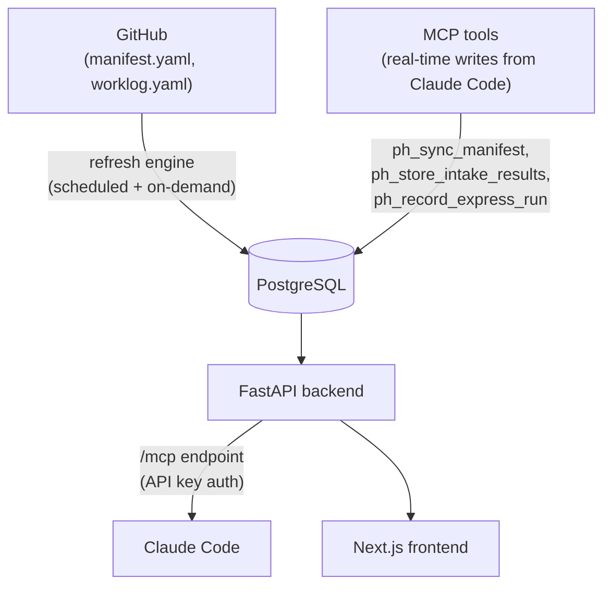

# Central

The RHDP Publishing House Central provides cross-project visibility into the content lifecycle. While individual authors interact with the CLI skills, Central gives managers, PMs, and stakeholders a single view across all active projects — without needing Claude Code.

The Central has two data paths: the **refresh engine** pulls project state from GitHub repos on a schedule, and **MCP tools** accept writes from Claude Code skills in real time. The manifest in git remains the source of truth for onboarded and self-published projects; the Central database also stores intake session data and express metrics that have no git representation.

## Architecture



The refresh engine checks each registered project's GitHub repo and syncs manifest and worklog data to the database. It runs on a schedule and on-demand when you trigger a manual refresh.

MCP tools provide a second write path: Claude Code skills call `ph_sync_manifest` after every manifest write (keeping Central in sync without waiting for the next refresh cycle), `ph_store_intake_results` to persist intake session data across Claude Code restarts, and `ph_record_express_run` for lightweight express usage metrics.

## Registering a Project

Navigate to the **Register** page and provide the GitHub repository URL. The Central fetches the manifest, reads project metadata (name, owner, type, deployment mode), parses lifecycle phases, and adds the project. You'll be redirected to the project detail page.

Registration requires only a repo URL — all other metadata comes from the manifest.

## Pipeline View

The **Pipeline** page shows a kanban board with columns mapping to lifecycle phases:

| Column | Phases |
|--------|--------|
| Intake | intake, vetting, spec_refinement |
| Approval | approval |
| Writing | writing |
| Automation | automation |
| Editing | editing |
| Review | editing, code_review, security_review |
| Ready | e2e_testing, final_review, ready_for_publishing |

Each project appears as a card in its current active phase column. Cards show the project name, module count, and assignees.

## Projects Table

The **Projects** page shows a searchable table of all registered projects:

- **Project name** — clickable link to the detail page
- **Type** — workshop or demo
- **Deployment mode** — `rhdp_published` or `self_published`
- **Module count** — number of writing modules
- **Assignees** — everyone assigned across all phases
- **Phase progress bar** — colored segments showing which phases are complete, active, or pending
- **Actions** — refresh (re-fetch from GitHub), edit (update name or repo URL), delete

## Project Detail

Click a project name to see the full detail view.

### Overview Tab

**Phase accordions** — each lifecycle phase is an expandable section showing:

- **Completion date** — when the phase was finished
- **Assignees** — who worked on this phase
- **Artifacts** — file paths linked directly to the file in the GitHub repo
- **Phase-specific content:**
  - **Writing** — module list with individual status and links to content and review files
  - **Automation** — substep status (requirements, catalog item, automation code, testing), catalog path, AgnosticV repo/branch
  - **Approval** — who approved it and when
  - **Vetting** — RCARS result (approved, revise, rejected)

Pending phases show a dependency hint explaining what must complete first.

### Worklog Tab

A chronological timeline of entries from `publishing-house/worklog.yaml`:

- Decisions (open and resolved)
- Action items
- Handoff notes
- Session summaries

Open items are highlighted. Resolved items show who resolved them and when.

### Artifacts Tab

Aggregated list of all artifacts across all phases — specs, module outlines, review reports, automation files — with links to the files in the GitHub repo.

### Launch Instructions Tab

For deployed projects: how to order the environment and what users need to get started. Source: the automation manifest and catalog configuration. For `self_published` projects, includes the Field Source CI order instructions and the GitOps repo URL.

## Sidebar

Each project detail page shows a sidebar with:

- **Project Info** — type, deployment mode, owner, autonomy level, created date
- **Links** — GitHub repo, Showroom repo, automation repo
- **Assignees** — listed with their phase assignment

## Refreshing Data

Data is refreshed in two ways:

- **Scheduled** — the refresh engine checks all registered projects periodically
- **Manual** — click the refresh button (⟳) on any project in the table or detail view

The refresh engine is incremental: it checks the repo's last-push timestamp before fetching, so unchanged repos are skipped. Parallel fetching keeps refresh time low even at scale.

## Manifest Requirements

For a project to display correctly, its `publishing-house/manifest.yaml` must include:

```yaml
project:
  name: "Project Title"
  owner_github: "jsmith"
  owner_email: "jsmith@redhat.com"
  type: "workshop"              # workshop | demo
  deployment_mode: "rhdp_published"  # rhdp_published | self_published
  autonomy: "guided"
  created: "2026-04-01"

lifecycle:
  phases:
    <phase_name>:
      status: "pending"         # pending | in_progress | completed | skipped
      completed_at: null        # ISO datetime when completed (YYYY-MM-DD HH:mm)
      assignees: []             # GitHub usernames working on this phase
      artifacts: []             # File paths (linked to GitHub in Central)
```

The `completed_at`, `assignees`, and `artifacts` fields drive what appears in the phase accordions.

## Deployment

The Central runs on OpenShift. See [Central Deployment](central-deployment.md) for deployment instructions.
