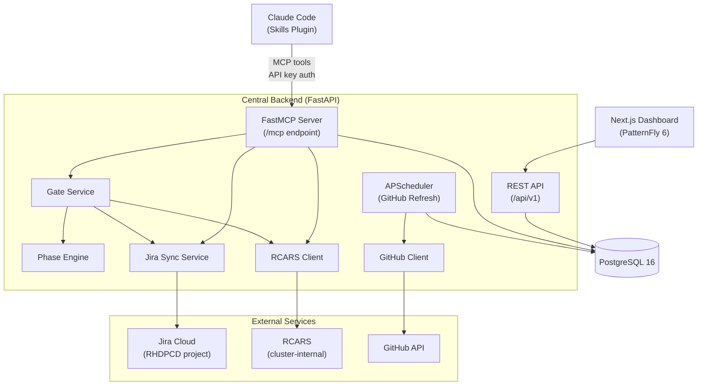

# Central Backend Architecture

Central is the backend service that powers Publishing House. It runs as a single deployment on OpenShift and serves four distinct roles: **MCP gateway** for skill-to-backend communication, **gate authority** for lifecycle phase transitions, **Jira sync engine** for management reporting, and **project dashboard** for stakeholder visibility. All four roles share one codebase, one database, and one deployment.

The Central backend lives in the `rhdp-publishing-house-central` repository. Skills, the dashboard, and future chatbot integrations all interact with the same service instance.

## Architecture Overview

## MCP Server

Central exposes a FastMCP 3.2+ server mounted at `/mcp` on the FastAPI application. All communication between Claude Code skills and Central flows through MCP tools. Skills never call REST endpoints or external services directly — they call MCP tools, and Central handles the rest.

### Authentication

MCP requests are authenticated via API key middleware. Each request must include a Bearer token in the Authorization header. Keys are stored as SHA-256 hashes in a Kubernetes Secret (`ph-mcp-api-keys`). The middleware hashes the incoming key and compares it against stored hashes using `hmac.compare_digest` (constant-time comparison to prevent timing attacks). See [MCP Authentication](../admin/mcp-auth.md) for key management procedures.

### Tool Registration

MCP tools are defined as decorated functions across three modules: `tools.py` (gate and project tools), `rcars_tools.py` (RCARS gateway tools), and `session_tools.py` (session continuity and metrics tools). Each module is imported via side-effect import in `main.py`, which triggers tool registration with the FastMCP server instance. Adding a new tool means defining the function with `@mcp.tool()` and adding the import.

## MCP Tools

Every skill-to-backend interaction uses one of these tools. The table below is the canonical reference — it replaces the standalone MCP tools reference doc.

### Gate Service Tools

| Tool | Purpose |
|------|---------|
| `ph_register(repo_url, branch)` | Fetch manifest from GitHub, create or update the project record, cache phase status. For onboarded projects, creates a Jira Epic and Intake task. Returns the project status. |
| `ph_list_projects(owner_email)` | List all projects registered by a given owner. Searches by both GitHub username and email address. |
| `ph_get_status(repo_url, branch)` | Fetch the manifest from GitHub, compute phase status via the Phase Engine, and return the current phase, next recommended action, and Jira summary (if synced). |
| `ph_request_gate(repo_url, branch, target_phase, requested_by)` | The core gate mechanism. Validates prerequisites against the Phase Engine, runs phase-specific checks (RCARS evaluation for vetting, spec validation for approval), records a GateRecord with findings, and syncs the result to Jira. Async. |
| `ph_submit_results(repo_url, branch, phase, result_type, results, submitted_by)` | Store structured results from local skill runs (verify-content reports, automation status checks). Results are considered when evaluating future gates. |
| `ph_get_history(repo_url, branch)` | Return the full custody chain — every gate decision, validation, and approval in chronological order. |
| `ph_get_open_initiatives()` | Query Jira for open Initiatives in the RHDPCD project. Used during intake to let the developer associate their project with an Initiative. |

### RCARS Tools

| Tool | Purpose |
|------|---------|
| `ph_rcars_query(query)` | Submit a natural-language content vetting query to RCARS. Polls until the advisor job completes and returns relevance-tiered results with rationale. Async. |
| `ph_rcars_catalog_search(query, limit)` | Browse or search the RCARS catalog. Returns slim metadata per item — use `ph_rcars_catalog_item` for full details. Async. |
| `ph_rcars_catalog_item(ci_name)` | Get full metadata and analysis for a specific RCARS catalog item, including display name, stage, analysis summary, content hash, staleness info, and tags. Async. |

### Session and Legacy Tools

| Tool | Purpose |
|------|---------|
| `ph_store_intake_results(owner_email, mode, intake_data, project_name)` | Persist intake interview data to the Central database for session continuity. Survives Claude Code restarts. Used by all three deployment modes. |
| `ph_get_intake_results(session_id)` | Retrieve stored intake data by session ID for resuming a previously started intake interview. |
| `ph_list_intake_sessions(owner_email, status)` | List intake sessions for a user, optionally filtered by status (active, converted, abandoned). Ordered by creation date, newest first. |
| `ph_sync_manifest(project_id, manifest_yaml)` | Push manifest YAML content from a skill to the Central database. Sets `sync_source='mcp'` to distinguish MCP-pushed manifests from GitHub-refreshed ones, preventing circular sync. |
| `ph_record_express_run(owner_email, base_ci, automated)` | Record a completed express mode run for metrics tracking. |
| `ph_get_launch_instructions(project_id)` | Generate step-by-step deployment ordering instructions for a project. Sources from the automation manifest and catalog configuration. |
| `ph_store_validation_results(project_id, phase, validator, status, summary, findings, run_by)` | Store validation results from `agnosticv:validator` or `showroom:verify-content` runs. |
| `ph_get_validation_results(project_id, phase)` | Retrieve stored validation results, optionally filtered by lifecycle phase. |

## Gate Service

The gate service is Central's decision authority for lifecycle phase transitions. Every advancement from one phase to the next passes through the gate service, which validates prerequisites, runs phase-specific checks, records the decision, and syncs the result to Jira.

### Gate Decisions

Every gate request produces a **GateRecord** — an immutable record in the custody chain. Each record captures the decision (approved, rejected, or overridden), findings that informed it, who requested it, who or what approved it, and the spec commit hash at decision time. The custody chain is append-only; decisions are never modified or deleted.

### Hard Gates and Soft Gates

Gates come in two types. **Hard gates** enforce prerequisites and run phase-specific validation — the gate service actively evaluates whether the project is ready and can reject advancement. **Soft gates** enforce prerequisites only — once prerequisite phases are complete, the gate automatically approves. The gate type is determined by the project's deployment mode profile (see Phase Engine below).

### Phase-Specific Behavior

Most gates perform only prerequisite checking. Two phases have additional logic:

**Vetting gate.** When a project requests advancement to the vetting phase, the gate service submits the project's learning objectives and topic description to RCARS for content overlap evaluation. RCARS returns relevance-tiered matches against the existing RHDP catalog. The gate service includes the RCARS findings in the GateRecord. The orchestrator skill uses these findings to guide the author through revision or proceed to spec refinement.

**Approval gate.** The approval gate is the most complex. It validates the specification document, runs an LLM-assisted review for completeness, prevents self-approval (the requestor cannot be the approver), and on approval creates Phase 2 Jira tasks — per-module content tasks and review tasks for the writing phase. This progressive task creation keeps Jira clean until a project actually reaches writing.

See [Lifecycle & Phases](lifecycle-phases.md) for the full gate logic and prerequisite chain for each phase.

## Phase Engine

The Phase Engine is a pure-logic component that determines what phase a project should be in and what it needs to do next. It has no database access, no I/O, and makes no external calls — it operates entirely on the manifest data passed to it.

### Deployment Mode Profiles

The engine defines three phase profiles that control which phases exist and whether their gates are hard or soft:

| Profile | Phases | Gate Style | Used By |
|---------|--------|------------|---------|
| `ONBOARDED_PHASES` | 12 phases (intake through ready_for_publishing) | Mostly hard gates — vetting, approval, code review, security review, final review are hard | `rhdp_published` projects |
| `SELF_PUBLISHED_PHASES` | 12 phases (same set) | All soft gates — prerequisites enforced, but no active validation | `self_published` projects |
| `EXPRESS_PHASES` | 3 phases (intake, automation, ready_for_publishing) | All soft gates | `express` mode projects |

### Core Methods

`check_prerequisites(manifest, target_phase)` examines the manifest to determine whether a project can advance to the target phase. It returns whether prerequisites are met, the reason if not, and the gate type (hard or soft) for that phase in the project's deployment mode.

`get_next_action(manifest)` scans the manifest's phase statuses to determine the next phase the project should advance to and produces a human-readable action recommendation. The orchestrator skill calls this to decide what to do next.

## Jira Sync

Central maintains one-directional sync from Publishing House to Jira Cloud. Jira is a downstream reporting target — it receives state changes from PH but never drives PH state. The sync is non-blocking: Jira API failures are logged but never block gate decisions or phase transitions.

### Progressive Task Creation

Jira tasks are created incrementally as a project advances, not all at once during registration:

**Phase 1 — At registration.** When a project registers via `ph_register`, the sync service creates a Jira Epic for the project and an Intake task. The Epic lives under the RHDPCD project and is optionally linked to an Initiative if the developer selected one during intake.

**Phase 2 — At approval gate.** When a project passes the approval gate, the sync service creates per-module content tasks and review tasks for the upcoming writing phase. Supporting pages (intro, conclusion, overview modules) are excluded from task creation — they do not represent meaningful deliverables.

### Sync Logic

The sync service operates on three rules: create tasks that should exist but do not, close tasks for deliverables that have been removed from the manifest (orphaned tasks), and transition task statuses to match the manifest's phase statuses. Each sync operation diffs the manifest's deliverable list against the `JiraTaskMapping` table to determine what has changed.

### Deliverable Types and Points

Each Jira task maps to a `DeliverableType` with an assigned story point value that reflects relative effort:

| Deliverable Type | Points | Created When |
|------------------|--------|--------------|
| `INTAKE_SPEC` | 13 | Registration |
| `MODULE_CONTENT` | 5 | Approval gate |
| `MODULE_AUTOMATION` | 8 | Approval gate |
| `MODULE_VERIFIED` | 5 | Approval gate |
| `CODE_REVIEW` | 3 | Approval gate |
| `SECURITY_REVIEW` | 3 | Approval gate |
| `E2E_TEST` | 8 | Approval gate |
| `FINAL_REVIEW` | 1 | Approval gate |

See [Jira Integration](jira-integration.md) for the full ticket hierarchy, Initiative linking, and the points model rationale.

## GitHub Refresh

Central maintains cached copies of project manifests and phase statuses. A background scheduler (APScheduler) refreshes this cache every 30 minutes by default (configurable via the `refresh_interval_minutes` setting).

The refresh engine reads manifests from the GitHub API — it never clones repositories. For each registered project, it fetches the manifest file, parses it, and updates the cached phase status, current phase, and next action in the database.

The refresh engine respects the `sync_source` field on manifest records. If a manifest was recently pushed via MCP (`sync_source='mcp'`), the refresh engine skips overwriting it. This prevents the circular sync pitfall where a skill pushes a manifest to Central, then the refresh engine overwrites it with a stale version from GitHub before the skill's commit has been pushed.

## Database Models

Central uses PostgreSQL 16 with SQLAlchemy ORM. Migrations are managed by Alembic.

| Model | Purpose |
|-------|---------|
| `Project` | Core project record — name, owner, repo URL, deployment mode, cached phase status, Jira Epic key |
| `Manifest` | Stores the full manifest YAML and a parsed JSONB representation. Tracks `sync_source` to distinguish MCP-pushed vs GitHub-refreshed manifests. |
| `Phase` | Per-phase status tracking — status, completion timestamp, assignees, artifacts |
| `GateRecord` | The custody chain. Every gate decision (approved, rejected, overridden) with findings, requestor, approver, and spec commit hash. Append-only. |
| `SubmittedResult` | Structured results from local skill runs (verify-content reports, automation checks). Referenced during future gate evaluations. |
| `JiraTaskMapping` | Maps manifest deliverables to Jira issue keys. Used by the sync service to diff and reconcile tasks. |
| `IntakeSession` | Persists intake interview data across Claude Code restarts. Stores the full intake data dict, deployment mode, and session status. |
| `ExpressMetric` | Express mode usage tracking for aggregate reporting. |
| `ValidationRun` | Validation results from `showroom:verify-content` or `agnosticv:validator` runs, with severity-tagged findings. |
| `WorklogEntry` | Mirrors `worklog.yaml` entries for dashboard visibility — decisions, action items, handoff notes, session summaries. |

## Dashboard

The project dashboard is a Next.js application styled with PatternFly 6, served behind an OpenShift OAuth proxy for access control. It provides stakeholder visibility into project state without requiring Claude Code.

### Pipeline Board

A kanban-style board with columns grouped by lifecycle phase. Each project appears as a card in its current active phase column, showing the project name, module count, and assignees. Cards link to the project detail view.

### Project Detail

The detail view organizes project state into phase accordions — each lifecycle phase is an expandable section showing its completion date, assignees, artifacts (linked to the GitHub repository), and phase-specific content. The writing phase shows per-module status. The automation phase shows substep progress. The vetting phase shows RCARS evaluation results.

Pending phases display a dependency hint explaining which prerequisite phases must complete first.

### Custody Chain Viewer

A chronological view of every gate decision for a project. Each entry shows the decision (approved, rejected, overridden), who requested it, when, and the findings that informed the decision. This provides a complete audit trail for content governance.

### Worklog Timeline

A timeline of entries from the project's worklog — decisions (open and resolved), action items, handoff notes, and session summaries. Open items are highlighted; resolved items show who resolved them and when.

## REST API

The backend exposes REST endpoints under `/api/v1` organized into three route groups:

| Route Group | Purpose |
|-------------|---------|
| `/api/v1/health` | Liveness and readiness probes for OpenShift |
| `/api/v1/projects` | Project CRUD, phase status, manifest data, custody chain — consumed by the dashboard |
| `/api/v1/validations` | Validation result storage and retrieval |

The dashboard reads exclusively from these REST endpoints. MCP tools share the same database session factory but run within the FastMCP server lifecycle rather than the FastAPI request lifecycle. Both paths use the same SQLAlchemy models and service layer.

## Cross-References

- See [System Design](system-design.md) for the end-to-end architecture across all Publishing House components
- See [Lifecycle & Phases](lifecycle-phases.md) for gate logic details, prerequisite chains, and phase ordering
- See [Jira Integration](jira-integration.md) for the full ticket hierarchy, Initiative linking, and points model
- See [RCARS Integration](rcars-integration.md) for the RCARS gateway auth model and cross-namespace connectivity
- See [MCP Authentication](../admin/mcp-auth.md) for key management procedures
