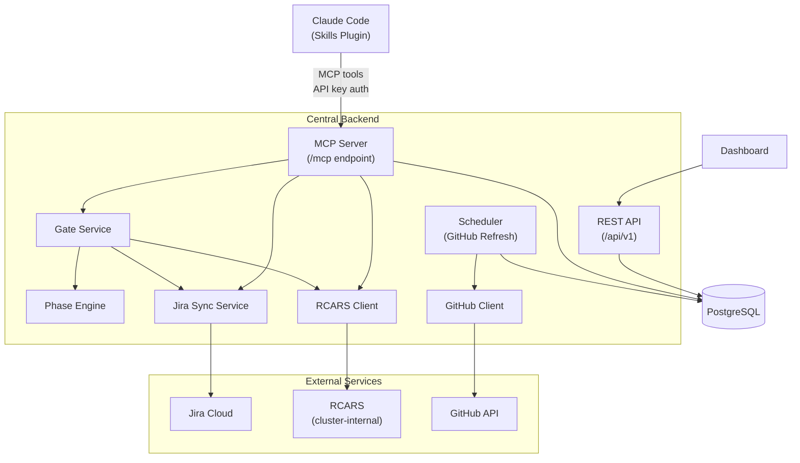

# Central Backend Architecture

Central is the backend service that powers Publishing House. It runs as a single deployment on OpenShift and serves four distinct roles: **MCP gateway** for skill-to-backend communication, **gate authority** for lifecycle phase transitions, **Jira sync engine** for management reporting, and **project dashboard** for stakeholder visibility. All four roles share one codebase, one database, and one deployment.

The Central backend lives in the `rhdp-publishing-house-central` repository. Skills, the dashboard, and future chatbot integrations all interact with the same service instance.

## Architecture Overview

## MCP Server

Central exposes an MCP server mounted at `/mcp` on the FastAPI application. All communication between Claude Code skills and Central flows through MCP tools. Skills never call REST endpoints or external services directly — they call MCP tools, and Central handles the rest.

### Authentication

MCP requests require a Bearer API key. Keys are stored securely in a Kubernetes Secret. See [MCP Authentication](../admin/mcp-auth.md) for key management.

## MCP Tools

Every skill-to-backend interaction uses one of these tools. The table below is the canonical reference — it replaces the standalone MCP tools reference doc.

### Gate Service Tools

| Tool | Purpose |
|------|---------|
| `ph_register` | Fetch manifest from GitHub, create or update the project record, cache phase status. For onboarded projects, creates a Jira Epic and Intake task. |
| `ph_list_projects` | List all projects registered by a given owner. |
| `ph_get_status` | Fetch the manifest, compute phase status, and return the current phase, next recommended action, and Jira summary. |
| `ph_request_gate` | The core gate mechanism. Validates prerequisites, runs phase-specific checks (RCARS evaluation for vetting, spec validation for approval), records the gate decision, and syncs to Jira. |
| `ph_submit_results` | Store structured results from local skill runs (verify-content reports, automation status checks). Results are considered when evaluating future gates. |
| `ph_get_history` | Return the full gate decision history -- every decision, validation, and approval in chronological order. |
| `ph_get_open_initiatives` | Query Jira for open Initiatives. Used during intake to let the developer associate their project with an Initiative. |

### RCARS Tools

| Tool | Purpose |
|------|---------|
| `ph_rcars_query` | Submit a natural-language content vetting query to RCARS. Polls until the advisor job completes and returns relevance-tiered results with rationale. |
| `ph_rcars_catalog_search` | Browse or search the RCARS catalog. Returns slim metadata per item. |
| `ph_rcars_catalog_item` | Get full metadata and analysis for a specific RCARS catalog item. |

### Session and Legacy Tools

| Tool | Purpose |
|------|---------|
| `ph_store_intake_results` | Persist intake interview data for session continuity. Survives Claude Code restarts. Used by all three deployment modes. |
| `ph_get_intake_results` | Retrieve stored intake data for resuming a previously started intake interview. |
| `ph_list_intake_sessions` | List intake sessions for a user, optionally filtered by status. |
| `ph_record_express_run` | Record a completed express mode run for metrics tracking. |
| `ph_get_launch_instructions` | Generate step-by-step deployment ordering instructions for a project. |
| `ph_store_validation_results` | Store validation results from `agnosticv:validator` or `showroom:verify-content` runs. |
| `ph_get_validation_results` | Retrieve stored validation results, optionally filtered by lifecycle phase. |

## Gate Service

The gate service is Central's decision authority for lifecycle phase transitions. See [System Design](../system-design.md) for the overall gate concept and [Lifecycle & Phases](lifecycle-phases.md) for the full prerequisite chain.

What's unique to Central is the phase-specific behavior of two gates:

**Vetting gate.** When a project requests advancement to the vetting phase, the gate service submits the project's learning objectives and topic description to RCARS for content overlap evaluation. RCARS returns relevance-tiered matches against the existing RHDP catalog. The gate service includes the RCARS findings in the gate decision record. The orchestrator skill uses these findings to guide the author through revision or proceed to spec refinement.

**Approval gate.** The approval gate validates the specification document, runs an LLM-assisted review for completeness, prevents self-approval (the requestor cannot be the approver), and on approval creates Phase 2 Jira tasks -- per-module content tasks and review tasks for the writing phase. This progressive task creation keeps Jira clean until a project actually reaches writing.

## Phase Engine

The Phase Engine is a pure-logic component that determines what phase a project should be in and what it needs to do next. It operates entirely on the manifest data passed to it -- no database access, no I/O, no external calls. The engine defines deployment mode profiles that control which phases exist and whether their gates are hard or soft. See [Lifecycle & Phases](lifecycle-phases.md) for the full phase DAG and gate logic.

## Jira Sync

Central maintains one-directional sync from Publishing House to Jira Cloud. Jira is a downstream reporting target -- it receives state changes but never drives PH state. The sync is non-blocking: Jira API failures are logged but never block gate decisions or phase transitions.

Tasks are created progressively -- an Epic and Intake task at registration, then per-module tasks when the approval gate passes. The sync service diffs the manifest against Jira to create missing tasks, close orphaned tasks, and transition statuses to match the manifest.

See [Jira Integration](jira-integration.md) for the full ticket hierarchy, Initiative linking, points model, and sync behavior.

## GitHub Refresh

Central refreshes manifests from GitHub periodically (every 30 minutes by default) to catch changes made outside PH. The refresh engine reads manifests via the GitHub API -- it never clones repositories. For each registered project, it fetches the manifest, parses it, and updates the cached phase status in the database. Recently-pushed manifests are protected from being overwritten by stale GitHub data.

## Database Models

| Model | Purpose |
|-------|---------|
| `Project` | Core project record -- name, owner, repo URL, deployment mode, cached phase status, Jira Epic key |
| `Manifest` | Stores the full manifest YAML and a parsed representation |
| `Phase` | Per-phase status tracking -- status, completion timestamp, assignees, artifacts |
| `GateRecord` | Gate decision history -- every decision (approved, rejected, overridden) with findings, requestor, approver, and spec commit hash |
| `SubmittedResult` | Structured results from local skill runs, referenced during future gate evaluations |
| `JiraTaskMapping` | Maps manifest deliverables to Jira issue keys for sync reconciliation |
| `IntakeSession` | Persists intake interview data across Claude Code restarts |
| `ExpressMetric` | Express mode usage tracking for aggregate reporting |
| `ValidationRun` | Validation results from `showroom:verify-content` or `agnosticv:validator` runs |
| `WorklogEntry` | Mirrors `worklog.yaml` entries for dashboard visibility |

## Dashboard

The project dashboard is served behind an OpenShift OAuth proxy for access control. It provides stakeholder visibility into project state without requiring Claude Code.

### Pipeline Board

A kanban-style board with columns grouped by lifecycle phase. Each project appears as a card in its current active phase column, showing the project name, module count, and assignees. Cards link to the project detail view.

### Project Detail

The detail view organizes project state into phase accordions -- each lifecycle phase is an expandable section showing its completion date, assignees, artifacts (linked to the GitHub repository), and phase-specific content. The writing phase shows per-module status. The automation phase shows substep progress. The vetting phase shows RCARS evaluation results.

Pending phases display a dependency hint explaining which prerequisite phases must complete first.

### Gate Decision History

A chronological view of every gate decision for a project. Each entry shows the decision (approved, rejected, overridden), who requested it, when, and the findings that informed the decision. This provides a complete audit trail for content governance.

### Worklog Timeline

A timeline of entries from the project's worklog -- decisions (open and resolved), action items, handoff notes, and session summaries. Open items are highlighted; resolved items show who resolved them and when.

## REST API

The backend exposes REST endpoints under `/api/v1` organized into three route groups. The dashboard reads exclusively from these endpoints.

| Route Group | Purpose |
|-------------|---------|
| `/api/v1/health` | Liveness and readiness probes for OpenShift |
| `/api/v1/projects` | Project CRUD, phase status, manifest data, gate decision history |
| `/api/v1/validations` | Validation result storage and retrieval |