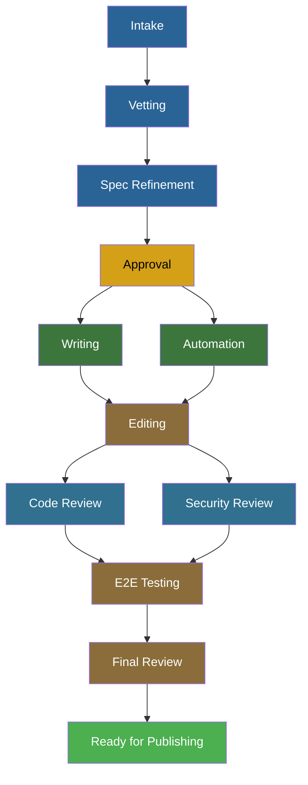

# Lifecycle Phases

The Publishing House lifecycle is a set of phases that tracks a content project from initial idea through catalog readiness. Phases have dependencies — some run in parallel, others must wait for earlier work to finish. Gates between phases control whether a project can advance.

## Phase Definitions

Every project progresses through a defined set of phases. Onboarded and self-published projects share the same 12-phase structure but differ in how strictly gates are enforced.

| Phase | Gate (Onboarded) | Gate (Self-Published) | Prerequisites |
|-------|-----------------|----------------------|---------------|
| `intake` | hard | hard | none |
| `vetting` | hard | hard | intake |
| `spec_refinement` | hard | soft | vetting |
| `approval` | soft | soft | spec_refinement |
| `writing` | hard | soft | approval |
| `automation` | hard | soft | approval |
| `editing` | hard | soft | writing AND automation |
| `code_review` | hard | soft | editing |
| `security_review` | hard | soft | editing |
| `e2e_testing` | hard | soft | code_review AND security_review |
| `final_review` | hard | soft | e2e_testing |
| `ready_for_publishing` | hard | soft | final_review |

!!! note "Approval gate"
    The onboarded approval gate is currently soft while the gate validation logic matures. This will become a hard gate to enforce spec quality before content production begins.

!!! note "Express mode"
    Express mode uses a minimal phase set (intake and vetting only) that is still being designed. See [Deployment Modes](../user/deployment-modes.md) for the current concept.

---

## Phase Flow

The lifecycle is not a linear sequence — it's a directed graph where some phases run in parallel. Two pairs of phases fan out and converge:



Key structural features:

1. **Writing and automation run in parallel after approval.** A content author writes lab modules while the automation engineer builds deployment code. Neither blocks the other.
2. **Editing requires both writing and automation to complete.** The editor needs the full picture — content and infrastructure — before reviewing.
3. **Code review and security review run in parallel after editing.** Different reviewers can work simultaneously.
4. **E2E testing requires both reviews to complete.** End-to-end testing runs after all review findings are resolved.

---

## Hard and Soft Gates

Every phase boundary has a gate. The gate type determines whether the system can prevent advancement.

**Hard gates** check prerequisites and may run additional validation — RCARS overlap analysis at vetting, spec quality review at approval. If validation fails, the project stays in its current phase until the issue is resolved.

**Soft gates** check the same prerequisites. Once all required prior phases are complete, the gate approves automatically. Validation still runs and findings are still recorded, but they're informational — the author decides whether to act on them.

Hard gates are used for onboarded projects because those items will appear in the RHDP catalog. Soft gates are used for self-published projects where the author owns the quality decision.

Both gate types record the decision — what phase was requested, whether it was approved, the rationale, and who was involved. These records build up a history of how the project moved through its lifecycle.

---

## Gate Service

When the orchestrator calls `ph_request_gate`, Central runs this flow:

1. **Fetch the manifest** from GitHub to ensure it's evaluating the latest committed state.
2. **Check prerequisites.** Are all required prior phases completed or skipped? If not, reject immediately — regardless of gate type.
3. **Run gate-specific logic.** For soft gates, approve once prerequisites pass. For hard gates, additional validation may run (see below).
4. **Record the decision** with findings, regardless of outcome.
5. **Sync to Jira** if the project has Jira tracking enabled and the gate approved.

### Vetting Gate

The vetting gate checks whether similar content already exists in the RHDP catalog.

Central submits the project's learning objectives and topic description to RCARS, which returns catalog items grouped by relevance. If there are several close matches, the author needs to explain how their content differs before advancing.

If RCARS is unavailable, the gate still passes — with a note that overlap analysis was skipped. An infrastructure issue should not block content development. The author can re-run vetting later when RCARS is back.

### Approval Gate

The approval gate is the most consequential — once a spec is approved, the project enters production phases where rework is expensive.

**Structural validation** checks the spec against the PH template: required sections present, minimum learning objectives defined, no unfilled placeholders, module map populated. These are objective checks — failures are clear.

**Quality review** uses an LLM to assess whether the spec is realistic, the infrastructure is feasible, and a writer could produce modules from it without ambiguity. The reviewer returns approve, needs-work, or reject with feedback.

**Jira task creation.** When the approval gate passes, Central creates per-module Jira tasks for the upcoming work — content, automation, and verification tasks for each module, plus cross-cutting review tasks. Supporting pages (intro, conclusion, overview) are excluded.

---

## Phase Statuses

Each phase in the manifest tracks its status:

- **`pending`** — not started yet
- **`in_progress`** — work has begun
- **`completed`** — done, gate passed
- **`skipped`** — intentionally bypassed (e.g., automation for a project reusing an existing catalog item)

The orchestrator sets `in_progress` when it dispatches a skill, and `completed` after a successful gate request. There is no backward transition.

---

## Gate Decision History

Every gate decision is recorded. This gives visibility into how a project moved through its lifecycle — who requested advancement, whether it was approved, and what findings were produced at each step. The `ph_get_history` tool returns the full history for a project, and the Central dashboard renders it as a timeline.

---

## Manifest Structure

The manifest's `lifecycle` block tracks phase state:

```yaml
lifecycle:
  current_phase: writing
  phases:
    intake: { status: completed, completed_at: "2026-06-01T..." }
    vetting: { status: completed, result: approved, rcars_response: {...} }
    spec_refinement: { status: completed, completed_at: "2026-06-05T..." }
    approval: { status: completed, approved_by: "reviewer@redhat.com" }
    writing: { status: in_progress, modules: [...] }
    automation: { status: pending, substeps: { requirements: pending, ... } }
    # ... remaining phases
```

Completed phases carry a timestamp. Some carry additional metadata: `vetting` stores the RCARS response, `approval` stores the approver, `writing` tracks per-module progress, and `automation` breaks into substeps.
