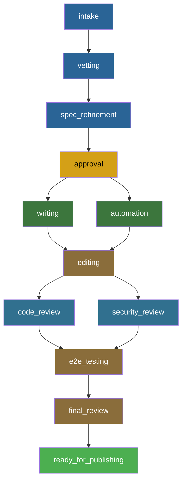

# Lifecycle Phases

The Publishing House lifecycle is a directed acyclic graph of 12 phases (onboarded/self-published) or 3 phases (express) that tracks a content project from initial idea through catalog readiness, with hard or soft gates controlling advancement at each boundary.

## Phase Definitions

Every project progresses through a defined set of phases. Onboarded and self-published projects share the same 12-phase structure but differ in gate strictness. Express mode uses a minimal 3-phase lifecycle because the author is reusing an existing catalog item rather than building new content.

### Onboarded and Self-Published Phases

| Phase | Gate Type (Onboarded) | Gate Type (Self-Published) | Prerequisites |
|-------|----------------------|---------------------------|---------------|
| `intake` | hard | hard | none |
| `vetting` | hard | hard | intake |
| `spec_refinement` | hard | soft | vetting |
| `approval` | soft | soft | spec_refinement |
| `writing` | hard | soft | approval |
| `automation` | hard | soft | approval |
| `editing` | hard | soft | writing AND automation |
| `code_review` | hard | soft | editing |
| `security_review` | hard | soft | editing |
| `e2e_testing` | hard | soft | code_review AND security_review |
| `final_review` | hard | soft | e2e_testing |
| `ready_for_publishing` | hard | soft | final_review |

**Note on the approval gate:** The onboarded approval gate is currently soft. This is a known TODO -- it should be hard to enforce spec quality before content production begins. The current soft state allows projects to advance past approval without formal sign-off, which is temporary while the gate validation logic matures.

### Express Phases

| Phase | Gate Type | Prerequisites |
|-------|-----------|---------------|
| `intake` | hard | none |
| `vetting` | soft | intake |
| `base_finding` | soft | vetting |

Express projects skip the full lifecycle because the author is selecting an existing base catalog item (via RCARS) and ordering it for a specific event. There is no content to write, automate, or review.

---

## The Phase DAG

The lifecycle is not a linear sequence. Two pairs of phases run in parallel, creating a DAG with fan-out and fan-in points:



The structural features of this DAG:

1. **Writing and automation run in parallel after approval.** A content author writes lab modules while the automation engineer builds the AgnosticV catalog item and deployment code. Neither blocks the other.

2. **Editing requires BOTH writing AND automation to complete.** The editor needs the full picture -- content and infrastructure -- before reviewing. This is the first fan-in point.

3. **Code review and security review run in parallel after editing.** Different reviewers can work simultaneously. Code review focuses on Showroom content quality, automation correctness, and catalog configuration. Security review checks for credential exposure, network policies, and RBAC configuration.

4. **E2E testing requires BOTH reviews to complete.** The second fan-in point. End-to-end testing should only run after all review findings are resolved.

5. **The tail is linear.** Final review and ready-for-publishing are sequential -- there is no reason to parallelize the final stages.

---

## Hard vs. Soft Gates

Every phase boundary has a gate. The gate type determines whether the system can block progress.

### Hard Gates

A hard gate blocks advancement until all prerequisites are met and Central's gate service explicitly approves. The gate service may run additional validation beyond prerequisite checking -- RCARS queries at vetting, spec validation at approval, structural checks at later phases. If any validation fails, the gate rejects the request and the project stays in its current phase.

Hard gates are used for onboarded projects because these items will appear in the RHDP catalog. Quality enforcement at phase boundaries prevents incomplete or substandard content from reaching production.

### Soft Gates

A soft gate checks the same prerequisites as a hard gate. If all required prior phases are completed (or skipped), the gate automatically approves. Validation still runs and findings are still recorded, but they are informational -- they never block progress.

Soft gates are used for self-published projects where the author owns the quality decision. The system provides feedback; the author decides whether to act on it.

### Gate Records

Both gate types produce a `GateRecord` in the custody chain. The record captures:

- **Phase** -- which phase the project is advancing to
- **Result** -- `approved`, `rejected`, or `overridden`
- **Reason** -- human-readable explanation of the decision
- **Findings** -- structured JSONB containing validation details (e.g., RCARS matches, spec review results)
- **Requested by** -- email of the person who triggered the gate request
- **Approved by** -- email of the person who approved (may differ from requester)
- **Self-approval flag** -- whether the requester and approver are the same person

The record is permanent. Gate decisions cannot be edited or deleted after the fact.

---

## Gate Service

When the orchestrator calls `ph_request_gate`, Central executes a multi-step validation pipeline. The steps vary by phase, but the overall flow is consistent.

### Common Flow (All Gates)

1. **Manifest fetch.** Central reads the project's `manifest.yaml` from GitHub at the specified branch. This ensures the gate evaluates the committed state, not a local working copy.

2. **Prerequisite check.** The PhaseEngine inspects the manifest's `lifecycle.phases` block. For each prerequisite phase, it verifies the status is `completed` or `skipped`. If any prerequisite is still `pending` or `in_progress`, the gate rejects immediately -- regardless of gate type.

3. **Gate-type dispatch.** For soft gates, if prerequisites pass, the gate approves and records the decision. For hard gates, additional validation runs (described below).

4. **GateRecord creation.** The gate decision is written to the custody chain with all findings, regardless of outcome.

5. **Jira sync.** If the project has Jira tracking enabled and the gate approved, Central syncs the phase transition to Jira. This step is non-blocking -- Jira failures do not revert the gate decision.

### Vetting Gate (Hard)

The vetting gate evaluates content overlap with existing RHDP catalog items using RCARS.

- Central submits a query to RCARS combining the project's learning objectives, topics, and target products.
- RCARS returns catalog items grouped by relevance tier (high, medium, low).
- **3 or more high-relevance matches:** The gate requires the author to articulate how the proposed content differs from existing items. Without clear differentiation, the gate rejects.
- **No matches at all:** The gate flags this for review -- either the spec is too vague to produce matches, or it genuinely covers new ground. The author should verify the spec is specific enough.
- **RCARS unavailability:** If RCARS cannot be reached or returns an error, hard gates block. The system does not let projects bypass vetting when it cannot verify content overlap.

### Approval Gate (Hard)

The approval gate runs two validation layers before deciding:

**1. Structural validation (SpecValidator).** Checks the project's `design.md` against the PH spec template:

- 9 required sections must be present (project overview, learning objectives, audience, module map, infrastructure, duration, success criteria, risks, and timeline)
- A minimum of 3 learning objectives must be defined
- No unfilled placeholders (e.g., `[TODO]`, `<FILL IN>`, `__BLANK__`)
- Module map must list at least one module with a title and description

Structural failures block the gate immediately. These are objective checks with no ambiguity.

**2. LLM quality review (SpecReviewer).** Claude Haiku assesses the spec for quality, infrastructure feasibility, and actionability:

- Returns one of: `approve`, `needs_work`, or `reject`
- A `reject` verdict blocks the hard gate
- A `needs_work` verdict includes specific feedback for the author
- If no LLM provider is configured, the quality review degrades gracefully -- it is skipped, not treated as a failure

**Self-approval prevention.** For onboarded projects, the project owner cannot approve their own spec. The `approved_by` field must differ from the project owner's email. Self-published projects do not enforce this restriction.

**Jira task creation (Phase 2).** When the approval gate passes, Central creates per-module Jira tasks for the downstream phases:

- One content task, one automation task, and one verification task per module
- One task each for code review, security review, e2e testing, and final review
- Supporting pages (introduction, conclusion, overview) are excluded from task generation -- only substantive modules get tracked

### Later Gates

Gates beyond approval follow the common flow without phase-specific validation. The hard/soft distinction still applies: hard gates block if prerequisites are not met, soft gates approve once prerequisites are satisfied.

---

## Custody Chain

The custody chain is the complete audit trail for a project's lifecycle. Every gate decision -- approved, rejected, or overridden -- is permanently recorded with its findings, timestamps, and actors.

The chain answers questions like:

- Who approved this project's spec, and when?
- What did RCARS find during vetting?
- Were any gates overridden, and by whom?
- What findings did the spec reviewer produce?

Each `GateRecord` stores findings as JSONB, so the full context of the gate evaluation is preserved. Reviewers can inspect not just the decision but the evidence that informed it.

The MCP tool `ph_get_history` returns the full custody chain for a project in chronological order. The Central dashboard's project detail page renders the chain as a timeline with expandable finding details.

---

## Phase Statuses

Each phase in the manifest tracks its status through a simple state machine:

```
pending → in_progress → completed
                      → skipped
```

- **`pending`** -- the phase has not started. This is the initial state for all phases.
- **`in_progress`** -- work has begun. The orchestrator sets this when it dispatches a skill to work on a phase.
- **`completed`** -- the phase is done and the gate passed. The orchestrator sets this after a successful gate request.
- **`skipped`** -- the phase was intentionally bypassed. Used for phases that do not apply to a particular project (e.g., automation for a demo that reuses an existing catalog item).

The manifest's `current_phase` field indicates which phase is currently active. For parallel phases (writing/automation, code_review/security_review), the orchestrator manages both and advances `current_phase` to the fan-in point (editing or e2e_testing) once both parallel tracks complete.

---

## Manifest Structure

The manifest's `lifecycle` block tracks phase state. Each phase entry records its status and phase-specific metadata:

```yaml
lifecycle:
  current_phase: writing
  phases:
    intake: { status: completed, completed_at: "2026-06-01T..." }
    vetting: { status: completed, result: approved, rcars_response: {...} }
    spec_refinement: { status: completed, completed_at: "2026-06-05T..." }
    approval: { status: completed, approved_by: "reviewer@redhat.com" }
    writing: { status: in_progress, modules: [...] }
    automation: { status: pending, substeps: { requirements: pending, ... } }
    # ... remaining phases follow the same pattern
```

Completed phases carry a `completed_at` timestamp. Some phases carry additional metadata: `vetting` stores the RCARS response, `approval` stores the approver's identity, `writing` tracks per-module progress, and `automation` breaks down into substeps (requirements, catalog item, code, testing).

The orchestrator reads this block to determine what work is available. Individual skills read their phase's entry to understand their inputs. Neither the orchestrator nor skills modify other phases' entries -- each skill owns only its own artifacts.

---

## Spec Validation at the Approval Gate

The approval gate is the most consequential in the lifecycle. Once a spec is approved, the project enters the production phases (writing, automation, editing, review). Catching spec problems after approval means rework across multiple phases.

### Layer 1: Structural Validation (SpecValidator)

The SpecValidator checks `design.md` against the PH spec template. It enforces objective, unambiguous requirements:

- **Required sections (9):** Project overview, learning objectives, target audience, module map, infrastructure requirements, estimated duration, success criteria, risks and mitigations, timeline. Missing sections are hard failures.
- **Learning objectives (minimum 3):** Each objective should be specific and measurable. The validator checks count, not quality -- quality is the LLM reviewer's job.
- **Placeholder detection:** Scans for common unfilled markers (`[TODO]`, `<FILL IN>`, `__BLANK__`, `TBD`, `FIXME`). Any match is a hard failure.
- **Module map completeness:** At least one module with a title and description. Modules without descriptions suggest the spec is incomplete.

### Layer 2: LLM Quality Review (SpecReviewer)

The SpecReviewer passes the spec to Claude Haiku for qualitative assessment. The LLM evaluates three dimensions:

- **Content quality:** Are the learning objectives achievable in the proposed format? Is the scope realistic for the estimated duration? Are the modules logically sequenced?
- **Infrastructure feasibility:** Can the described infrastructure be provisioned on RHDP? Are there resource requirements that exceed typical quotas? Are the technology versions compatible?
- **Actionability:** Could a content writer produce modules from this spec without ambiguity? Are the module descriptions detailed enough to write from?

The reviewer returns a structured verdict (`approve`, `needs_work`, `reject`) with per-dimension feedback. A `reject` blocks hard gates. A `needs_work` allows the author to revise and re-request.

If no LLM provider is configured (e.g., in a test environment), the quality review is skipped entirely. The gate falls back to structural validation only.

---

## Cross-References

- See [Central Backend](central.md) for the gate service implementation and MCP tool details
- See [Deployment Modes](../user/deployment-modes.md) for how gate types differ across onboarded, self-published, and express modes
- See [RCARS Integration](rcars-integration.md) for how the vetting gate queries RCARS
- See [Jira Integration](jira-integration.md) for how gate approvals trigger Jira task creation
