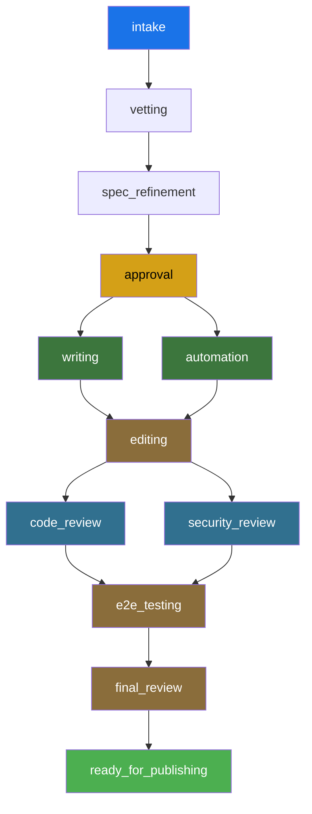

# PhaseEngine Explained

**File:** `rhdp-publishing-house-central/src/backend/app/services/phase_engine.py`  
**Lines:** 130 (pure logic, no I/O)  
**Purpose:** Deterministic lifecycle validation — the brain that decides what can happen next

---

## What Is PhaseEngine?

The PhaseEngine is the **rules engine** for Publishing House's content lifecycle. It answers three questions:

1. **Can this project advance to phase X?** (prerequisite checking)
2. **What should happen next?** (next action logic)
3. **How strict should gates be?** (deployment mode profiles)

It's **pure logic** — no database calls, no HTTP requests, no file I/O. You give it a manifest dictionary, it returns a decision. This makes it:
- ✅ **Testable** — 100% unit test coverage, no mocks needed
- ✅ **Fast** — microseconds to execute
- ✅ **Deterministic** — same manifest always produces same result
- ✅ **Portable** — could run in a Lambda, workflow, or browser

---

## Core Concept: Phase Profiles

Every deployment mode has a **phase profile** — a tuple of `PhaseDefinition` objects that define:

| Field | Meaning |
|-------|---------|
| `name` | Phase name (e.g., `"vetting"`) |
| `gate_type` | `"hard"` (must pass validation) or `"soft"` (informational only) |
| `prerequisites` | Tuple of phases that must be `completed` or `skipped` first |

### Three Profiles

```python
ONBOARDED_PHASES = (
    PhaseDefinition("intake", "hard", ()),
    PhaseDefinition("vetting", "hard", ("intake",)),
    PhaseDefinition("spec_refinement", "hard", ("vetting",)),
    PhaseDefinition("approval", "hard", ("spec_refinement",)),
    PhaseDefinition("writing", "hard", ("approval",)),
    PhaseDefinition("automation", "hard", ("approval",)),
    PhaseDefinition("editing", "hard", ("writing", "automation")),
    PhaseDefinition("code_review", "hard", ("editing",)),
    PhaseDefinition("security_review", "hard", ("editing",)),
    PhaseDefinition("e2e_testing", "hard", ("code_review", "security_review")),
    PhaseDefinition("final_review", "hard", ("e2e_testing",)),
    PhaseDefinition("ready_for_publishing", "hard", ("final_review",)),
)
```

**Key observations:**
- **Intake has no prerequisites** — always the starting point
- **Writing and automation both depend on approval** → can run in parallel
- **Editing requires BOTH writing AND automation** → convergence point
- **Code review and security review both depend on editing** → parallel again
- **E2E testing requires BOTH reviews** → second convergence point
- **All gates are hard** for onboarded (quality enforced)

```python
SELF_PUBLISHED_PHASES = (
    # Same phase names, same prerequisites...
    PhaseDefinition("intake", "hard", ()),
    PhaseDefinition("vetting", "soft", ("intake",)),  # ← soft gate
    PhaseDefinition("spec_refinement", "soft", ("intake",)),  # ← depends on intake only!
    PhaseDefinition("approval", "soft", ("spec_refinement",)),
    # ... rest are soft gates
)
```

**Key difference:**
- **All gates except intake are soft** → findings recorded but never block
- **Spec refinement can skip vetting** → faster iteration for self-published
- **Same structural ordering** → writing still requires approval

```python
EXPRESS_PHASES = (
    PhaseDefinition("intake", "hard", ()),
    PhaseDefinition("vetting", "soft", ("intake",)),
    PhaseDefinition("base_finding", "soft", ("intake",)),
)
```

**Key difference:**
- **Minimal phases** → no writing, editing, automation
- **Base finding** → identify reusable catalog item, customize, done

---

## Visualizing the DAG



This is a **directed acyclic graph (DAG)**:
- **Directed** — arrows show prerequisite order
- **Acyclic** — no loops (can't go backward)
- **Two fan-out points** — approval → writing/automation, editing → code/security review
- **Two convergence points** — editing, e2e_testing

---

## The Three Methods

### 1. `get_profile(deployment_mode: str)`

**Simple lookup** — returns the phase tuple for a mode.

```python
profile = PhaseEngine.get_profile("rhdp_published")
# Returns: ONBOARDED_PHASES tuple

profile = PhaseEngine.get_profile("self_published")
# Returns: SELF_PUBLISHED_PHASES tuple

profile = PhaseEngine.get_profile("invalid")
# Raises: ValueError("Unknown deployment mode: invalid")
```

### 2. `check_prerequisites(manifest: dict, target_phase: str)`

**Core validation** — Can this project advance to `target_phase`?

**Algorithm:**
1. Extract deployment mode from manifest
2. Get the phase profile for that mode
3. Find the `PhaseDefinition` for `target_phase`
4. For each prerequisite, check if its status is `"completed"` or `"skipped"`
5. If any prereq is missing → `{"met": False, "reason": "..."}`
6. If all prereqs satisfied → `{"met": True, "gate_type": "hard"/"soft"}`

**Example:**

```python
manifest = {
    "project": {"deployment_mode": "rhdp_published"},
    "lifecycle": {
        "current_phase": "writing",
        "phases": {
            "intake": {"status": "completed"},
            "vetting": {"status": "completed"},
            "spec_refinement": {"status": "completed"},
            "approval": {"status": "completed"},
            "writing": {"status": "in_progress"},
            "automation": {"status": "pending"},
            # ... rest pending
        }
    }
}

# Can we advance to editing?
result = PhaseEngine.check_prerequisites(manifest, "editing")
# Returns: {
#   "met": False,
#   "reason": "Prerequisites not met: automation must be completed"
# }

# Update manifest: automation completed
manifest["lifecycle"]["phases"]["automation"]["status"] = "completed"
manifest["lifecycle"]["phases"]["writing"]["status"] = "completed"

result = PhaseEngine.check_prerequisites(manifest, "editing")
# Returns: {
#   "met": True,
#   "reason": "All prerequisites satisfied",
#   "gate_type": "hard"
# }
```

**Edge case handling:**

```python
# Target phase not in profile
result = PhaseEngine.check_prerequisites(manifest, "nonexistent_phase")
# Returns: {
#   "met": False,
#   "reason": "Phase 'nonexistent_phase' not in rhdp_published profile"
# }
```

### 3. `get_next_action(manifest: dict)`

**Navigation logic** — What should the developer do next?

**Returns one of:**
- `{"next_phase": "X", "action": "continue", "detail": "..."}` — current phase in progress
- `{"next_phase": "X", "action": "advance", "detail": "..."}` — ready to move to next phase
- `{"next_phase": "X", "action": "start", "detail": "..."}` — ready to start current phase
- `{"next_phase": "X", "action": "blocked", "detail": "..."}` — prerequisites not met
- `{"next_phase": None, "action": "done", "detail": "..."}` — all phases complete

**Algorithm:**
1. Get current phase from manifest
2. Check current phase status:
   - `"in_progress"` → return `"continue"`
   - `"completed"` → check if next phase is ready
   - `"pending"` → check if this phase is ready to start
3. If all phases complete → return `"done"`

**Example walkthrough:**

```python
# Scenario 1: Work in progress
manifest = {
    "project": {"deployment_mode": "rhdp_published"},
    "lifecycle": {
        "current_phase": "writing",
        "phases": {
            "intake": {"status": "completed"},
            "vetting": {"status": "completed"},
            "spec_refinement": {"status": "completed"},
            "approval": {"status": "completed"},
            "writing": {"status": "in_progress"},  # ← Currently working
            # ... rest
        }
    }
}

result = PhaseEngine.get_next_action(manifest)
# Returns: {
#   "next_phase": "writing",
#   "action": "continue",
#   "detail": "Continue working on writing"
# }
```

```python
# Scenario 2: Phase complete, ready to advance
manifest["lifecycle"]["phases"]["writing"]["status"] = "completed"
manifest["lifecycle"]["phases"]["automation"]["status"] = "completed"

result = PhaseEngine.get_next_action(manifest)
# Returns: {
#   "next_phase": "editing",
#   "action": "advance",
#   "detail": "Ready to advance to editing"
# }
```

```python
# Scenario 3: Blocked
manifest["lifecycle"]["phases"]["writing"]["status"] = "completed"
manifest["lifecycle"]["phases"]["automation"]["status"] = "in_progress"  # ← Still working

result = PhaseEngine.get_next_action(manifest)
# Returns: {
#   "next_phase": "editing",
#   "action": "blocked",
#   "detail": "Prerequisites not met: automation must be completed"
# }
```

```python
# Scenario 4: All done
manifest["lifecycle"]["phases"]["ready_for_publishing"]["status"] = "completed"
# ... assume all other phases completed

result = PhaseEngine.get_next_action(manifest)
# Returns: {
#   "next_phase": None,
#   "action": "done",
#   "detail": "All phases complete"
# }
```

---

## How GateService Uses PhaseEngine

The `GateService` is the orchestration layer. It calls PhaseEngine for prerequisite checking, then adds:
- Database custody chain (who approved, when)
- External validation (RCARS, spec validator)
- Self-approval prevention (onboarded projects)
- Spec commit consistency checking

**Example flow:**

```python
# In GateService.evaluate_gate()

# 1. Check prerequisites via PhaseEngine
prereq = PhaseEngine.check_prerequisites(manifest, target_phase)
gate_type = prereq.get("gate_type", "hard")

if not prereq["met"]:
    # Reject immediately — prerequisites not satisfied
    record = GateRecord(result="rejected", reason=prereq["reason"])
    db.add(record)
    return {"approved": False, "reason": prereq["reason"]}

# 2. If soft gate and prereqs met → auto-approve
if gate_type == "soft":
    record = GateRecord(result="approved", reason="Soft gate — informational only")
    db.add(record)
    return {"approved": True, "gate_type": "soft"}

# 3. Hard gate → additional checks
# - Verify Central's custody chain (not just manifest)
# - Prevent self-approval on approval gate
# - Check spec commit consistency for vetting → approval
# - Run RCARS for vetting gate
# - Run spec validation for approval gate

# 4. Record decision
record = GateRecord(result="approved"/"rejected", findings=..., ...)
db.add(record)
```

---

## Why PhaseEngine Is Brilliant

### 1. **Pure Function Design**
No side effects. Same input → same output. Trivial to test:

```python
def test_editing_requires_writing_and_automation():
    manifest = _manifest(
        writing="completed",
        automation="completed"
    )
    result = PhaseEngine.check_prerequisites(manifest, "editing")
    assert result["met"] is True
```

No mocks, no database setup, no HTTP stubs. Just call it.

### 2. **Separation of Concerns**

| PhaseEngine | GateService |
|-------------|-------------|
| ✅ **What** can advance | ✅ **Who** requested it |
| ✅ Prerequisite DAG | ✅ Custody chain recording |
| ✅ Gate type (hard/soft) | ✅ External validation (RCARS) |
| ✅ Next action logic | ✅ Self-approval prevention |
| ❌ No database | ❌ No pure logic |
| ❌ No HTTP calls | ❌ No decisions |

PhaseEngine is the **policy**. GateService is the **enforcement**.

### 3. **Easily Extensible**

Want to add a new phase? One line:

```python
ONBOARDED_PHASES = (
    # ... existing phases ...
    PhaseDefinition("documentation_review", "hard", ("final_review",)),
    PhaseDefinition("ready_for_publishing", "hard", ("documentation_review",)),
)
```

Want a new deployment mode? Copy the tuple, tweak gate types:

```python
PARTNER_PHASES = (
    PhaseDefinition("intake", "hard", ()),
    PhaseDefinition("vetting", "hard", ("intake",)),
    # ... rest soft
)

_PROFILES = {
    "rhdp_published": ONBOARDED_PHASES,
    "self_published": SELF_PUBLISHED_PHASES,
    "express": EXPRESS_PHASES,
    "partner": PARTNER_PHASES,  # ← new mode
}
```

### 4. **Reusable Across Systems**

Because it's pure logic with no dependencies, you could:
- Run it in a browser (transpile to JS)
- Run it in a Lambda (no DB connection needed)
- Run it in a SonataFlow workflow (call as microservice)
- Run it in the CLI (validate manifest locally)
- Run it in tests (verify profile correctness)

### 5. **Self-Documenting**

The phase definitions **are** the documentation:

```python
PhaseDefinition("editing", "hard", ("writing", "automation"))
```

This one line tells you:
- Editing is a phase
- It has a hard gate
- It requires both writing AND automation to be complete
- No external docs needed

---

## Real-World Examples

### Example 1: Parallel Work

```python
# Developer finishes approval gate, starts writing
manifest["lifecycle"]["phases"]["approval"]["status"] = "completed"
manifest["lifecycle"]["phases"]["writing"]["status"] = "in_progress"
manifest["lifecycle"]["current_phase"] = "writing"

# Meanwhile, automation engineer starts automation in parallel
manifest["lifecycle"]["phases"]["automation"]["status"] = "in_progress"

# Both can advance because both depend only on approval, not each other:
PhaseEngine.check_prerequisites(manifest, "writing")     # ✅ met (approval done)
PhaseEngine.check_prerequisites(manifest, "automation")  # ✅ met (approval done)
PhaseEngine.check_prerequisites(manifest, "editing")     # ❌ blocked (need BOTH)
```

### Example 2: Soft vs. Hard Gates

```python
# Onboarded project tries to skip vetting
manifest = {
    "project": {"deployment_mode": "rhdp_published"},
    "lifecycle": {
        "phases": {
            "intake": {"status": "completed"},
            "vetting": {"status": "pending"},  # ← skipped
        }
    }
}

result = PhaseEngine.check_prerequisites(manifest, "spec_refinement")
# Returns: {"met": False, "reason": "vetting must be completed"}
# GateService sees gate_type="hard" → BLOCKS advancement

# Self-published project tries same thing
manifest["project"]["deployment_mode"] = "self_published"

result = PhaseEngine.check_prerequisites(manifest, "spec_refinement")
# Returns: {"met": True, "gate_type": "soft"}
# GateService sees gate_type="soft" → ALLOWS advancement (no vetting required)
```

### Example 3: Convergence Points

```python
# Developer tries to advance to editing with only writing done
manifest = {
    "project": {"deployment_mode": "rhdp_published"},
    "lifecycle": {
        "phases": {
            "intake": {"status": "completed"},
            "vetting": {"status": "completed"},
            "spec_refinement": {"status": "completed"},
            "approval": {"status": "completed"},
            "writing": {"status": "completed"},
            "automation": {"status": "in_progress"},  # ← Not done
        }
    }
}

result = PhaseEngine.check_prerequisites(manifest, "editing")
# Returns: {
#   "met": False,
#   "reason": "Prerequisites not met: automation must be completed"
# }

# This enforces the convergence — editing sees the full picture (content + infra)
```

---

## Testing Strategy

PhaseEngine has **100% test coverage** because it's pure logic:

```python
# Test file: tests/test_phase_engine.py

class TestPhaseProfiles:
    """Tests for profile definitions"""
    def test_onboarded_all_gates_are_hard(self):
        profile = PhaseEngine.get_profile("rhdp_published")
        for p in profile:
            assert p.gate_type == "hard"
    
    def test_self_published_only_intake_is_hard(self):
        profile = PhaseEngine.get_profile("self_published")
        # All gates except intake should be soft

class TestPrerequisites:
    """Tests for check_prerequisites"""
    def test_editing_requires_writing_and_automation(self):
        manifest = _manifest(writing="completed", automation="completed")
        result = PhaseEngine.check_prerequisites(manifest, "editing")
        assert result["met"] is True

class TestNextAction:
    """Tests for get_next_action"""
    def test_next_action_during_writing(self):
        manifest = _manifest(current="writing", writing="in_progress")
        result = PhaseEngine.get_next_action(manifest)
        assert result["action"] == "continue"
```

No mocks. No database setup. Just logic tests.

---

## Why NOT Convert to SonataFlow Workflows?

You **could** rewrite PhaseEngine as workflow conditions, but:

❌ **Loses testability**
```yaml
# Workflow YAML — how do you unit test this?
- name: CheckPrerequisites
  type: switch
  dataConditions:
    - condition: "${ .phases.writing.status == 'completed' and .phases.automation.status == 'completed' }"
      transition: ApproveGate
```

❌ **Loses clarity**
```python
# Python — crystal clear
PhaseDefinition("editing", "hard", ("writing", "automation"))

# vs YAML — verbose, nested, hard to scan
- name: editing
  prerequisites:
    - writing
    - automation
  gateType: hard
```

❌ **Loses portability**
- Python code runs anywhere (browser, CLI, Lambda, workflow, tests)
- YAML workflows run only in SonataFlow runtime

✅ **Best of both worlds:**
- Keep PhaseEngine as pure Python
- Expose it as a microservice (`POST /check-prerequisites`)
- SonataFlow workflows call it as a REST function
- Tests still run against the Python code directly

---

## Summary

**PhaseEngine is:**
- 130 lines of pure logic
- Zero dependencies (no DB, HTTP, filesystem)
- 100% deterministic (same input → same output)
- 100% tested (no mocks needed)
- The "brain" that decides what can happen next

**It defines:**
- Phase profiles (onboarded, self-published, express)
- Prerequisite DAG (what must come before what)
- Gate types (hard vs. soft enforcement)
- Next action logic (continue, advance, start, blocked, done)

**It powers:**
- Gate validation in `GateService`
- Orchestrator routing in skills
- Dashboard progress indicators
- Jira sync (what tasks to create/transition)

**Why it's brilliant:**
- Separates policy (PhaseEngine) from enforcement (GateService)
- Trivial to test, extend, and understand
- Could run anywhere (browser, workflow, Lambda, CLI)
- Self-documenting via phase definitions
