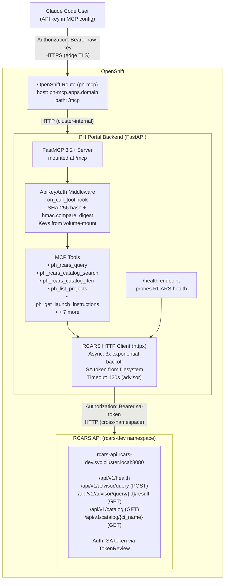
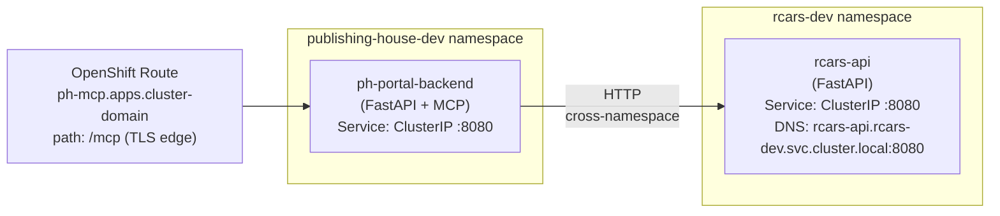

# RCARS Integration Architecture

## Overview

The Publishing House portal backend serves as a single MCP gateway to the RCARS v2 content advisory system. Claude Code users and the future portal chatbot access RCARS through authenticated MCP tools (`ph_rcars_query`, `ph_rcars_catalog_search`, `ph_rcars_catalog_item`) exposed at the `/mcp` endpoint. Skills never call RCARS directly -- the MCP server handles routing, authentication, and network access. If RCARS changes its API, skills remain unchanged.

## System Diagram

## Auth Model

Two authentication boundaries protect the integration.

### Boundary 1: External -- API Key Auth (Claude Code to PH MCP Server)

Claude Code users authenticate to the PH MCP endpoint using API keys sent as `Authorization: Bearer <raw-key>` headers.

- **Storage:** API keys are stored as SHA-256 hashes in a Kubernetes Secret (`ph-mcp-api-keys`) volume-mounted into the backend pod at `/etc/ph/mcp-api-keys/keys.yaml`
- **Format:** YAML map of `key-name: "sha256:<hex-digest>"` pairs. Key names are admin identifiers (who has this key), not user identity
- **Validation:** The FastMCP `ApiKeyAuth` Middleware intercepts every tool call via the `on_call_tool` hook. It hashes the incoming raw key with SHA-256 and compares against stored hashes using `hmac.compare_digest()` for timing-safe comparison
- **Rejection:** Missing or invalid API key raises a `ToolError` at the MCP protocol level
- **Lifecycle:** Keys are created, distributed, and revoked via the Ansible deployer workflow. See [MCP Auth Admin Guide](../admin/mcp-auth.md)
- **Key refresh:** Backend reads the key file at startup only. Adding or revoking a key requires a pod restart via redeployment (D-01)

### Boundary 2: Internal -- SA Token Auth (PH Backend to RCARS)

The PH backend authenticates to RCARS using its Kubernetes ServiceAccount token.

- **Token source:** Auto-mounted by Kubernetes at `/var/run/secrets/kubernetes.io/serviceaccount/token`. Re-read from the filesystem on every RCARS request (never cached) because K8s rotates tokens automatically
- **Validation:** RCARS middleware validates the token via the Kubernetes TokenReview API, then checks the authenticated identity against the `RCARS_SA_ALLOWLIST_STR` environment variable
- **Allowlist entry:** `system:serviceaccount:publishing-house-dev:default`
- **No secrets to manage:** K8s handles token lifecycle -- no creation, rotation, or revocation required
- **Configuration:** See [RCARS Service Auth Admin Guide](../admin/rcars-service-auth.md)

## Network Topology

The PH backend and RCARS API are deployed in separate OpenShift namespaces on the same cluster.

- **External access:** Only the `/mcp` path is exposed via the OpenShift Route. Internal backend APIs (`/api/v1/projects`, etc.) remain cluster-internal behind the existing OAuth-proxied Route
- **Cross-namespace calls:** Standard Kubernetes service DNS (`rcars-api.rcars-dev.svc.cluster.local:8080`). No special NetworkPolicy configuration required unless restrictive policies exist in either namespace

## Deployment Components

| Component | Repo | Changes | Managed By |
|-----------|------|---------|------------|
| RCARS SA token auth middleware | `rcars-advisory` | New TokenReview + allowlist auth dependency | RCARS Ansible deployer |
| RCARS HTTP client (`rcars_client.py`) | `rhdp-publishing-house-portal` | New httpx async client with retry and SA token | PH Ansible deployer |
| ApiKeyAuth middleware (`auth.py`) | `rhdp-publishing-house-portal` | FastMCP 3.2+ Middleware subclass, replaces Keycloak scaffolding | PH Ansible deployer |
| RCARS MCP tools (`rcars_tools.py`) | `rhdp-publishing-house-portal` | Three new tools: query, catalog search, catalog item | PH Ansible deployer |
| MCP Route | `rhdp-publishing-house-portal` | OpenShift Route for `/mcp` path with TLS edge | PH Ansible deployer |
| API key Secret | `rhdp-publishing-house-portal` | K8s Secret volume-mounted into backend pod | PH Ansible deployer |
| Health endpoint update | `rhdp-publishing-house-portal` | RCARS connectivity sub-check in `/health` response | PH Ansible deployer |
| Intake skill vetting update | `rhdp-publishing-house` (skills-plugin) | Replace broken `curl` with `ph_rcars_query` MCP tool reference | Committed to dev repo |
| Documentation (5 files) | `rhdp-publishing-house` | Architecture, admin guides, user guide, API reference | Committed to dev repo |

## Data Flow

Step-by-step flow for a typical `ph_rcars_query` call from Claude Code to RCARS and back.

1. **Claude Code user** sends a message like "Check if there's existing content covering OpenShift GitOps with ArgoCD"
2. **Claude Code** recognizes the `ph_rcars_query` tool is relevant and invokes it via MCP with the query string
3. **MCP transport** sends the tool call over HTTPS to `https://ph-mcp.apps.<cluster-domain>/mcp` with the `Authorization: Bearer <raw-api-key>` header
4. **OpenShift Route** (`ph-mcp`) terminates TLS and forwards to the PH backend service on port 8080
5. **FastMCP Server** receives the MCP tool call request
6. **ApiKeyAuth Middleware** (`on_call_tool` hook) extracts the `Authorization` header, hashes the raw key with SHA-256, and compares against stored hashes using `hmac.compare_digest()`. If invalid, returns a `ToolError`
7. **`ph_rcars_query` tool** is dispatched. It instantiates an `RCARSClient` and calls `query_advisor(query)`
8. **RCARSClient** reads the SA token from `/var/run/secrets/kubernetes.io/serviceaccount/token` and sends `POST /api/v1/advisor/query` to `rcars-api.rcars-dev.svc.cluster.local:8080` with `Authorization: Bearer <sa-token>`
9. **RCARS API** validates the SA token via TokenReview, checks the allowlist, and enqueues the advisor job. Returns `{"job_id": "<uuid>"}`
10. **RCARSClient** polls `GET /api/v1/advisor/query/{job_id}/result` every 10 seconds until the status is `completed` or `failed`, or 120 seconds elapse
11. **RCARS** returns structured results with matching catalog items, relevance tiers (green/yellow/white), and rationale text
12. **`ph_rcars_query` tool** returns the structured result dict to the MCP server
13. **FastMCP Server** sends the MCP response back to Claude Code
14. **Claude Code** presents the results to the user and uses them to inform the intake vetting judgment

If RCARS is unavailable at step 8, the RCARSClient retries 3 times with exponential backoff (1s, 2s, 4s). If all retries fail, the tool returns `{"error": "...", "status": "unavailable"}` so the skill can gracefully skip vetting.

## Related Documentation

- [MCP Auth Admin Guide](../admin/mcp-auth.md) -- API key lifecycle management
- [RCARS Service Auth Admin Guide](../admin/rcars-service-auth.md) -- SA token auth and allowlist config
- [Claude Code Setup Guide](../user/claude-code-setup.md) -- End-user MCP configuration
- [MCP Tools Reference](../api/mcp-tools.md) -- Tool parameters, return shapes, examples
