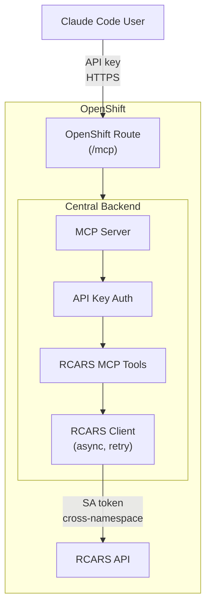
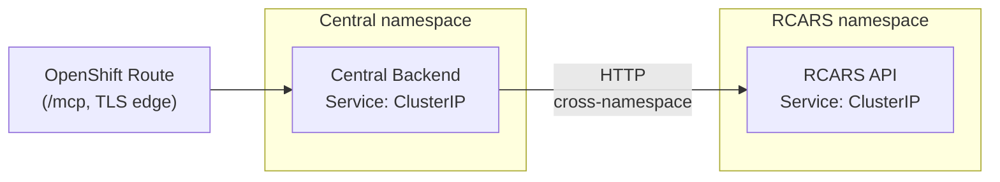

# RCARS Integration Architecture

## Overview

The Publishing House Central backend serves as a single MCP gateway to the RCARS v2 content advisory system. Claude Code users and the future Central chatbot access RCARS through authenticated MCP tools (`ph_rcars_query`, `ph_rcars_catalog_search`, `ph_rcars_catalog_item`) exposed at the `/mcp` endpoint. Skills never call RCARS directly -- the MCP server handles routing, authentication, and network access. If RCARS changes its API, skills remain unchanged.

## System Diagram

## Auth Model

Two authentication boundaries protect the integration.

### Boundary 1: Claude Code to Central (API Key)

Claude Code users authenticate with API keys. Keys are stored securely in a Kubernetes Secret. See [MCP Authentication](../admin/mcp-auth.md) for key management.

### Boundary 2: Central to RCARS (ServiceAccount Token)

Central authenticates to RCARS using a Kubernetes ServiceAccount token. Tokens are managed automatically by Kubernetes -- no manual key provisioning or rotation needed. The token is re-read from the filesystem on every request to handle automatic rotation.

## Network Topology

The Central backend and RCARS API are deployed in separate OpenShift namespaces on the same cluster. Communication between them uses standard Kubernetes cross-namespace service DNS.

- **External access:** Only the `/mcp` path is exposed via the OpenShift Route. Internal backend APIs remain cluster-internal behind the existing OAuth-proxied Route.
- **Cross-namespace calls:** Standard Kubernetes service DNS. No special NetworkPolicy configuration required unless restrictive policies exist in either namespace.

## Data Flow

A typical `ph_rcars_query` call follows this flow:

1. **User asks a question** -- e.g., "Check if there's existing content covering OpenShift GitOps with ArgoCD"
2. **Claude Code calls the MCP tool** -- sends `ph_rcars_query` to Central's MCP endpoint, authenticated with an API key
3. **Central authenticates the request** -- validates the API key and dispatches the tool
4. **RCARS client submits the query** -- Central's RCARS client authenticates with a ServiceAccount token and submits an advisor query to RCARS
5. **RCARS processes and returns results** -- Central polls until the advisor job completes, then returns structured results with matching catalog items, relevance tiers, and rationale
6. **Results delivered to the user** -- Claude Code presents the results and uses them to inform the vetting judgment

If RCARS is unavailable, the client retries 3 times with exponential backoff. If all retries fail, the tool returns an error status so the skill can handle the failure gracefully.