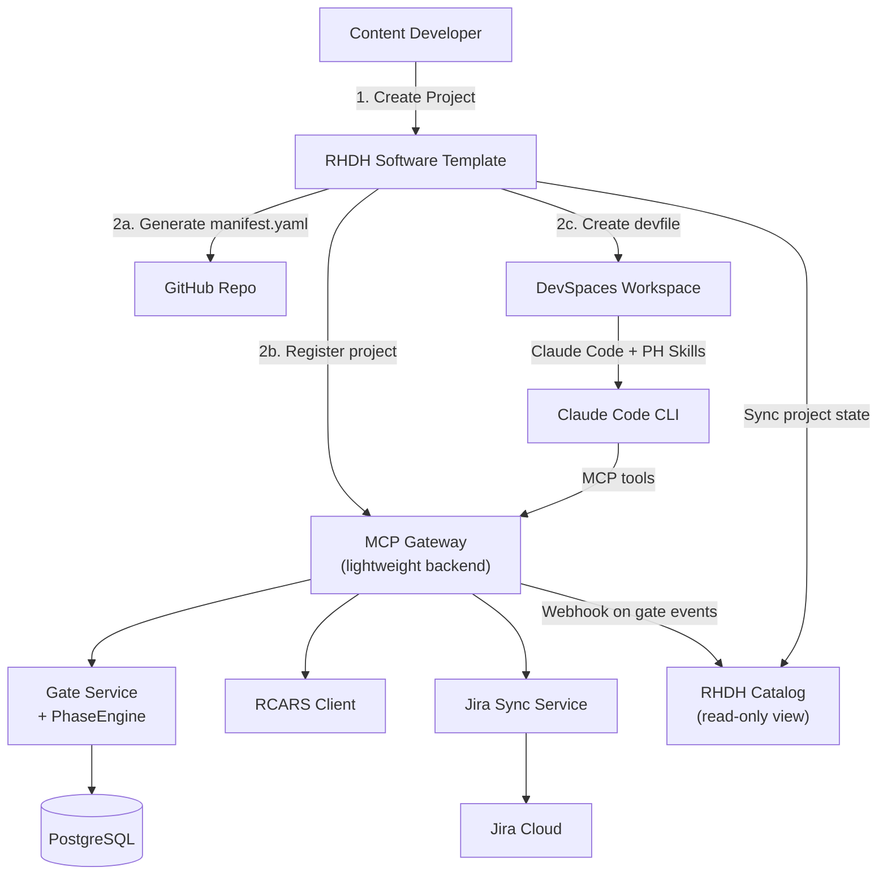

# RHDH Integration Architecture

**Date:** 2026-07-06  
**Status:** Proposed  
**Author:** Tyrell Reddy

## Overview

Replace the Central dashboard and intake flow with Red Hat Developer Hub (RHDH/Backstage) while keeping the validation engine and MCP gateway as a lightweight backend service.

## Architecture



## Component Responsibilities

### RHDH Software Template

**Replaces:** Central intake flow, dashboard registration UI, workspace creation

**Template Questions:**
```yaml
# template.yaml - Software Template definition
parameters:
  - title: Project Information
    properties:
      project_name:
        title: Project Name
        type: string
        description: "E.g., 'OpenShift AI Workshop'"
      
      project_type:
        title: Project Type
        type: string
        enum: [workshop, lab, demo]
      
      deployment_mode:
        title: Deployment Mode
        type: string
        enum: [rhdp_published, self_published, express]
        enumNames: [Onboarded, Self-Published, Express]
      
      github_repo:
        title: GitHub Repository
        type: string
        description: "Existing repo URL or org/name for new repo"
      
      owner_email:
        title: Owner Email
        type: string
        ui:field: OwnerPicker
      
      jira_initiative_key:
        title: Jira Initiative (optional)
        type: string
        description: "Link to existing Initiative (e.g., RHDPCD-25)"
        condition:
          deployment_mode: rhdp_published
```

**Template Actions:**
```yaml
steps:
  # 1. Create/clone GitHub repo from template
  - id: fetch-base
    name: Fetch PH Template
    action: fetch:template
    input:
      url: https://github.com/rhpds/rhdp-publishing-house-template
      values:
        project_name: ${{ parameters.project_name }}
        deployment_mode: ${{ parameters.deployment_mode }}
        owner_email: ${{ parameters.owner_email }}
  
  # 2. Publish to GitHub
  - id: publish
    name: Publish Repository
    action: publish:github
    input:
      repoUrl: ${{ parameters.github_repo }}
      defaultBranch: main
  
  # 3. Register with PH MCP Gateway
  - id: register-ph
    name: Register with Publishing House
    action: http:backstage:request
    input:
      method: POST
      url: https://ph-mcp.apps.cluster/api/v1/projects/register
      body:
        repo_url: ${{ steps.publish.output.remoteUrl }}
        branch: main
        deployment_mode: ${{ parameters.deployment_mode }}
        owner_email: ${{ parameters.owner_email }}
        jira_initiative_key: ${{ parameters.jira_initiative_key }}
  
  # 4. Provision MaaS API key via MCP Gateway
  - id: provision-key
    name: Provision MaaS Key
    action: http:backstage:request
    input:
      method: POST
      url: https://ph-mcp.apps.cluster/api/v1/workspaces/provision-key
      body:
        project_id: ${{ steps['register-ph'].output.project_id }}
        user_email: ${{ parameters.owner_email }}
  
  # 5. Generate devfile with injected secrets
  - id: create-devfile
    name: Create DevSpaces Devfile
    action: fetch:template
    input:
      url: ./devfile-template
      values:
        repo_url: ${{ steps.publish.output.remoteUrl }}
        maas_api_key: ${{ steps['provision-key'].output.api_key }}
        mcp_endpoint: https://ph-mcp.apps.cluster/mcp
        project_id: ${{ steps['register-ph'].output.project_id }}
  
  # 6. Create DevSpaces workspace
  - id: create-workspace
    name: Launch DevSpaces Workspace
    action: devspaces:create
    input:
      devfile: ${{ steps['create-devfile'].output.devfile }}
      namespace: ph-${{ parameters.owner_email | replace('@', '-') }}

outputs:
  - title: Repository
    url: ${{ steps.publish.output.remoteUrl }}
  
  - title: DevSpaces Workspace
    url: ${{ steps['create-workspace'].output.workspaceUrl }}
  
  - title: PH Project
    url: https://backstage.apps.cluster/catalog/default/component/${{ parameters.project_name | lower }}
```

### MCP Gateway (Lightweight Backend)

**What stays from Central:**
- FastAPI app with FastMCP server at `/mcp`
- All MCP tools (`ph_register`, `ph_request_gate`, etc.)
- `GateService` + `PhaseEngine` (validation logic)
- `JiraSyncService` (automatic ticket creation/updates)
- `RCARSClient` (content vetting)
- `GitRepoReader` (manifest parsing)
- PostgreSQL database (GateRecord, SubmittedResult, JiraTaskMapping)

**What's removed:**
- ❌ Dashboard frontend (Next.js) — replaced by RHDH Catalog
- ❌ Project registration UI — replaced by RHDH Software Template
- ❌ Workspace management UI — replaced by DevSpaces native UI + RHDH

**New REST endpoints for RHDH:**
```python
# app/api/rhdh.py - RHDH-specific endpoints

@router.post("/api/v1/projects/register")
async def register_project_from_rhdh(
    repo_url: str,
    branch: str,
    deployment_mode: str,
    owner_email: str,
    jira_initiative_key: str | None = None,
) -> dict:
    """Register project and optionally create Jira Epic.
    
    Called by RHDH Software Template after repo creation.
    """
    # Fetch manifest from GitHub
    # Register in DB
    # Create Jira Epic if deployment_mode == rhdp_published
    # Return project_id for subsequent steps

@router.post("/api/v1/projects/{project_id}/webhook")
async def webhook_to_rhdh(project_id: str, event: dict):
    """Webhook triggered on gate events to update RHDH Catalog.
    
    Events: gate_approved, phase_completed, jira_synced
    """
    # Push event to RHDH Catalog API to update entity metadata
```

### RHDH Catalog Entity

Projects appear in RHDH Catalog with metadata synced from MCP Gateway:

```yaml
# catalog-info.yaml (generated by template, updated by webhook)
apiVersion: backstage.io/v1alpha1
kind: Component
metadata:
  name: openshift-ai-workshop
  title: OpenShift AI Workshop
  annotations:
    publishing-house/project-id: "abc-123-def"
    publishing-house/deployment-mode: "rhdp_published"
    publishing-house/repo-url: "https://github.com/rhpds/openshift-ai-workshop"
    publishing-house/current-phase: "writing"
    jira/project-key: "RHDPCD"
    jira/epic-key: "RHDPCD-200"
  links:
    - url: https://github.com/rhpds/openshift-ai-workshop
      title: GitHub Repository
      icon: github
    - url: https://redhat.atlassian.net/browse/RHDPCD-200
      title: Jira Epic
      icon: dashboard
    - url: https://devspaces.apps.cluster/workspace-abc123
      title: DevSpaces Workspace
      icon: catalog
spec:
  type: publishing-house-project
  lifecycle: writing
  owner: user:treddy
  system: rhdp-content
```

### RHDH Plugin: Publishing House Status

Custom Backstage plugin to display phase progress:

```typescript
// plugins/publishing-house/src/components/PhaseProgress.tsx

export const PhaseProgressCard = () => {
  const { entity } = useEntity();
  const projectId = entity.metadata.annotations?.['publishing-house/project-id'];
  
  // Fetch from MCP Gateway REST API
  const { data } = useFetch(`https://ph-mcp.apps.cluster/api/v1/projects/${projectId}`);
  
  return (
    <InfoCard title="Publishing House Progress">
      <PhaseTimeline phases={data.phases} />
      <GateDecisions history={data.gate_history} />
      <JiraTaskList tasks={data.jira_tasks} />
    </InfoCard>
  );
};
```

## Devfile Template

Generated by RHDH template, provisions workspace with:

```yaml
# .devfile.yaml (injected into repo by template)
schemaVersion: 2.2.0
metadata:
  name: ph-workspace-openshift-ai-workshop
  namespace: ph-treddy

components:
  - name: dev
    container:
      image: quay.io/rhpds/publishing-house-udi:latest
      memoryLimit: 4Gi
      cpuLimit: 2
      env:
        - name: MAAS_API_KEY
          value: "sk-..."  # Provisioned by template
        - name: MCP_ENDPOINT
          value: "https://ph-mcp.apps.cluster/mcp"
        - name: PROJECT_ID
          value: "abc-123-def"
        - name: PROJECT_REPO_NAME
          value: "openshift-ai-workshop"
      
projects:
  - name: project
    git:
      remotes:
        origin: https://github.com/rhpds/openshift-ai-workshop
      checkoutFrom:
        revision: main

commands:
  - id: post-start
    exec:
      component: dev
      commandLine: /opt/ph/scripts/workspace-startup.sh
      workingDir: /projects

events:
  postStart:
    - post-start
```

## Data Flow

### 1. Project Creation Flow

```
Developer → RHDH Template UI
  ↓
Template asks questions (name, mode, repo, etc.)
  ↓
Template actions:
  1. Create/clone GitHub repo from PH template
  2. POST /api/v1/projects/register → MCP Gateway
     - Fetches manifest.yaml from new repo
     - Creates Project + GateRecord (intake completed)
     - Creates Jira Epic if onboarded
     - Returns project_id
  3. POST /api/v1/workspaces/provision-key
     - Creates MaaS virtual key via LiteLLM
     - Returns api_key (30d TTL)
  4. Generate devfile with injected secrets
  5. Create DevSpaces workspace via devfile
  ↓
Developer lands in browser VS Code with:
  - Claude Code CLI pre-configured
  - PH skills installed
  - Project repo cloned
  - MaaS key set
  - MCP endpoint configured
```

### 2. Active Development Flow

```
Developer in DevSpaces → runs /rhdp-publishing-house
  ↓
Orchestrator skill → calls MCP tools
  ↓
MCP Gateway → validates gates, records decisions
  ↓
On gate approval → webhook to RHDH
  ↓
RHDH Catalog entity updated (current_phase, gate_history)
```

### 3. Cross-Project Visibility

```
Manager opens RHDH Catalog
  ↓
Views Component list filtered by type=publishing-house-project
  ↓
Sees all projects with phase status (via annotations)
  ↓
Clicks project → PH Status plugin shows:
  - Phase timeline
  - Gate decisions
  - Jira tasks
  - Links to repo, workspace, Jira Epic
```

## Migration Path

### Phase 1: Keep Central, Add RHDH Template
- Deploy RHDH alongside Central
- Create Software Template that calls Central's existing API
- Template provisions workspace via Central's workspace endpoints
- Central dashboard still works, RHDH Catalog is read-only view

### Phase 2: Move Workspace Provisioning to Template
- Template directly creates DevSpaces workspace (not via Central)
- Template directly provisions MaaS key via LiteLLM
- Remove workspace management from Central UI
- Central keeps MCP tools, gate service, Jira sync

### Phase 3: Remove Central Dashboard
- All project discovery via RHDH Catalog
- RHDH PH plugin replaces Central dashboard detail views
- Central becomes headless MCP Gateway + REST API

### Phase 4 (Optional): Evaluate Backstage Backend Plugin
- Could rewrite gate service as a Backstage backend plugin
- Still needs MCP server for skill communication
- Complexity vs. benefit unclear

## Benefits

✅ **Better Developer Experience**
- Self-service project creation via familiar Backstage UI
- One-click workspace provisioning
- Catalog-based discovery (search, filter, browse)

✅ **Reduced Maintenance**
- No custom dashboard to maintain
- Leverage RHDH's auth, RBAC, plugin ecosystem
- Central shrinks to focused validation engine

✅ **Integration with RHDP Ecosystem**
- RHDH can be the single portal for all RHDP tooling
- Catalog can include AgnosticV configs, Showroom labs, PH projects
- Unified developer portal

## Drawbacks

❌ **Two Systems to Deploy**
- RHDH (complex Backstage deployment)
- MCP Gateway (lightweight but still necessary)

❌ **Webhook Sync Complexity**
- Need to keep RHDH Catalog in sync via webhooks
- Risk of drift if webhook delivery fails

❌ **Plugin Development Required**
- Custom RHDH plugin for PH-specific UI
- Maintenance burden

❌ **Loss of Integrated Dashboard**
- Current Central dashboard is purpose-built for PH workflow
- RHDH Catalog is more generic, requires plugins to match

## Decision Points

### Keep or Replace?

**Keep Central as-is if:**
- PH is the only content tool (no broader developer portal)
- Team prefers purpose-built UI over generic catalog
- Avoiding RHDH deployment complexity

**Migrate to RHDH if:**
- Already deploying RHDH for broader developer portal
- Want self-service project creation UX
- Need to integrate with other Backstage plugins (Jira, GitHub, etc.)

### Hybrid Recommendation (Short-Term)

**Phase 1 only:** Add RHDH Software Template that calls Central's API. Developers can choose:
- RHDH template (self-service, one-click)
- OR `/rhdp-publishing-house` skill (conversational, guided)

Both paths lead to the same Central backend. Evaluate adoption before committing to dashboard replacement.

## Open Questions

1. **Does RHDH DevSpaces integration support custom devfile injection?**
   - Need to verify template can pass secrets (MaaS key) securely

2. **How to handle MaaS key rotation in devfile?**
   - Current approach: workspace startup script validates key
   - RHDH approach: template provisions 30d key, user recreates workspace after expiry?

3. **RHDH Catalog vs. Central DB as source of truth?**
   - Recommendation: Central DB is truth, RHDH is read-only view
   - Webhook sync on gate events keeps catalog current

4. **Authentication for MCP Gateway REST API?**
   - Skills use API key (existing)
   - RHDH template needs API key for registration endpoint
   - Store in RHDH secret, inject into template environment

## Next Steps

1. Deploy RHDH in dev environment
2. Create basic Software Template (no MaaS key, just repo creation)
3. Test DevSpaces workspace creation from template
4. Add REST endpoint to Central for RHDH registration
5. Build prototype RHDH plugin for phase status display
6. User testing: compare template UX vs. skill-based intake
7. Decide: full migration or hybrid approach
