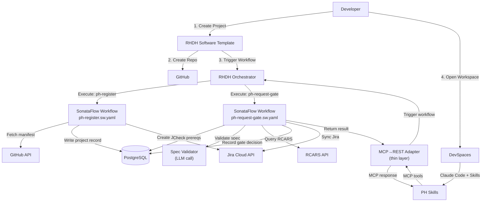

# RHDH Orchestrator Integration - Maximum Replacement

**Date:** 2026-07-06  
**Status:** Proposed  
**Author:** Tyrell Reddy

## Overview

Leverage RHDH Orchestrator (SonataFlow) to replace **most** of the Central backend, keeping only a thin MCP→REST adapter for skill communication.

## What RHDH Orchestrator Replaces

Based on [RHDH Orchestrator capabilities](https://docs.redhat.com/en/documentation/red_hat_developer_hub/1.7/html-single/orchestrator_in_red_hat_developer_hub/index):

| Central Component | RHDH Orchestrator Replacement |
|------------------|-------------------------------|
| GateService Python code | ✅ SonataFlow workflow (`ph-request-gate.sw.yaml`) |
| PhaseEngine Python logic | ✅ Workflow state conditions + PostgreSQL queries |
| JiraSyncService | ✅ Workflow triggered by gate events, calls Jira API |
| RCARSClient | ✅ Workflow REST function calls RCARS |
| GitRepoReader | ✅ Workflow REST function calls GitHub API |
| SpecValidator | ✅ Workflow step calls validation service or inline logic |
| Dashboard UI | ✅ RHDH Catalog + Orchestrator plugin |
| PostgreSQL access | ✅ Workflows can read/write DB via [Data Index Service](https://www.rhdhorchestrator.io/1.7/docs/architecture/) |

## Architecture



## Component Details

### 1. MCP→REST Adapter (Minimal)

**Purpose:** Translate MCP tool calls from skills to SonataFlow workflow REST invocations

**Size:** ~200 lines of Python

```python
# app/main.py - Thin MCP adapter
from fastmcp import FastMCP
import httpx

mcp = FastMCP(name="publishing-house")
WORKFLOW_BASE = "https://sonataflow.apps.cluster"

@mcp.tool()
def ph_register(repo_url: str, branch: str = "main") -> dict:
    """Trigger ph-register workflow."""
    response = httpx.post(
        f"{WORKFLOW_BASE}/ph-register",
        json={"repo_url": repo_url, "branch": branch},
        timeout=30.0,
    )
    response.raise_for_status()
    return response.json()

@mcp.tool()
def ph_request_gate(repo_url: str, branch: str, target_phase: str, requested_by: str) -> dict:
    """Trigger ph-request-gate workflow."""
    response = httpx.post(
        f"{WORKFLOW_BASE}/ph-request-gate",
        json={
            "repo_url": repo_url,
            "branch": branch,
            "target_phase": target_phase,
            "requested_by": requested_by,
        },
        timeout=60.0,
    )
    response.raise_for_status()
    return response.json()

@mcp.tool()
def ph_get_status(repo_url: str, branch: str) -> dict:
    """Query project status from PostgreSQL."""
    response = httpx.get(
        f"{WORKFLOW_BASE}/query/project-status",
        params={"repo_url": repo_url, "branch": branch},
    )
    response.raise_for_status()
    return response.json()

# ... remaining MCP tools follow same pattern
```

### 2. SonataFlow Workflow: ph-register

**File:** `workflows/ph-register.sw.yaml`

```yaml
id: ph-register
version: "1.0"
specVersion: "0.8"
name: Publishing House - Register Project
description: Register a project from its GitHub repo

start: FetchManifest

functions:
  - name: fetchManifest
    operation: https://api.github.com/repos/{owner}/{repo}/contents/publishing-house/manifest.yaml
    type: rest
  
  - name: writeProject
    operation: specs/writeProject.json#writeProject
    type: rest
  
  - name: createJiraEpic
    operation: https://redhat.atlassian.net/rest/api/3/issue
    type: rest

states:
  - name: FetchManifest
    type: operation
    actions:
      - name: GetManifestFromGitHub
        functionRef:
          refName: fetchManifest
          arguments:
            owner: "${ .repo_url | split(\"/\") | .[-2] }"
            repo: "${ .repo_url | split(\"/\") | .[-1] | split(\".\") | .[0] }"
            ref: "${ .branch }"
        actionDataFilter:
          toStateData: "${ .manifest_raw }"
    
    transition: ParseManifest
  
  - name: ParseManifest
    type: operation
    actions:
      - name: DecodeAndParse
        functionRef: yamlParse
        arguments:
          content: "${ .manifest_raw.content | base64decode }"
        actionDataFilter:
          toStateData: "${ .manifest }"
    
    transition: CheckExistingProject
  
  - name: CheckExistingProject
    type: operation
    actions:
      - name: QueryDB
        functionRef: queryPostgres
        arguments:
          query: "SELECT id FROM projects WHERE repo_url = $1 AND branch = $2"
          params: ["${ .repo_url }", "${ .branch }"]
        actionDataFilter:
          toStateData: "${ .existing_project }"
    
    transition: WriteProject
  
  - name: WriteProject
    type: operation
    actions:
      - name: UpsertProject
        functionRef: writeProject
        arguments:
          manifest: "${ .manifest }"
          repo_url: "${ .repo_url }"
          branch: "${ .branch }"
        actionDataFilter:
          toStateData: "${ .project }"
    
    transition: CheckJiraEnabled
  
  - name: CheckJiraEnabled
    type: switch
    dataConditions:
      - condition: "${ .manifest.project.deployment_mode == \"rhdp_published\" }"
        transition: CreateJiraEpic
    
    defaultCondition:
      transition: ReturnResult
  
  - name: CreateJiraEpic
    type: operation
    actions:
      - name: CallJiraAPI
        functionRef: createJiraEpic
        arguments:
          fields:
            project:
              key: RHDPCD
            summary: "${ .manifest.project.name }"
            issuetype:
              name: Epic
            description: "PH Project: ${ .repo_url }"
        actionDataFilter:
          toStateData: "${ .epic }"
    
    transition: ReturnResult
  
  - name: ReturnResult
    type: operation
    actions:
      - name: FormatResponse
        functionRef: jsonFormat
        arguments:
          project_id: "${ .project.id }"
          name: "${ .project.name }"
          deployment_mode: "${ .manifest.project.deployment_mode }"
          current_phase: "${ .manifest.lifecycle.current_phase }"
          epic_key: "${ .epic.key // null }"
    
    end: true
```

### 3. SonataFlow Workflow: ph-request-gate

**File:** `workflows/ph-request-gate.sw.yaml`

```yaml
id: ph-request-gate
version: "1.0"
specVersion: "0.8"
name: Publishing House - Request Gate
description: Validate prerequisites and approve/reject phase advancement

start: FetchManifest

functions:
  - name: fetchManifest
    operation: https://api.github.com/repos/{owner}/{repo}/contents/publishing-house/manifest.yaml
    type: rest
  
  - name: checkPrerequisites
    operation: specs/phaseEngine.json#checkPrerequisites
    type: rest
  
  - name: queryRCARS
    operation: http://rcars-api.rcars-dev.svc.cluster.local:8080/api/v2/advisor/query
    type: rest
  
  - name: validateSpec
    operation: specs/specValidator.json#validate
    type: rest
  
  - name: writeGateRecord
    operation: specs/gateRecord.json#create
    type: rest

states:
  - name: FetchManifest
    type: operation
    actions:
      - name: GetManifest
        functionRef: fetchManifest
        arguments:
          owner: "${ .repo_url | split(\"/\") | .[-2] }"
          repo: "${ .repo_url | split(\"/\") | .[-1] | split(\".\") | .[0] }"
          ref: "${ .branch }"
    
    transition: ParseManifest
  
  - name: ParseManifest
    type: operation
    actions:
      - name: Decode
        functionRef: yamlParse
        arguments:
          content: "${ .manifest_raw.content | base64decode }"
        actionDataFilter:
          toStateData: "${ .manifest }"
    
    transition: CheckPrerequisites
  
  - name: CheckPrerequisites
    type: operation
    actions:
      - name: CallPhaseEngine
        functionRef: checkPrerequisites
        arguments:
          manifest: "${ .manifest }"
          target_phase: "${ .target_phase }"
        actionDataFilter:
          toStateData: "${ .prereq_check }"
    
    transition: EvaluatePrereqs
  
  - name: EvaluatePrereqs
    type: switch
    dataConditions:
      - condition: "${ .prereq_check.met == false }"
        transition: RejectGate
      
      - condition: "${ .target_phase == \"vetting\" }"
        transition: RunVetting
      
      - condition: "${ .target_phase == \"approval\" }"
        transition: ValidateSpec
    
    defaultCondition:
      transition: ApproveGate
  
  - name: RunVetting
    type: operation
    actions:
      - name: CallRCARS
        functionRef: queryRCARS
        arguments:
          query: "${ .manifest.project.name } covering ${ .manifest.spec.objectives }"
          stages: ["prod"]
        actionDataFilter:
          toStateData: "${ .rcars_result }"
    
    transition: ApproveGate
  
  - name: ValidateSpec
    type: operation
    actions:
      - name: CallValidator
        functionRef: validateSpec
        arguments:
          repo_url: "${ .repo_url }"
          branch: "${ .branch }"
        actionDataFilter:
          toStateData: "${ .spec_validation }"
    
    transition: CheckSpecValid
  
  - name: CheckSpecValid
    type: switch
    dataConditions:
      - condition: "${ .spec_validation.valid == false }"
        transition: RejectGate
    
    defaultCondition:
      transition: ApproveGate
  
  - name: ApproveGate
    type: operation
    actions:
      - name: RecordDecision
        functionRef: writeGateRecord
        arguments:
          project_id: "${ .project_id }"
          phase: "${ .target_phase }"
          result: "approved"
          reason: "${ .prereq_check.reason }"
          findings: "${ .rcars_result // .spec_validation // {} }"
          requested_by: "${ .requested_by }"
    
    transition: SyncJira
  
  - name: RejectGate
    type: operation
    actions:
      - name: RecordRejection
        functionRef: writeGateRecord
        arguments:
          project_id: "${ .project_id }"
          phase: "${ .target_phase }"
          result: "rejected"
          reason: "${ .prereq_check.reason // .spec_validation.reason }"
          requested_by: "${ .requested_by }"
    
    transition: ReturnResult
  
  - name: SyncJira
    type: operation
    actions:
      - name: TriggerJiraSync
        functionRef: callWorkflow
        arguments:
          workflow: "ph-jira-sync"
          project_id: "${ .project_id }"
          manifest: "${ .manifest }"
    
    transition: ReturnResult
  
  - name: ReturnResult
    type: operation
    actions:
      - name: FormatResponse
        functionRef: jsonFormat
        arguments:
          approved: "${ .gate_decision.result == \"approved\" }"
          reason: "${ .gate_decision.reason }"
          gate_id: "${ .gate_decision.id }"
    
    end: true
```

### 4. Supporting Services

**Phase Engine Service** (if not rewritten as workflow logic):
```python
# microservice: phase-engine-svc
# Exposes PhaseEngine.check_prerequisites as REST endpoint
# Called by workflows when evaluating gates
```

**Spec Validator Service**:
```python
# microservice: spec-validator-svc
# Combines SpecValidator + SpecReviewer
# Calls LiteMaaS for LLM-based quality review
```

## Benefits of RHDH Orchestrator Approach

✅ **Visual Workflow Editing**
- Workflows visible in RHDH Orchestrator UI
- Non-developers can understand/modify logic
- No Python code to maintain for orchestration

✅ **Event-Driven**
- [Workflows triggered by CloudEvents](https://www.rhdhorchestrator.io/blog/building-and-deploying-workflows/)
- Can listen to GitHub webhooks, Kafka, etc.
- Natural fit for async processes (Jira sync, RCARS)

✅ **Standardized Platform**
- RHDH is Red Hat's strategic developer portal
- Less custom infrastructure to maintain
- Integrates with broader RHDP ecosystem

✅ **Separation of Concerns**
- Orchestration logic (workflows) separate from validation logic (microservices)
- Each microservice can be tested independently
- Skills remain unaware of backend implementation

## Drawbacks

❌ **YAML Complexity**
- PhaseEngine's Python is 129 lines, clear logic
- Equivalent workflow YAML is more verbose, harder to test

❌ **Debugging Workflow Execution**
- Python stack traces vs. workflow state logs
- Learning curve for SonataFlow debugging

❌ **Latency**
- Skills call MCP → adapter → workflow → microservices → DB
- More hops than monolithic Python backend
- May impact UX for real-time gates

❌ **Deployment Complexity**
- [Orchestrator only supports OpenShift](https://docs.redhat.com/en/documentation/red_hat_developer_hub/1.7/html/orchestrator_in_red_hat_developer_hub/assembly-orchestrator-rhdh)
- Not available on AKS, EKS, GKE
- Requires SonataFlow operator, Data Index Service, PostgreSQL

## Recommendation

### Hybrid Approach (Recommended)

**Keep in Python (minimal backend):**
- MCP→REST adapter
- PhaseEngine (pure logic, well-tested)
- Database models + Alembic migrations

**Move to RHDH Orchestrator:**
- Jira sync (already async, event-driven)
- RCARS vetting (can be async)
- Spec validation (orchestrate calls to validator services)

**Use RHDH Software Templates:**
- Project creation/onboarding
- Workspace provisioning

**Use RHDH Catalog:**
- Project discovery
- Cross-project visibility

### Full Replacement Path

If committed to **maximum** RHDH adoption:

**Phase 1:** Add RHDH Template + Orchestrator workflows alongside Central
**Phase 2:** Migrate Jira sync to workflow (`ph-jira-sync.sw.yaml`)
**Phase 3:** Migrate RCARS vetting to workflow (in `ph-request-gate.sw.yaml`)
**Phase 4:** Migrate spec validation to workflow
**Phase 5:** Shrink Central to MCP adapter only (~200 lines)
**Phase 6:** Evaluate moving PhaseEngine logic into workflows

## Sources

- [RHDH Orchestrator Documentation](https://docs.redhat.com/en/documentation/red_hat_developer_hub/1.7/html-single/orchestrator_in_red_hat_developer_hub/index)
- [Building and Deploying Serverless Workflows](https://www.rhdhorchestrator.io/blog/building-and-deploying-workflows/)
- [RHDH Orchestrator Architecture](https://www.rhdhorchestrator.io/1.7/docs/architecture/)
- [Customer Q&A: Common Questions About Orchestrator](http://www.rhdhorchestrator.io/blog/customer-q-and-a/)
