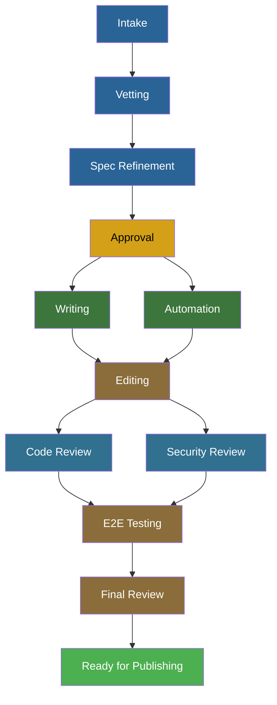

# Skill System

The Publishing House skill system is a dispatch architecture where a single orchestrator reads project state from the manifest, maps user intent to specialized skills, and manages phase transitions through Central's gate service.

## The Orchestrator

The orchestrator is the entry point for all Publishing House interactions. Users invoke it with `/rhdp-publishing-house` followed by an optional [autonomy level](#autonomy-levels):

```
/rhdp-publishing-house
/rhdp-publishing-house assisted
```

When no level is specified, the default is `guided`.

### What Happens When You Run It

The orchestrator's first job is figuring out what project you're working on.

**If you're in a project directory** (a repo with `publishing-house/manifest.yaml`), the orchestrator syncs the repo, reads the manifest and worklog, and registers the project with Central. It then tells you where the project stands and asks what you want to do.

**If you're not in a project directory**, the orchestrator searches for PH projects — locally and via Central. It presents what it finds and offers options: point it at an existing project, clone one from a remote, start a new project from the template, or launch express mode (no repo needed).

**For new projects**, the orchestrator walks you through creating a repo from the PH template, sets initial manifest fields (owner, email, deployment mode), and dispatches the intake skill.

### One Gate, Then Stop

When a skill completes its work and the project is ready to move to the next phase, the orchestrator requests a gate from Central. Central checks prerequisites, records the decision, and returns pass or fail. If it passes, the orchestrator updates the manifest. If it fails, the orchestrator reports what's missing and stops.

Only one phase transition happens per interaction. This keeps transitions auditable and prevents an agent from advancing a project through multiple phases without the developer being aware.

### Fast Path

Not every interaction needs a skill dispatch. Status queries — "what's next?", "where are we?", "show me the worklog" — are answered directly from the manifest and worklog on disk, without calling Central or dispatching skills.

### Session End

Before ending a session, the orchestrator invokes the worklog skill to record a session summary — what was accomplished, what decisions were made, and what should happen next. It then commits and pushes any remaining changes. This ensures whoever picks up the project next (including the same developer days later) has context.

---

## Example: Starting a New Onboarded Project

```
You: /rhdp-publishing-house

Orchestrator: I don't see a PH manifest in this directory. Let me check Central
              for your projects... No existing projects found.

              What would you like to do?
              1. I have a PH project cloned locally — tell me the path
              2. I have a PH project in a remote repo — give me the git URL
              3. I'm starting a new project
              4. I need a customized environment (express mode)

You: 3

Orchestrator: Create a new repo from the PH template:
              gh repo create rhpds/my-workshop --template rhpds/rhdp-publishing-house-template --clone

              [You create and clone the repo]

You: /rhdp-publishing-house

Orchestrator: Found manifest in publishing-house/manifest.yaml.
              Project is new — starting intake.
              What deployment mode?
              - RHDP Published (onboarded) — full lifecycle, Jira tracking, catalog publishing
              - Self-Published — same tools, softer gates, no catalog
              - Express — one-off environment, no repo needed

You: onboarded

Orchestrator: [Dispatches intake skill]
              Intake runs — captures requirements, generates design.md and module outlines.
              Intake complete. Requesting vetting gate from Central...
              Gate passed. Project is now in vetting phase.
              [Commits and pushes]
```

## Example: Continuing an Existing Project

```
You: /rhdp-publishing-house

Orchestrator: I don't see a PH manifest in this directory. Let me check
              for your projects...

              Found 2 projects:
              1. OCP Getting Started Workshop (writing phase) — ~/devel/ocp-workshop
              2. AI Observability Lab (intake phase) — ~/devel/ai-obs-lab

              Which project would you like to work on?

You: 1

Orchestrator: Switching to ~/devel/ocp-workshop
              Syncing repo... pulled 2 new commits.
              Project: "OCP Getting Started Workshop"
              Current phase: writing (3 of 5 modules drafted)
              Next: Write module 4 — Canary Serving

You: let's keep going

Orchestrator: [Dispatches writer skill for module 4]
              Writer generates module-04-canary-serving.adoc via showroom:create-lab.
              Module 4 drafted. 4 of 5 modules complete.
              [Commits and pushes]
```

## Lifecycle Flow

The lifecycle is not a linear sequence. Writing and automation run in parallel after approval, and code review and security review run in parallel after editing:



See [Lifecycle & Phases](lifecycle-phases.md) for the full phase definitions, gate types, and prerequisite chain.

---

## Skill Dispatch

The orchestrator maps user intent to skill dispatch based on what the user says and where the project is in its lifecycle:

| Intent | Dispatched Skill |
|--------|-----------------|
| Start a new project | intake |
| Refine the spec | intake (spec_refinement mode) |
| Write module N | writer |
| Build automation | automation |
| Review/edit content | editor |
| What happened / handoff notes | worklog |

The mapping is not purely keyword-based. The orchestrator considers the current phase — if the project is in `writing` and the user says "let's keep going," the orchestrator dispatches the writer for the next unwritten module. If the project is in `automation` and the user says "review my content," the orchestrator dispatches the editor (content can always be revised, regardless of phase).

---

## Individual Skills

### Intake

The intake skill handles the transition from "I want to build something" to a structured spec that the writer can execute against. It supports three entry paths:

**(A) Spec-first** — the user has a design document (Google Doc, Confluence page, or local file). Intake extracts learning objectives, module structure, duration targets, and product requirements.

**(B) Conversational** — the user has an idea but no document. Intake runs a structured interview covering topic, audience, learning outcomes, duration, and products.

**(C) Jira-driven** — the user has a Jira issue with requirements attached. Intake reads the issue via Atlassian MCP tools and fills gaps conversationally.

All three paths produce the same outputs:

- `publishing-house/spec/design.md` — the master spec with learning objectives, audience, duration, product list, and module plan
- `publishing-house/spec/modules/` — one outline file per module, with section structure, key concepts, and estimated duration

Fields that the orchestrator has already set in the manifest (owner name, email, deployment mode) are pre-filled and not re-asked.

Intake also handles **spec refinement** after vetting. When RCARS identifies overlapping content during the vetting phase, the orchestrator re-dispatches intake in `spec_refinement` mode. In this mode, intake receives the RCARS findings and helps the user differentiate their content — adjusting scope, depth, or angle to complement rather than duplicate existing catalog items.

### Writer

The writer generates Showroom AsciiDoc content by wrapping `showroom:create-lab` and `showroom:create-demo`. It uses headless mode (`ph_payload`) — never writing `.adoc` files directly — to ensure consistent formatting, navigation structure, and scaffold compliance.

Modules are typically written in order, with each module receiving the context of what came before. This produces content that reads as a coherent workshop rather than a collection of independent exercises.

After generating each module, the writer runs post-generation verification: scaffold files exist, the generated `.adoc` file is at the expected path, and the module has an entry in `nav.adoc`. Verification failures are reported but do not block progress — the editor handles quality issues in a later phase.

### Automation

The automation skill handles the most complex phase in the lifecycle, broken into four sub-phases:

**7a — Requirements manifest.** Reads the spec, content, and module outlines to produce a structured requirements document: what infrastructure the workshop needs, what software must be pre-installed, what credentials users need, and what post-deployment configuration is required.

**7b — Catalog item.** Generates the RHDP catalog configuration that makes the workshop orderable. This sub-phase is **skipped for self-published projects**.

**7c — Automation code.** Generates the deployment automation itself. Three approaches are supported: Ansible (collections with roles), GitOps (Helm charts with ArgoCD), or both.

**7d — Testing gate.** This is a human gate, not an automated test. The automation skill tracks whether the user has deployed and tested the environment, but it does not deploy or run tests itself.

### Editor

The editor runs a two-layer review on content that the writer (or a human) has produced.

**Layer 1 — Showroom quality.** The editor dispatches `showroom:verify-content`, which checks AsciiDoc syntax, scaffold compliance, formatting standards, and Showroom-specific conventions. This is a mechanical check — does the content meet the platform's technical requirements?

**Layer 2 — Spec alignment.** The editor compares the content against the spec and module outlines, checking outline coverage, learning objectives, duration alignment, cross-module consistency, and product name accuracy.

**Content on disk is authoritative.** If a human edited a module and it now diverges from the spec, the editor reports the divergence as informational, not as an error. It asks before reverting human work.

### Worklog

The worklog manages `publishing-house/worklog.yaml` — the human-context layer that captures what the manifest cannot: why a decision was made, what was tried and abandoned, what the next person should know, what's blocked and why.

| Type | Purpose |
|------|---------|
| `note` | Freeform observation or context |
| `decision` | A choice that was made, with rationale |
| `handoff` | What the next person needs to know |
| `action` | Something that needs to happen |
| `summary` | End-of-session recap |

The worklog is also invoked automatically at the end of every session to capture a summary. It is not a task tracker — the manifest handles structured progress. The worklog captures what falls between the cracks.

---

## Skill Boundaries

Rules that govern what skills can and cannot do:

**Skills don't own phase transitions.** Only the orchestrator calls `ph_request_gate`. Skills never modify `lifecycle.current_phase`. A skill signals readiness to the orchestrator, which decides whether to request a gate.

**Skills don't call external services directly.** No direct RCARS calls, no direct Jira calls, no reporting database queries. Everything flows through Central MCP tools.

!!! note "Exception"
    Intake path (C) may use Atlassian MCP tools to read a Jira issue that contains requirements. This is input gathering, not a side effect.

**Manifest is read-before-write.** Before modifying any file, skills must read the current version from disk. Never assume a file matches what an agent last wrote — humans edit between sessions.

**Content on disk is authoritative.** If a human modified a file, the skill treats the on-disk version as ground truth, even if it diverges from the spec.

---

## Autonomy Levels

Three levels control how much confirmation skills require from the user. The level is set at orchestrator invocation and propagates to all dispatched skills.

| Level | Behavior |
|-------|----------|
| **Guided** | Every action requires user confirmation. Default. |
| **Assisted** | Low-risk actions (fixing AsciiDoc syntax, correcting product names) are applied automatically. Structural changes require confirmation. |
| **Autonomous** | All clear-cut issues are fixed automatically. The skill only stops for genuinely ambiguous decisions. |

The distinction between levels is about risk, not capability. All three levels use the same skills — they differ in how aggressively those skills act without asking.
