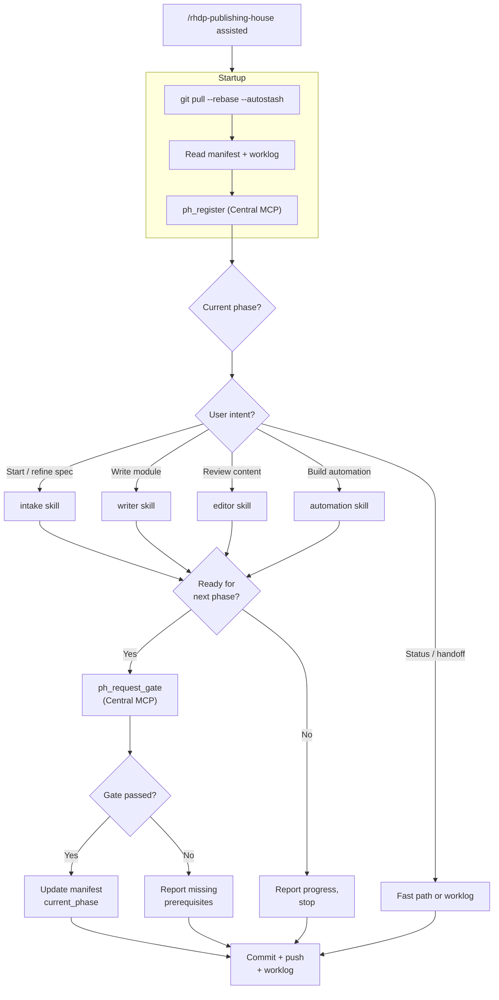

# Skill System

The Publishing House skill system is a dispatch architecture where a single orchestrator reads project state from the manifest, maps user intent to one of five specialized skills, and enforces phase transitions through Central's gate service -- ensuring that every interaction advances the project by exactly one step.

## The Orchestrator

The orchestrator is the entry point for all Publishing House interactions. Users invoke it with `/rhdp-publishing-house` followed by an optional autonomy level:

```
/rhdp-publishing-house guided
/rhdp-publishing-house assisted
/rhdp-publishing-house autonomous
```

When no level is specified, the default is `guided`.

### Startup Sequence

On every invocation, the orchestrator runs a deterministic startup sequence:

1. **Sync** -- `git pull --rebase --autostash` to pick up changes from humans and other agents.
2. **Read state** -- parse `publishing-house/manifest.yaml` and `publishing-house/worklog.yaml` from disk.
3. **Register with Central** -- call `ph_register` with the repo URL and branch. Idempotent -- already-registered projects get a no-op update.
4. **Determine phase** -- read `lifecycle.current_phase` from the manifest to constrain what skills can be dispatched.
5. **Map intent** -- based on the user's first message, determine which skill to dispatch.

### One Gate Per Interaction

The orchestrator enforces a critical invariant: **one gate per user interaction, then stop.** When a skill completes its work and the project is ready to advance, the orchestrator calls `ph_request_gate` on Central with the target phase. Central validates prerequisites, checks the manifest, records the decision in the custody chain, and returns a pass/fail result. If the gate passes, the orchestrator updates `lifecycle.current_phase` in the manifest. If the gate fails, the orchestrator reports what's missing and stops.

This constraint exists because phase transitions have side effects -- Central records them in the custody chain, syncs to Jira (for onboarded projects), and updates the dashboard. Multiple transitions in a single interaction would be difficult to audit and could allow runaway agents to advance a project without human awareness.

### Fast Path

Not every interaction needs a skill dispatch. Status queries -- "what's next?", "where are we?", "show me the worklog" -- are answered directly from the manifest and worklog on disk. The orchestrator reads the files, formats the response, and returns without loading reference docs, dispatching skills, or calling Central. This keeps status checks fast and token-efficient.

### Session End

When the session ends, the orchestrator invokes the worklog skill to record what happened, then commits and pushes all changes -- ensuring a clean handoff for the next session.

### Tool Boundaries

The orchestrator calls exactly six Central MCP tools:

| Tool | When |
|------|------|
| `ph_register` | Startup (every session) |
| `ph_list_projects` | Project discovery (when no manifest in CWD) |
| `ph_get_status` | Status queries, pre-gate checks |
| `ph_request_gate` | Phase advancement |
| `ph_submit_results` | Forwarding skill results to Central |
| `ph_get_history` | Custody chain queries |

The orchestrator never calls RCARS directly, never queries the reporting database, and never accesses any data source outside Central MCP.

---

## Skill Dispatch

The orchestrator maps user intent to skill dispatch based on what the user says and where the project is in its lifecycle:

| Intent | Dispatched Skill |
|--------|-----------------|
| Start a new project | intake |
| Refine the spec | intake (spec_refinement mode) |
| Write module N | writer |
| Review/edit content | editor |
| Build automation | automation |
| What happened / handoff notes | worklog |

The mapping is not purely keyword-based. The orchestrator considers the current phase -- if the project is in `writing` and the user says "let's keep going," the orchestrator dispatches the writer for the next unwritten module. If the project is in `automation` and the user says "review my content," the orchestrator dispatches the editor (content can always be revised, regardless of phase). Skills receive the manifest state, autonomy level, and user input as context, and return structured results the orchestrator uses to decide whether a gate request is appropriate.



---

## Individual Skills

### Intake (Opus 4.6)

The intake skill handles the transition from "I want to build something" to a structured spec that the writer can execute against. It supports three entry paths:

**(A) Spec-first** -- the user has a design document (Google Doc, Confluence page, or local file). Intake extracts learning objectives, module structure, duration targets, and product requirements.

**(B) Conversational** -- the user has an idea but no document. Intake runs a structured interview covering topic, audience, learning outcomes, duration, and products.

**(C) Jira-driven** -- the user has a Jira issue with requirements attached. Intake reads the issue via Atlassian MCP tools and fills gaps conversationally.

All three paths produce the same outputs:

- `publishing-house/spec/design.md` -- the master spec with learning objectives, audience, duration, product list, and module plan
- `publishing-house/spec/modules/` -- one outline file per module, with section structure, key concepts, and estimated duration

Intake does not call Central MCP tools. It works entirely locally -- reading and writing files in the project repo. Fields that the orchestrator has already set in the manifest (owner name, email, deployment mode) are pre-filled and not re-asked.

Intake also handles **spec refinement** after vetting. When RCARS identifies overlapping content during the vetting phase, the orchestrator re-dispatches intake in `spec_refinement` mode. In this mode, intake receives the RCARS findings and helps the user differentiate their content -- adjusting scope, depth, or angle to complement rather than duplicate existing catalog items.

### Writer (Sonnet 4.6)

The writer generates Showroom AsciiDoc content by wrapping `showroom:create-lab` and `showroom:create-demo`. It must use headless mode (`ph_payload`) -- never writing `.adoc` files directly -- to ensure consistent formatting, navigation structure, and scaffold compliance.

Modules are written sequentially. Each module after the first uses `mode: continue`, giving the Showroom skill the context of what came before. This matters for narrative continuity -- module 3 should reference concepts introduced in module 2, not re-explain them. Sequential generation is slower but produces content that reads as a coherent workshop rather than a collection of independent exercises.

After generating each module, the writer runs post-generation verification:

- Scaffold files exist and are well-formed (`site.yml`, `antora.yml`, `nav.adoc`)
- The generated `.adoc` file exists at the expected path
- The module has an entry in `nav.adoc`
- The generated content covers the sections specified in the module outline

Verification failures are reported but do not block progress. The editor skill handles quality issues in a later phase.

### Editor (Sonnet 4.6)

The editor runs a two-layer review on content that the writer (or a human) has produced.

**Layer 1 -- Showroom quality.** The editor dispatches `showroom:verify-content`, which checks AsciiDoc syntax, scaffold compliance, formatting standards, and Showroom-specific conventions (callout blocks, code annotation, prerequisite sections). This is a mechanical check -- does the content meet the platform's technical requirements?

**Layer 2 -- Spec alignment.** The editor compares the content against the spec and module outlines, checking:

- **Outline coverage** -- does the module address every section in its outline?
- **Learning objectives** -- do the exercises actually teach what the spec says they should?
- **Duration alignment** -- is the content roughly appropriate for the target duration?
- **Cross-module consistency** -- do modules use the same terminology, variable names, and environment assumptions?
- **Product accuracy** -- are product names and versions correct and consistent?

**Content on disk is authoritative.** If a human edited a module and it now diverges from the spec, the editor reports the divergence as informational, not as an error. It asks before reverting human work.

### Automation (Opus 4.6)

The automation skill handles the most complex phase in the lifecycle, broken into four sub-phases:

**7a -- Requirements manifest.** Reads the spec, content, and module outlines to produce a structured requirements document: what infrastructure the workshop needs (clusters, VMs, storage, networking), what software must be pre-installed, what credentials users need, and what post-deployment configuration is required.

**7b -- AgnosticV catalog.** Generates the AgnosticV catalog item (`common.yaml`, environment-specific overrides) that RHDP uses to provision the workshop environment. This sub-phase is **skipped for `self_published` projects** -- they don't use RHDP's provisioning system and manage their own infrastructure.

**7c -- Automation code.** Generates the deployment automation itself. Three approaches are supported:

- **Ansible** -- collections with roles, following RHDP's established patterns for AgnosticD workloads
- **GitOps** -- Helm charts with ArgoCD Application resources, consistent with RHDP's GitOps catalog items
- **Both** -- Ansible for infrastructure provisioning, GitOps for application deployment (common for complex workshops)

**7d -- Testing gate.** This is a human gate, not an automated test. The automation skill tracks whether the user has deployed and tested the environment, but it does not deploy or run tests itself. It prompts the user to confirm that provisioning works, the environment matches requirements, and the workshop exercises can be completed. The skill records the testing outcome but does not attempt to validate it.

### Worklog (Sonnet 4.6)

The worklog manages `publishing-house/worklog.yaml` -- the human-context layer that captures what the manifest cannot: why a decision was made, what was tried and abandoned, what the next person should know, what's blocked and why.

Entry types:

| Type | Purpose |
|------|---------|
| `note` | Freeform observation or context |
| `decision` | A choice that was made, with rationale |
| `handoff` | What the next person needs to know |
| `action` | Something that needs to happen (not a task tracker -- just a flag) |
| `summary` | End-of-session recap |

The worklog is not a task tracker -- the manifest handles structured progress. The worklog captures what falls between the cracks: reasoning, false starts, and tribal knowledge.

To prevent unbounded growth, the worklog skill **squashes old entries** -- resolved entries older than one week are compressed into a summary that preserves key decisions and outcomes but drops the play-by-play.

---

## Skill Boundaries

Four rules govern what skills can and cannot do. These are not guidelines -- they are invariants that the system depends on for correctness.

**Skills don't own phase transitions.** Only the orchestrator calls `ph_request_gate`. Skills never modify `lifecycle.current_phase`. A skill signals readiness to the orchestrator, which decides whether to request a gate. This ensures every transition is recorded in Central's custody chain and synced to Jira.

**Skills don't call external services directly.** No direct RCARS calls, no direct Jira calls, no reporting database queries. Everything flows through Central MCP tools. One scoped exception: intake path (C) may use Atlassian MCP tools to read a Jira issue, because the issue content is input -- not a side effect.

**Manifest is read-before-write.** Before modifying any YAML file, skills must read the current version from disk. Never assume a file matches what an agent last wrote -- humans edit between sessions and git operations during startup may have pulled new content.

**Content on disk is authoritative.** If a human modified an `.adoc` file, a module outline, or the manifest itself, the on-disk version is ground truth. Skills report divergence from specs as informational findings and ask before reverting human work.

---

## Autonomy Levels

Three levels control how much confirmation skills require from the user. The level is set at orchestrator invocation and propagates to all dispatched skills.

| Level | Behavior |
|-------|----------|
| **Guided** | Every action requires user confirmation. The skill explains what it plans to do and waits for approval before proceeding. Default for new users and unfamiliar projects. |
| **Assisted** | Low-risk and medium-risk actions (fixing AsciiDoc syntax, adding missing nav entries, correcting product names) are applied automatically. High-risk changes (rewriting a section, deleting content, changing module structure) require confirmation. |
| **Autonomous** | All clear-cut issues are fixed automatically. The skill only stops for genuinely ambiguous decisions -- cases where two reasonable approaches exist and the user's preference is unknowable. |

The distinction between levels is about **risk classification**, not capability. All three levels use the same skills; they differ in how aggressively those skills act without asking. The editor in autonomous mode fixes typos, reformats code blocks, and corrects product names without asking -- but still stops when a section diverges from the spec and two reasonable approaches exist.

The autonomy level is informational only in the worklog and intake skills, which are inherently interactive.

---

## Cross-References

- See [System Design](system-design.md) for the full system architecture
- See [Lifecycle & Phases](lifecycle-phases.md) for how phases and gates work
- See [Central Backend](central.md) for the MCP tools the orchestrator calls
- See [RCARS Integration](rcars-integration.md) for how vetting queries reach RCARS
