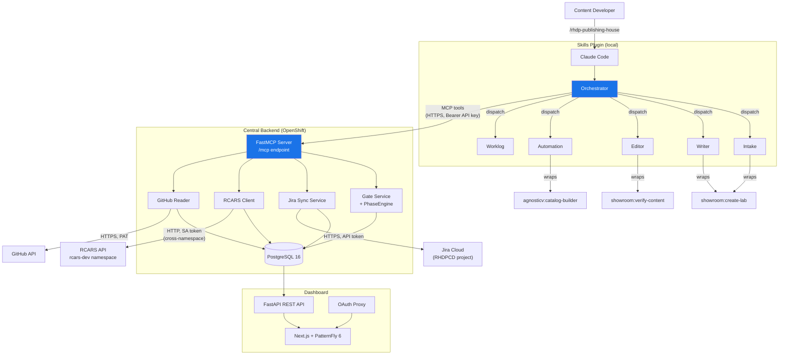

# System Design

## System Overview

Publishing House is a three-part system -- a Claude Code skills plugin running locally on a developer's machine, a Central backend (FastAPI + FastMCP + PostgreSQL) deployed on OpenShift, and external integrations (RCARS, Jira Cloud, GitHub) -- that manages the full content development lifecycle for Red Hat Demo Platform labs, workshops, and demos.

### Components

| Component | Stack | Purpose |
|---|---|---|
| Skills Plugin | Claude Code plugin (6 skills) | Local AI agents: intake, writing, editing, automation, worklog, orchestration |
| Central Backend | FastAPI + FastMCP 3.2+ + PostgreSQL 16 | Gate authority, Jira sync engine, RCARS gateway, project dashboard API |
| Dashboard | Next.js + PatternFly 6 (behind OAuth proxy) | Pipeline board, project detail views, custody chain, validation results |
| RCARS | FastAPI + pgvector (cluster-internal) | Content advisory -- semantic catalog search, overlap detection, recommendations |
| Jira Cloud | Atlassian Jira (RHDPCD project) | Management reporting -- Epics, Tasks, story points, Initiative tracking |
| GitHub | Git hosting | Manifest storage, Showroom content repos, automation repos |

The skills plugin is the primary interface -- content developers interact with Publishing House by running `/rhdp-publishing-house` in Claude Code. The orchestrator skill discovers the project, reads the manifest, and dispatches specialized skills. Skills talk to Central through MCP tools for gate decisions, Jira sync, RCARS queries, and state persistence. Central talks to external services on behalf of skills -- skills never call RCARS, Jira, or GitHub APIs directly.



---

## Skills Layer

The skills plugin is a Claude Code plugin containing six skills that run locally in the developer's Claude Code session. Skills are AI agents -- each has a `SKILL.md` file that defines its identity, capabilities, and dispatch rules. They execute on the developer's machine with full access to the local filesystem and git repository.

### Six Skills

| Skill | Role | Wraps |
|---|---|---|
| **Orchestrator** | Hub. Discovers project, reads manifest, determines current phase, dispatches to the right skill. Calls Central for registration, status, and gate requests. | -- |
| **Intake** | Conversational project onboarding. Two entry paths ("I have a spec" / "I have an idea"). Deployment mode selection. RCARS vetting via MCP. Session continuity for multi-session intake. | -- |
| **Writer** | Content generation. Produces AsciiDoc modules for Showroom labs and demos from spec outlines, one module at a time. | `showroom:create-lab`, `showroom:create-demo` |
| **Editor** | Content review. Runs quality checks against Red Hat content standards, generates review reports with dimension scores and findings. | `showroom:verify-content` |
| **Automation** | Infrastructure automation. Four sub-phases: requirements analysis, AgnosticV catalog item creation, automation code scaffolding, testing. | `agnosticv:catalog-builder` |
| **Worklog** | Session bridging. Records what was accomplished, decisions made, and what should happen next. Enables multi-session continuity across days or weeks. | -- |

### Orchestrator as Hub

The orchestrator is the only skill a developer invokes directly. When `/rhdp-publishing-house` runs, the orchestrator:

1. **Discovers the project** -- checks for `publishing-house/manifest.yaml` in the current repo, or queries Central for registered projects by the current user.
2. **Reads the manifest** -- parses project metadata, current phase, and phase statuses.
3. **Calls Central** -- registers the project if new (`ph_register`), gets current status (`ph_get_status`), retrieves any pending gate decisions.
4. **Dispatches the appropriate skill** -- based on which lifecycle phase is active. If writing is in progress, the writer is dispatched. If intake hasn't completed, intake runs.

The orchestrator manages phase transitions by calling Central's gate tools (`ph_request_gate`) at phase boundaries. Individual skills must not modify phase-level state -- they read their inputs from the manifest, produce their outputs (AsciiDoc modules, review reports, catalog configs), and hand control back to the orchestrator.

### Skills Wrap Platform Tools

Writer, editor, and automation skills are thin wrappers around existing RHDP platform skills. The writer calls `showroom:create-lab` to generate AsciiDoc content. The editor calls `showroom:verify-content` to run quality checks. The automation skill calls `agnosticv:catalog-builder` to create AgnosticV catalog configurations. This layering means PH skills benefit from improvements to the underlying platform tools without code changes.

### MCP as the Only External Channel

Skills communicate with Central exclusively through MCP tools. A skill that needs RCARS content vetting calls `ph_rcars_query`. A skill that needs to record a gate decision calls `ph_request_gate`. Skills never make raw HTTP calls to RCARS, Jira, or GitHub. This constraint means Central controls all external access -- if RCARS changes its API, or Jira auth rotates, only Central's client code changes. Skills remain untouched.

### Autonomy Levels

Each project declares an autonomy level in its manifest, controlling how much confirmation the orchestrator requires from the developer:

- **Guided** -- confirm everything. The orchestrator presents each action and waits for approval before proceeding. Default for new projects.
- **Assisted** -- auto-fix low-risk issues. Routine corrections (formatting, minor AsciiDoc fixes) happen automatically. Structural changes still require confirmation.
- **Autonomous** -- auto-fix all clear findings. The orchestrator proceeds through phases with minimal interruption, only stopping for ambiguous decisions or gate failures.

The autonomy level affects orchestrator behavior, not skill behavior. Skills always produce the same output regardless of autonomy -- the orchestrator decides whether to apply that output automatically or present it for review.

---

## Central Backend

The Central backend is a FastAPI application deployed on OpenShift with a FastMCP 3.2+ server mounted at `/mcp`. It is the single gateway between skills and all external services. One codebase, one deployment, one database.

### Four Roles

**Gate authority.** When a project requests advancement to the next lifecycle phase, the gate service validates prerequisites using the PhaseEngine (a pure-logic module with no I/O dependencies), records the decision as a GateRecord in PostgreSQL, and returns the result. Every gate decision -- approved, rejected, with rationale -- forms a custody chain (an ordered sequence of gate records that provides a complete audit trail of how a project moved through its lifecycle). The custody chain is immutable: records are appended, never modified.

**Jira sync engine.** For onboarded projects (deployment mode `rhdp_published`), Central creates and updates Jira tickets automatically as work progresses. When a gate passes, corresponding Jira tasks transition. When a module completes writing, its task moves to Done. Sync is one-directional: PH pushes to Jira, Jira never drives PH state. This is a deliberate design choice -- the manifest in git is the source of truth, and Jira is a downstream reporting view. Jira sync is also non-blocking: if the Jira API returns an error or times out, the failure is logged but the gate decision still succeeds. Jira unavailability must never block content development.

**RCARS gateway.** Central proxies content advisory requests to the RCARS API using Kubernetes ServiceAccount token authentication. Three MCP tools (`ph_rcars_query`, `ph_rcars_catalog_search`, `ph_rcars_catalog_item`) expose RCARS capabilities to skills. The RCARS client (`rcars_client.py`) handles async HTTP calls with 3x exponential backoff and a 120-second timeout for advisor queries. See [RCARS Integration](rcars-integration.md) for the auth model and network topology.

**Project dashboard.** A Next.js frontend styled with PatternFly 6 gives content managers visibility into all active projects. The dashboard sits behind an OpenShift OAuth proxy for SSO authentication. Key views: pipeline board (kanban by lifecycle phase), project detail (phase accordions, worklog timeline, artifacts), and custody chain (chronological gate decisions). The frontend consumes a REST API served by the same FastAPI process -- the MCP endpoint and REST API coexist in a single deployment.

### Gate Service and PhaseEngine

The gate service is the enforcement layer for lifecycle transitions. When the orchestrator calls `ph_request_gate(target_phase="writing")`, Central:

1. Fetches the project's current manifest (from the database, synced from GitHub or MCP writes).
2. Passes the manifest to the PhaseEngine, which checks whether all prerequisite phases for the target are completed.
3. If prerequisites are met, records a GateRecord (project ID, target phase, decision, rationale, timestamp, requested_by) and returns approval.
4. If prerequisites are not met, returns rejection with a list of what's missing.

The PhaseEngine is a pure-logic module -- it takes a manifest dict and a target phase, applies the phase dependency graph, and returns a decision. No database calls, no HTTP calls. This makes it trivially testable and ensures gate logic is deterministic.

For the vetting phase specifically, the gate service also runs an RCARS query to check for content overlap before approving advancement. This is the only gate that involves an external service call.

### GitHub Refresh Engine

Central maintains a cached copy of each registered project's manifest in PostgreSQL. This cache is refreshed from GitHub on a schedule using APScheduler, defaulting to every 30 minutes. The refresh engine:

1. Iterates over all registered projects.
2. Checks each project's GitHub repo for the manifest file via the GitHub API.
3. If the manifest has changed (compared by content hash), parses it and updates the database.
4. Recomputes phase status using the PhaseEngine.

The refresh engine is incremental -- unchanged repos are skipped based on the last-push timestamp. Manual refresh is also available through the dashboard UI and the `ph_register` MCP tool (which performs an immediate refresh).

---

## Data Flow

Two data paths feed the Central database, each serving a different purpose.

### Path 1: Skill to MCP to Central (Real-Time Writes)

This is the primary path during active development. When a developer works in Claude Code, the orchestrator calls MCP tools that write directly to Central:

- `ph_register` -- registers a new project, fetches its manifest from GitHub, creates the database record.
- `ph_get_status` -- reads the project's current phase status, computes the next recommended action.
- `ph_request_gate` -- requests phase advancement, triggers the PhaseEngine, records the gate decision, syncs to Jira.
- `ph_submit_results` -- stores structured results from local skill runs (content verification scores, automation validation).
- `ph_sync_manifest` -- pushes the current manifest content directly to Central after every local manifest write, keeping the database in sync without waiting for the next GitHub refresh cycle.
- `ph_store_intake_results` -- persists intake session data across Claude Code restarts.

These writes flow through the FastMCP server, pass API key authentication, and update PostgreSQL immediately. Jira sync triggers as a side effect of gate transitions -- the Jira sync service is called after the gate record is committed, not before.

### Path 2: GitHub to Central (Scheduled Pull)

This is the background sync path. The refresh engine pulls manifests from GitHub on a schedule, recomputes phase status, and updates the cached state in PostgreSQL. This path catches changes that bypass the MCP path -- manual manifest edits, CI pipeline updates, changes made by developers who don't use PH skills.

The two paths converge in PostgreSQL. The dashboard reads from the database regardless of which path wrote the data. MCP-pushed manifests are tagged with `sync_source='mcp'` to distinguish them from GitHub-refreshed ones, preventing a circular sync scenario where Central's cached state would overwrite a fresher MCP write with a stale GitHub read.

---

## Manifest as Source of Truth

All project state flows from a single YAML file: `publishing-house/manifest.yaml` in the project's git repository. The manifest records project metadata, current lifecycle phases, phase completion statuses, module lists, automation configuration, and integration keys.

```yaml
project:
  name: "OCP Getting Started Workshop"
  owner_github: "jsmith"
  owner_email: "jsmith@redhat.com"
  type: "workshop"
  deployment_mode: "rhdp_published"
  autonomy: "guided"

lifecycle:
  phases:
    intake:
      status: "completed"
      completed_at: "2026-04-15 14:30"
      assignees: ["jsmith"]
    writing:
      status: "in_progress"
      assignees: ["jsmith", "mlee"]
      artifacts: ["content/modules/01-cluster-basics/pages/index.adoc"]
    automation:
      status: "pending"
```

Phase statuses follow a simple state machine: `pending` to `in_progress` to `completed` (or `skipped` for optional phases). Transitions are validated by the PhaseEngine and recorded in the custody chain. There is no backward transition -- a completed phase stays completed.

Central and Jira are downstream consumers. They read from the manifest (via GitHub refresh or MCP sync) and never write back. If Central's database is wiped, re-registering the project from its repo URL reconstructs the full state. If Jira tickets are deleted, re-syncing recreates them. The manifest is the recovery point.

**Express mode is the exception.** Express projects have no git repository -- they are transient, one-off demo environments. State lives in the Central database only (IntakeSession and ExpressMetric records). Express projects do not appear on the pipeline board and have no custody chain. See [Express Mode](../user/deployment-modes.md) for details.

---

## Auth Model

Two authentication boundaries protect the system, each using a different mechanism appropriate to its trust domain.

### Boundary 1: External -- Claude Code to Central

Claude Code users authenticate to the PH MCP endpoint using API keys sent as `Authorization: Bearer <raw-key>` headers over HTTPS.

- **Key storage:** API keys are stored as SHA-256 hashes in a Kubernetes Secret (`ph-mcp-api-keys`), volume-mounted into the backend pod at `/etc/ph/mcp-api-keys/keys.yaml`. The YAML file maps key names (admin identifiers like `nate-dev`) to hex-encoded SHA-256 digests.
- **Validation:** The FastMCP `ApiKeyAuth` Middleware intercepts every tool call via the `on_call_tool` hook. It hashes the incoming raw key with SHA-256 and compares against stored hashes using `hmac.compare_digest()` -- a timing-safe comparison function that prevents timing attacks (where an attacker measures response time to deduce correct key characters).
- **Rejection:** Missing or invalid keys raise a `ToolError` at the MCP protocol level. No partial access -- authentication is all-or-nothing.
- **Key lifecycle:** Keys are provisioned and revoked through the Ansible deployer. The backend reads the key file at startup only; adding or revoking a key requires a pod restart via redeployment. See [MCP Auth Admin Guide](../admin/mcp-auth.md).

### Boundary 2: Internal -- Central to RCARS

The Central backend authenticates to RCARS using its Kubernetes ServiceAccount token for cross-namespace calls within the OpenShift cluster.

- **Token source:** Auto-mounted by Kubernetes at `/var/run/secrets/kubernetes.io/serviceaccount/token`. The RCARS client re-reads this token from the filesystem on every request -- it is never cached in memory. On OpenShift 4.11+, bound service account tokens rotate automatically after 1 hour, so caching would cause intermittent auth failures.
- **Validation:** RCARS middleware validates the token via the Kubernetes TokenReview API (a K8s-native mechanism that verifies a token's authenticity and returns the associated identity), then checks the authenticated identity against its ServiceAccount allowlist.
- **No secrets to manage:** Kubernetes handles the entire token lifecycle -- creation, rotation, and revocation are automatic. No manual key provisioning or rotation procedures.

The dashboard uses a third auth mechanism (OpenShift OAuth proxy for SSO), but this sits outside the PH system boundary -- it is standard OpenShift infrastructure. See [RCARS Integration](rcars-integration.md) for the full network topology diagram.

---

## Deployment

Publishing House Central runs on OpenShift, managed entirely by Ansible. No manual `oc edit`, no ad-hoc kubectl -- all infrastructure state flows through the playbook.

### Topology

- **Cluster:** `ocpv-infra01` (Dallas)
- **Central namespace:** `publishing-house-central-dev` -- backend pod (FastAPI + MCP), PostgreSQL StatefulSet, Next.js frontend, OAuth proxy
- **RCARS namespace:** `rcars-dev` -- separate deployment, same cluster, accessed via Kubernetes service DNS (`rcars-api.rcars-dev.svc.cluster.local:8080`)

### Ansible Deployer

All deployments use `ansible-playbook ansible/deploy.yml -e env=dev --tags <tag>` from the `rhdp-publishing-house-central` repo.

| Tag | What It Does |
|---|---|
| `deploy` | Full deploy: namespace, infra + app manifests, builds, migrations, rollout wait |
| `build-backend` | Build backend image, wait for build + rollout |
| `build-frontend` | Build frontend image, wait for build |
| `builds` | Build both backend and frontend |
| `apply` | Apply Kubernetes manifests only (config changes, secrets, env vars -- no builds) |
| `migrate` | Run Alembic migrations on the current pod |

**Migration ordering:** Migrations execute on the running backend pod, so the pod must have the new code before migrations run. When deploying changes that include schema modifications, run `--tags build-backend` before `--tags migrate`, or use `--tags deploy` which handles the ordering automatically.

---

## Cross-References

- See [Central Backend](central.md) for the dashboard views, manifest requirements, and refresh engine behavior
- See [RCARS Integration](rcars-integration.md) for the RCARS auth model, network topology, and data flow
- See [Jira Integration](jira-integration.md) for the four-level Jira hierarchy, points model, and sync triggers
- See [Express Mode](../user/deployment-modes.md) for the express lifecycle and Central-only state model
- See [MCP Tools Reference](central.md) for tool parameters, return shapes, and examples
- See [Central Deployment](../admin/deployment.md) for operational setup and Ansible playbook details
