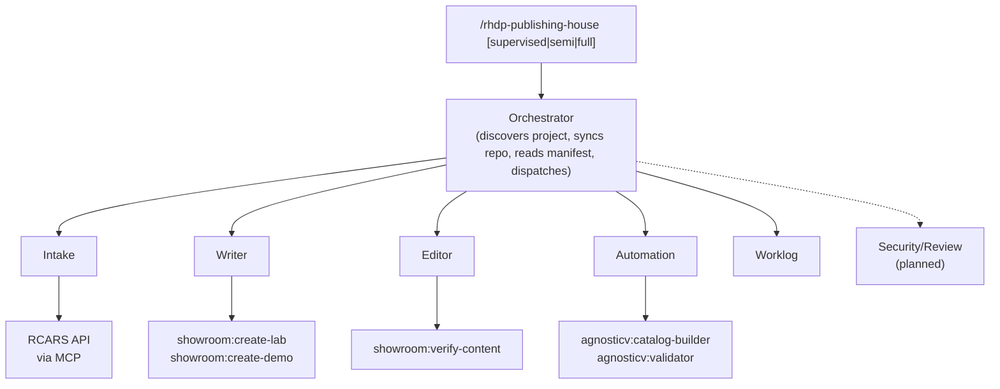

# How It Works

## Architecture: Hub + Spoke

RHDP Publishing House uses a Hub + Spoke plugin architecture. A thin orchestrator (hub) manages project state and dispatches specialized agent skills (spokes) for each lifecycle phase.



Each agent is a separate skill file — focused, testable, independently iterable. Adding a new phase means adding a new spoke, not rewriting a monolith.

## Content Lifecycle


*\* = required (unmarked = optional, skip if handled another way)*

### Required Phases

| Phase | Agent | What It Does |
|-------|-------|-------------|
| **Intake** | Intake Agent (Opus) | Generates or ingests the project spec and module outlines. Shortcuttable with a pre-existing design doc. |
| **Approval** | Human | Owner reviews and approves the spec. Hard gate — never auto-advanced. |
| **Technical Editing** | Editor Agent (Sonnet) | Wraps `showroom:verify-content` + spec alignment checks. Quality gate regardless of how content was produced. |
| **Code & Security Review** | Security Agent (Sonnet) | Content-level security audit and automation code review. *(Not yet implemented.)* |
| **Final Review** | Review Agent (Sonnet) | Holistic check: spec alignment, completeness, cross-module consistency. *(Not yet implemented.)* |

### Optional Phases

| Phase | Agent | What It Does | Skip If... |
|-------|-------|-------------|------------|
| **Vetting** | Intake Agent | Checks against existing RHDP content via RCARS API | RCARS unavailable or uniqueness already validated |
| **Spec Refinement** | Intake Agent | Cleans up spec for downstream agent consumption | Spec is already clean and detailed |
| **Writing** | Writer Agent (Sonnet) | Wraps `showroom:create-lab` / `showroom:create-demo` to generate AsciiDoc | Content was written manually |
| **Automation** | Automation Agent (Opus) | Requirements, catalog, code, testing gate | Environment setup handled externally |

## The Agents

### Orchestrator

The entry point. Checks the current directory for a project manifest, syncs the repo, reads state, presents current status, and dispatches agent skills. If no project is found, offers three paths: point to a local clone, provide a remote URL to clone, or create a new project from the template. Does not perform content work itself — purely state management and routing.

- **Model:** Opus 4.6
- **Invoked by:** `/rhdp-publishing-house [supervised|semi|full]`
- **Session start:** `git pull --rebase --autostash`
- **Session end:** commits manifest + worklog, pushes

**Fast path:** For status queries ("what's next?", "where are we?"), reads `manifest.yaml` and `worklog.yaml` directly without loading reference docs. Cheap, fast.

### Intake Agent

Handles intake, vetting, and spec refinement.

- **Model:** Opus 4.6
- **Two entry paths:**
  1. **"I have a spec"** — validates and normalizes an existing design doc (any format)
  2. **"I have an idea"** — builds the spec through conversation
- **Smart intake:** If the user provides existing docs, extracts answers rather than asking every question
- **Also handles:** Deployment mode selection (onboarded, self-published, express), RCARS vetting
- **Produces:** `publishing-house/spec/design.md` + per-module outlines in `publishing-house/spec/modules/`

### Writer Agent

Generates Showroom AsciiDoc content from approved module outlines.

- **Model:** Sonnet 4.6
- **Wraps:** `showroom:create-lab` (workshops) and `showroom:create-demo` (demos)
- **Works module-by-module** — owner triggers which module to write
- **Respects human edits** — if content was modified manually, builds on what exists
- **Produces:** AsciiDoc files in `content/`

### Editor Agent

Reviews content quality and spec alignment.

- **Model:** Sonnet 4.6
- **Wraps:** `showroom:verify-content` + Publishing House spec alignment checks
- **Checks:** AsciiDoc quality, Red Hat style, outline coverage, learning objectives, duration alignment, cross-module consistency, product names, version consistency
- **Produces:** Review reports in `publishing-house/reviews/`, direct edits to content
- **Fix loop:** Presents issues by severity, offers interactive or automated fixes

### Automation Agent

Creates automation requirements, AgnosticV catalog configuration, and environment automation code. Constrained by deployment mode.

- **Model:** Opus 4.6
- **Sub-phases:**
  - **7a: Automation Requirements** — analyzes content (outlines, AsciiDoc, design spec) to produce a reviewable `automation-manifest.yaml` describing what needs to be pre-configured. Always a human-approval gate.
  - **7b: Catalog Item** — wraps `agnosticv:catalog-builder` + `agnosticv:validator`. `rhdp_published` only; automatically skipped for `self_published`. Handles the case where the user doesn't have AgnosticV access (sets `pending_handoff` and records a worklog entry).
  - **7c: Automation Code** — writes Ansible collections or GitOps repos from the approved requirements manifest. Runs a safety checklist after writing (no hardcoded creds, pinned image tags, variable naming). The formal code review happens in Code & Security Review.
  - **7d: Testing** — human gate: deploy to a dev environment and verify automation works
- **Deployment mode behavior:**
  - `self_published` → GitOps only (Helm + ArgoCD, using `field-sourced-content-template`)
  - `rhdp_published` → user chooses: Ansible, GitOps, or both
- **Produces:** AgnosticV config + automation code in `automation/`

### Worklog Agent

Manages the human-context layer between sessions.

- **Model:** Sonnet 4.6
- **Manages:** `publishing-house/worklog.yaml` — decisions, handoffs, action items, session summaries
- **Not a task tracker** — the manifest handles structured phase progress; the worklog handles everything else
- **Commits and pushes** after every read/write operation
- **Auto-squashes** old resolved entries when the file grows large

### Code & Security Review Agent *(not yet implemented)*

Code review of automation artifacts and security audit of both content and automation.

### Final Review Agent *(not yet implemented)*

Holistic final check before marking ready for publishing.

## Deployment Modes

Set during intake. Determines the automation approach, publishing target, and state management. The content pipeline (intake, writing, editing) is identical for git-based modes.

| Mode | Automation | AgnosticV Catalog | Code Review | State | Publishing |
|------|------------|-------------------|-------------|-------|------------|
| `rhdp_published` | Ansible, GitOps, or both | Required at 7b | Required | Git manifest | Standalone RHDP catalog item |
| `self_published` | GitOps only | Skipped | Recommended | Git manifest | Order Field Source CI with your repo URL |
| `express` | Live agent (`oc` commands) | N/A | N/A | Portal DB | Disposable one-off demo environment |

**Express mode** is for transient demo environments — no git repo, no content pipeline. A user describes what they need, the system finds the closest existing base environment via RCARS, provisions it, and customizes it live. No Showroom content, no review gates, no Jira tracking. Express sessions are stored in the portal database and are disposable.

## State Management

For git-based modes (`rhdp_published`, `self_published`), all project state lives in `publishing-house/manifest.yaml` — a YAML file the orchestrator reads and writes every session. It tracks:

- Project metadata (name, type, owner, autonomy level, deployment mode)
- Current lifecycle phase
- Status of every phase and sub-phase
- Module-level progress (pending, in_progress, drafted, approved)
- Artifact paths (specs, content files, review reports)
- Integration URLs (RCARS, Showroom repo, automation repo)

`publishing-house/worklog.yaml` is a companion file for human context. The manifest is structured state; the worklog is narrative context.

Both files are committed and pushed at session end. The orchestrator pulls at session start. This makes collaboration seamless — push your repo, a colleague picks up exactly where you left off without any external coordination tool.

For **express mode**, state lives in the portal database (intake sessions, express metrics). No git repo, no manifest file.

## Autonomy Levels

Control how much review you want at each step:

| Level | Behavior |
|-------|----------|
| **supervised** (default) | Agent presents every artifact for approval before committing |
| **semi** | Agent works ahead, pauses at phase gates and decision points |
| **full** | Agent works through entire phase, presents output at phase completion |

Switch mid-session: `"switch to semi"` or re-invoke with a different level.

## Existing Skills Reused

Publishing House wraps existing RHDP marketplace skills rather than reinventing them:

| Skill | Used By | Phase |
|-------|---------|-------|
| `showroom:create-lab` | Writer Agent | Writing |
| `showroom:create-demo` | Writer Agent | Writing |
| `showroom:verify-content` | Editor Agent | Technical Editing |
| `agnosticv:catalog-builder` | Automation Agent | Catalog Item (7b) |
| `agnosticv:validator` | Automation Agent | Catalog Item (7b), Safety Check (7c) |

## Project Template

New projects start from a GitHub template repo (`rhpds/rhdp-publishing-house-template`) that provides a Showroom-ready project structure:

```
my-new-lab/
├── site.yml                             # Antora playbook (Showroom build config)
├── ui-config.yml                        # Showroom split-pane UI config
├── content/                             # Showroom AsciiDoc content
│   ├── antora.yml                       # Antora component descriptor
│   └── modules/ROOT/
│       ├── nav.adoc                     # Sidebar navigation
│       └── pages/
│           └── index.adoc               # Placeholder index page
├── automation/                          # Ansible/Helm (automation agent output)
├── publishing-house/
│   ├── manifest.yaml                    # Pre-populated with empty phases
│   ├── worklog.yaml                     # Empty worklog
│   ├── spec/
│   │   ├── design.md                    # Master design spec (produced by intake)
│   │   ├── modules/                     # Per-module outlines (produced by intake)
│   │   └── automation-manifest.yaml     # Automation requirements (produced by 7a)
│   ├── reviews/                         # Agent review artifacts
│   └── decisions/                       # Decision records
└── CLAUDE.md                            # Points to manifest, tells Claude Code to run /rhdp-publishing-house
```

Everything lives in one repo. The Showroom scaffold (`site.yml`, `ui-config.yml`, `content/antora.yml`) is included from the start so content agents can write AsciiDoc immediately. The writer agent places modules in `content/modules/ROOT/pages/` and the automation agent writes code to `automation/`.

## Portal

The [RHDP Publishing House Portal](https://github.com/rhpds/rhdp-publishing-house-portal) serves two roles: cross-project visibility for managers and PMs, and MCP gateway for Claude Code users and backend integrations.

**Visibility features:**

- **Pipeline kanban** — projects flowing through lifecycle phases
- **Projects table** — searchable list with phase progress bars
- **Project detail** — phase accordions with dates, assignees, artifacts linked to GitHub
- **Worklog timeline** — human-context entries from `worklog.yaml`
- **Launch instructions** — how to order and use the deployed environment

**MCP gateway:** The portal backend hosts a FastMCP server (mounted at `/mcp`) that provides tools for project queries, RCARS integration, validation storage, manifest sync, and session management. Claude Code skills call these tools — they never make raw HTTP calls to external services. The portal is the single gateway for all backend integrations.

**Express mode state:** For express projects (no git repo), the portal database stores intake sessions and metrics directly.

See [Portal Architecture](architecture/portal.md) for full details.
