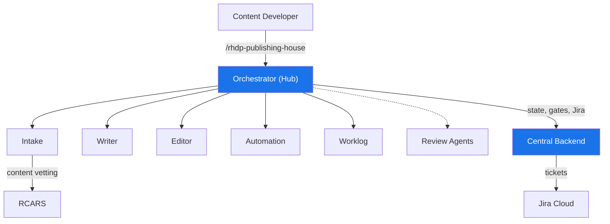

# Publishing House — Overview

## What is Publishing House?

Publishing House is an AI-powered content lifecycle management system for Red Hat Demo Platform — a Claude Code plugin that gives content developers a persistent, state-aware orchestrator managing the entire content lifecycle through specialized AI agent skills. Run `/rhdp-publishing-house` in a project repo and you have an assistant that knows where your project is, what's been done, and what needs to happen next.

Say you're building a new OpenShift workshop. Instead of manually writing AsciiDoc modules, creating AgnosticV catalog configurations, developing Ansible automation, and tracking progress in Jira — you tell Publishing House what you want to build, and it dispatches specialized agents to handle each phase while you focus on the design decisions that matter.

## The Problem It Solves

Building an RHDP workshop or demo means juggling multiple tools and skill sets — AsciiDoc for lab content, YAML for AgnosticV catalog items, Ansible or GitOps for automation, security reviews for compliance, Jira for tracking. Each step requires different expertise. Most time is spent on toil — formatting, boilerplate, configuration syntax — not on designing the learning experience.

There's also no single system that tracks where a project stands. Progress lives in scattered places: partially written modules in a git repo, a Jira ticket that may or may not be current, tribal knowledge about which reviews have happened. When someone picks up a project after a break, the first hour goes to figuring out where things left off.

## How It Works

### Hub + Spoke Architecture

Publishing House uses a thin orchestrator as its hub. When you invoke `/rhdp-publishing-house`, the orchestrator discovers your project, reads the manifest, determines which lifecycle phase you're in, and dispatches the appropriate skill. Each skill is a focused agent that reads its inputs from the manifest, produces its outputs, and hands control back.

Six skills run today: the orchestrator itself, intake (project onboarding and scoping), writer (lab and demo content generation), editor (content quality review), automation (AgnosticV catalog and Ansible), and worklog (session bridging). Code review, security review, and final review phases exist in the lifecycle but rely on review agents that are not yet implemented.

### Manifest as Truth

All project state flows from a single YAML file: `publishing-house/manifest.yaml` in the project's git repository. It records metadata, current lifecycle phase, phase completion status, and configuration. Every skill reads from it. Every phase transition updates it. Central and Jira are downstream consumers — they reflect the manifest, never the other way around.

Project state is versioned, portable, and auditable. You can `git log` the manifest to see exactly when each phase completed. There is no database that disagrees with the code.

### Central Backend

Central is the backend that ties the system together — a FastAPI application with a FastMCP server mounted at `/mcp`, deployed on OpenShift with PostgreSQL. It serves four roles:

**Gate authority.** When a project requests phase advancement, Central validates prerequisites and records the decision in a custody chain.

**Jira sync engine.** For onboarded projects, Central creates and updates Jira tickets automatically as work progresses. Developers never touch Jira — tickets update as a side effect of doing the work.

**RCARS gateway.** Central proxies content advisory requests to RCARS using Kubernetes ServiceAccount token authentication, so skills query RCARS through MCP tools rather than connecting directly.

**Project dashboard.** A Next.js frontend gives content managers visibility into all active projects — pipeline board, project detail views, custody chains, and validation results.

See [Central Backend](architecture/central.md) for the full technical architecture.

### RCARS Integration

During intake, Publishing House queries RCARS to check whether similar content already exists in the RHDP catalog. RCARS understands what each catalog item teaches — not just titles, but the actual lab content — so it detects semantic overlap that keyword searches would miss. If your proposed workshop covers the same ground as an existing one, PH surfaces that early. Reuse is always better than duplicate work.

See [RCARS Integration](architecture/rcars-integration.md) for the auth model and API details.

### Deployment Modes

Publishing House supports three deployment modes, each with different levels of process and oversight:

**Onboarded** is the full RHDP publishing lifecycle. The project gets a git repo from the PH template, a manifest, Jira tracking, RCARS vetting, all review gates, and a path to production in the RHDP catalog. This is the mode for content that will be maintained long-term.

**Self-published** follows the same lifecycle structure but with softer gates. Content developers manage their own publishing timeline. The manifest and skills still work, but Jira sync and formal review gates are not enforced.

**Express** is for one-off demo environments without the full publishing lifecycle — quick deployments where the infrastructure matters more than polished lab content. Express mode is currently in design.

### Session Continuity

Pick up where you left off any day, any session. The manifest preserves project state in git, and the worklog skill records what was accomplished and what should happen next. Run `/rhdp-publishing-house` after a month-long break and the orchestrator reads the manifest, checks Central, and tells you exactly where things stand.

## Who Uses It

**Content developers** are the primary users. They run `/rhdp-publishing-house` in a project repository and work through the lifecycle with AI assistance. The orchestrator guides each phase, dispatches the right skill, and tracks progress automatically.

**Content managers and PMs** view progress across projects in the Central dashboard and Jira — which projects are in which phase, gate decisions, velocity across the content portfolio. They don't need Claude Code.

**Platform engineers** maintain the Central backend, RCARS integration, and deployment infrastructure. They add new skills, extend the gate service, and manage the OpenShift deployments.

## What It Runs On

The skills plugin is a git repository that users clone and point their Claude Code installation at. The orchestrator and all agent skills run locally in Claude Code sessions.

Central runs on OpenShift as a FastAPI backend with a Next.js dashboard frontend, backed by PostgreSQL. RCARS runs in a separate namespace on the same cluster. Jira Cloud handles ticket tracking for onboarded projects. GitHub hosts the project repositories and manifest storage.

See [System Design](architecture/system-design.md) for the end-to-end technical architecture and [Getting Started](user/getting-started.md) for installation instructions.
