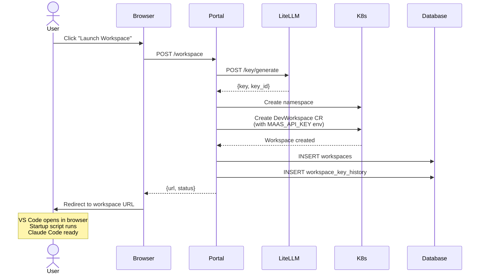
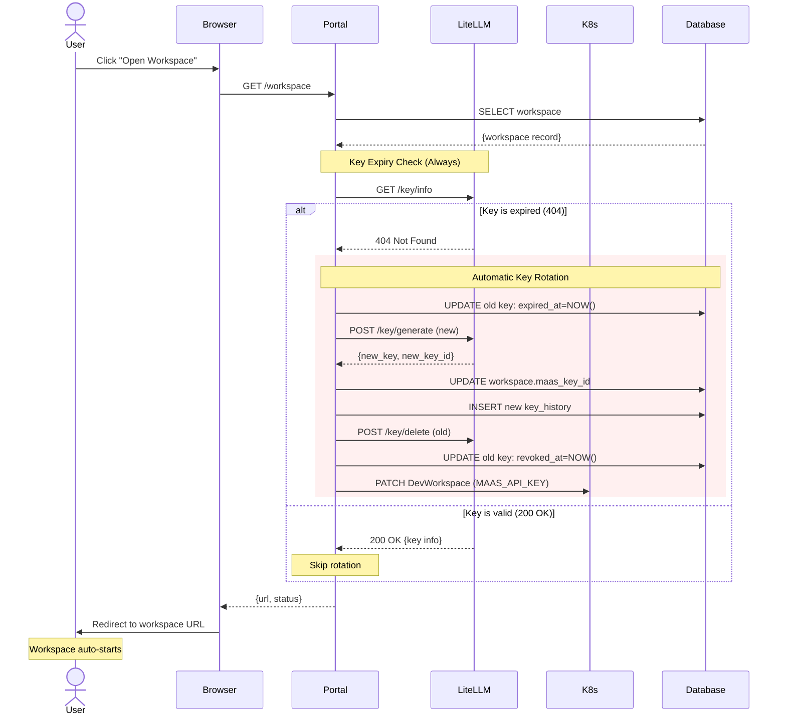
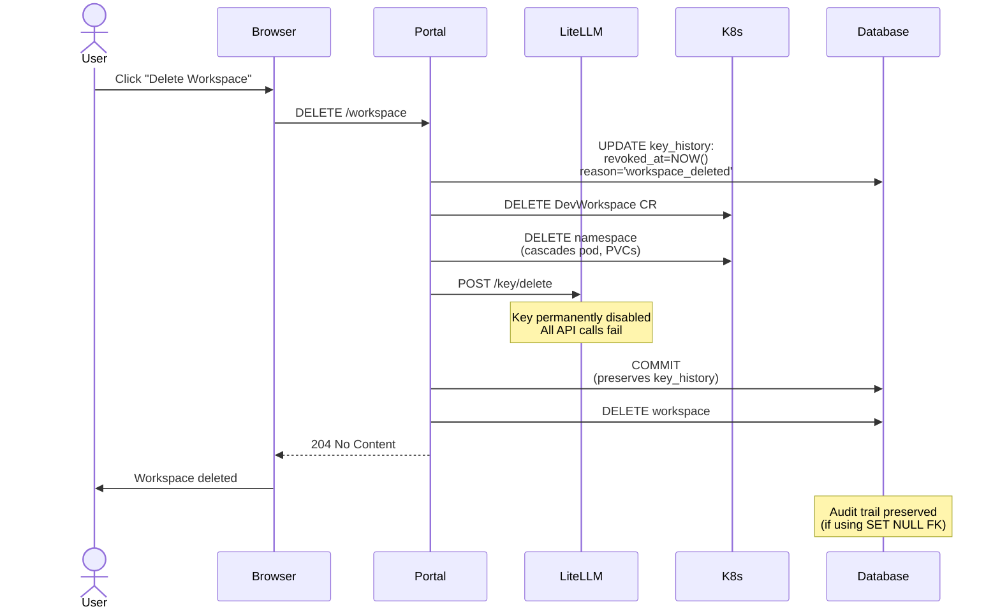
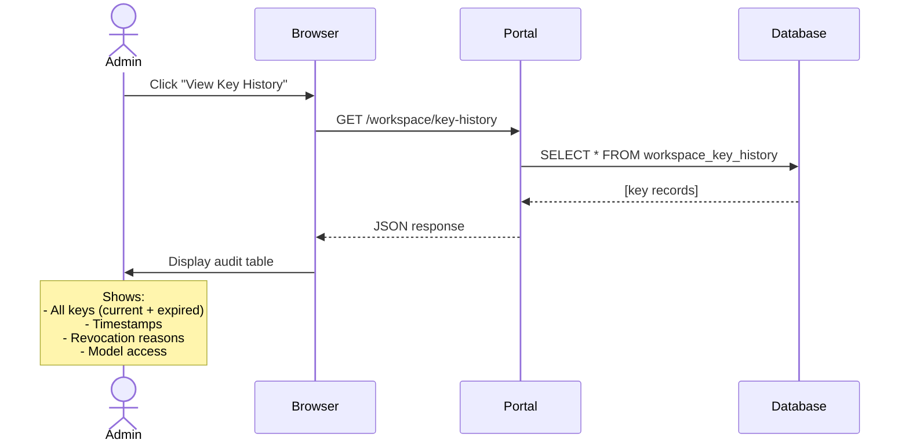

# Dev Spaces Integration — Implementation Spec

**Date:** 2026-06-29
**Status:** Implementation Ready
**Parent Spec:** [2026-05-15-hosted-workspace-design.md](./2026-05-15-hosted-workspace-design.md)
**Jira:** [RHDPCD-44](https://redhat.atlassian.net/browse/RHDPCD-44)

## Purpose

This spec defines the **concrete implementation** of the Dev Spaces integration for Publishing House. The parent spec (2026-05-15) established the overall design. This spec details the database schema, service architecture, API contracts, and deployment approach based on how AgnosticV currently deploys Dev Spaces.

---

## Architecture Overview

### Simple Flow

```
User clicks "Launch Workspace" on project page
  ↓
Portal backend:
  1. Creates MaaS API key via LiteLLM
  2. Creates DevWorkspace CR in Kubernetes
  3. Saves mapping to database
  ↓
User redirected to browser VS Code
Claude Code pre-configured and ready
```

### The 3 Core Components

1. **Custom UDI Image** — VS Code + Claude Code CLI + base tooling (skills cloned at runtime)
2. **Portal Backend Services** — Orchestrates workspace creation and key provisioning
3. **PostgreSQL Database** — Stores workspace → user → key mappings

---

## Database Schema

### New Table: `workspaces`

```sql
CREATE TABLE workspaces (
    -- Primary key
    id UUID PRIMARY KEY DEFAULT gen_random_uuid(),
    
    -- Project reference
    project_id UUID NOT NULL REFERENCES projects(id) ON DELETE CASCADE,
    
    -- User identification
    user_id VARCHAR NOT NULL,              -- e.g., "treddy"
    user_email VARCHAR NOT NULL,           -- e.g., "treddy@redhat.com"
    
    -- Dev Spaces workspace references
    workspace_id VARCHAR NOT NULL,         -- DevWorkspace UID from K8s
    workspace_namespace VARCHAR NOT NULL,  -- e.g., "devworkspace-treddy"
    workspace_name VARCHAR NOT NULL,       -- e.g., "ph-abc123ef"
    workspace_url VARCHAR NOT NULL,        -- Browser URL for redirect
    
    -- MaaS key references (for revocation)
    maas_key_id VARCHAR NOT NULL,          -- LiteLLM key ID
    maas_key_alias VARCHAR NOT NULL,       -- e.g., "ph-treddy-abc123ef"
    
    -- Audit trail
    created_at TIMESTAMP NOT NULL DEFAULT NOW(),
    updated_at TIMESTAMP NOT NULL DEFAULT NOW(),
    
    -- Constraints
    CONSTRAINT uq_workspace_project_user UNIQUE(project_id, user_id)
);

-- Indexes for lookups
CREATE INDEX ix_workspace_user_id ON workspaces(user_id);
CREATE INDEX ix_workspace_user_email ON workspaces(user_email);
CREATE INDEX ix_workspace_maas_key_alias ON workspaces(maas_key_alias);
```

### New Table: `workspace_key_history`

**Purpose:** Maintain audit trail of all MaaS keys provisioned for a workspace, including expired/rotated keys. Key history is **preserved after workspace deletion** for compliance and security investigations.

```sql
CREATE TABLE workspace_key_history (
    -- Primary key
    id UUID PRIMARY KEY DEFAULT gen_random_uuid(),
    
    -- Workspace reference (nullable to preserve audit trail after workspace deletion)
    workspace_id UUID REFERENCES workspaces(id) ON DELETE SET NULL,
    
    -- Denormalized fields for orphaned record identification after workspace deletion
    workspace_project_id UUID,             -- Original project ID
    workspace_user_email VARCHAR,          -- Original user email
    
    -- Key details
    maas_key_id VARCHAR NOT NULL,          -- LiteLLM key ID
    maas_key_alias VARCHAR NOT NULL,       -- e.g., "ph-treddy-abc123ef"
    
    -- Lifecycle tracking
    provisioned_at TIMESTAMP NOT NULL DEFAULT NOW(),
    expired_at TIMESTAMP,                  -- When key expired (null if still active)
    revoked_at TIMESTAMP,                  -- When key was manually revoked (null if expired naturally)
    revocation_reason VARCHAR,             -- "expired", "workspace_deleted", "user_requested", "security_rotation"
    
    -- Key metadata snapshot
    duration VARCHAR NOT NULL,             -- "30d", "7d"
    models JSONB NOT NULL,                 -- List of models this key had access to
    
    -- Audit info
    is_current BOOLEAN NOT NULL DEFAULT TRUE,  -- Only one current key per workspace
    
    -- Constraints (allow orphaned records where workspace_id is NULL)
    CONSTRAINT uq_one_current_key_per_workspace 
        EXCLUDE USING gist (workspace_id WITH =) 
        WHERE (is_current = TRUE AND workspace_id IS NOT NULL)
);

-- Indexes for audit queries
CREATE INDEX ix_key_history_workspace_id ON workspace_key_history(workspace_id) WHERE workspace_id IS NOT NULL;
CREATE INDEX ix_key_history_maas_key_id ON workspace_key_history(maas_key_id);
CREATE INDEX ix_key_history_is_current ON workspace_key_history(is_current) WHERE is_current = TRUE;
CREATE INDEX ix_key_history_expired_at ON workspace_key_history(expired_at) WHERE expired_at IS NOT NULL;
CREATE INDEX ix_key_history_project_id ON workspace_key_history(workspace_project_id);
CREATE INDEX ix_key_history_user_email ON workspace_key_history(workspace_user_email);
```

### Why Each Field

#### `workspaces` Table

| Field | Purpose | Used For |
|-------|---------|----------|
| `user_id` | Short username from OAuth | K8s namespace naming, lookups |
| `user_email` | Full email for identification | Support, audit trail, LiteLLM metadata |
| `workspace_namespace` | K8s namespace where DevWorkspace lives | Deletion without K8s list query |
| `workspace_name` | K8s resource name | Direct CR deletion |
| `maas_key_id` | **Current active** LiteLLM key ID | Primary deletion method |
| `maas_key_alias` | Human-readable key name | Fallback deletion, troubleshooting |

#### `workspace_key_history` Table

| Field | Purpose | Used For |
|-------|---------|----------|
| `workspace_id` | Reference to workspace (nullable) | Links to workspace if still exists, NULL if workspace deleted |
| `workspace_project_id` | Denormalized project ID | Identify orphaned records after workspace deletion |
| `workspace_user_email` | Denormalized user email | Identify orphaned records after workspace deletion |
| `provisioned_at` | When key was created | Audit trail, lifespan calculation |
| `expired_at` | **Natural expiration** (reached TTL) | Distinguish natural expiry from manual revocation |
| `revoked_at` | **Manual revocation** (LiteLLM API call) | Track when key was actively revoked |
| `revocation_reason` | Why key was revoked/expired | Security audits, compliance |
| `is_current` | Only one current key per workspace | Fast lookup of active key |
| `models` | Snapshot of model access | Audit what models were available |

**Timestamp semantics:**

- **`expired_at` only**: Key reached natural TTL (30d), not yet revoked from LiteLLM
- **`revoked_at` only**: Key manually revoked before expiration (workspace deleted, security rotation)
- **Both set**: Key expired naturally, then revoked from LiteLLM during rotation

**Key lifecycle scenarios:**

| Scenario | `expired_at` | `revoked_at` | `revocation_reason` |
|----------|-------------|-------------|---------------------|
| **Natural expiry + auto-rotation** | `NOW()` | `NOW()` (after revoke call) | `"expired"` |
| **Workspace deleted before expiry** | `NULL` | `NOW()` | `"workspace_deleted"` |
| **Security incident rotation** | `NULL` | `NOW()` | `"security_rotation"` |
| **User-requested rotation** | `NULL` | `NOW()` | `"user_requested"` |
| **Key still active** | `NULL` | `NULL` | `NULL` |

**Key rotation flow (natural expiration):**
1. User resumes workspace → Key validation fails (expired)
2. Mark old key: `is_current=false`, `expired_at=NOW()`, `revocation_reason='expired'`
3. Provision new key → New row in `workspace_key_history` with `is_current=true`
4. Update workspace table → `maas_key_id` points to new key
5. Revoke old key via LiteLLM → Set `revoked_at=NOW()` on old key record
6. Update DevWorkspace env vars → Workspace gets new key without restart

**Deletion flow (manual revocation):**
1. User deletes workspace
2. Mark current key: `is_current=false`, `revoked_at=NOW()`, `revocation_reason='workspace_deleted'`
3. Revoke key via LiteLLM
4. Delete workspace CR and namespace
5. Delete workspace record (cascades to history if configured, or keep for audit)

This maintains **complete audit trail** distinguishing natural expiration from manual revocation.

### Alembic Migration

```python
# alembic/versions/xxx_add_workspaces_table.py

"""Add workspaces table for Dev Spaces integration

Revision ID: xxx
Revises: yyy
Create Date: 2026-06-29

"""
from alembic import op
import sqlalchemy as sa
from sqlalchemy.dialects import postgresql

revision = 'xxx'
down_revision = 'yyy'
branch_labels = None
depends_on = None

def upgrade():
    # Create workspaces table
    op.create_table(
        'workspaces',
        sa.Column('id', postgresql.UUID(as_uuid=True), primary_key=True),
        sa.Column('project_id', postgresql.UUID(as_uuid=True), nullable=False),
        sa.Column('user_id', sa.String(), nullable=False),
        sa.Column('user_email', sa.String(), nullable=False),
        sa.Column('workspace_id', sa.String(), nullable=False),
        sa.Column('workspace_namespace', sa.String(), nullable=False),
        sa.Column('workspace_name', sa.String(), nullable=False),
        sa.Column('workspace_url', sa.String(), nullable=False),
        sa.Column('maas_key_id', sa.String(), nullable=False),
        sa.Column('maas_key_alias', sa.String(), nullable=False),
        sa.Column('created_at', sa.DateTime(), nullable=False, server_default=sa.func.now()),
        sa.Column('updated_at', sa.DateTime(), nullable=False, server_default=sa.func.now(), onupdate=sa.func.now()),
        sa.ForeignKeyConstraint(['project_id'], ['projects.id'], ondelete='CASCADE'),
        sa.UniqueConstraint('project_id', 'user_id', name='uq_workspace_project_user')
    )
    
    op.create_index('ix_workspace_user_id', 'workspaces', ['user_id'])
    op.create_index('ix_workspace_user_email', 'workspaces', ['user_email'])
    op.create_index('ix_workspace_maas_key_alias', 'workspaces', ['maas_key_alias'])
    
    # Create workspace_key_history table for audit trail
    # Uses ON DELETE SET NULL to preserve audit history after workspace deletion
    op.create_table(
        'workspace_key_history',
        sa.Column('id', postgresql.UUID(as_uuid=True), primary_key=True),
        sa.Column('workspace_id', postgresql.UUID(as_uuid=True), nullable=True),  # Nullable for orphaned records
        sa.Column('workspace_project_id', postgresql.UUID(as_uuid=True), nullable=True),  # Denormalized for audit
        sa.Column('workspace_user_email', sa.String(), nullable=True),  # Denormalized for audit
        sa.Column('maas_key_id', sa.String(), nullable=False),
        sa.Column('maas_key_alias', sa.String(), nullable=False),
        sa.Column('provisioned_at', sa.DateTime(), nullable=False, server_default=sa.func.now()),
        sa.Column('expired_at', sa.DateTime(), nullable=True),
        sa.Column('revoked_at', sa.DateTime(), nullable=True),
        sa.Column('revocation_reason', sa.String(), nullable=True),
        sa.Column('duration', sa.String(), nullable=False),
        sa.Column('models', postgresql.JSONB(), nullable=False),
        sa.Column('is_current', sa.Boolean(), nullable=False, server_default='true'),
        sa.ForeignKeyConstraint(['workspace_id'], ['workspaces.id'], ondelete='SET NULL')
    )
    
    op.create_index('ix_key_history_workspace_id', 'workspace_key_history', ['workspace_id'],
                    postgresql_where=sa.text('workspace_id IS NOT NULL'))
    op.create_index('ix_key_history_maas_key_id', 'workspace_key_history', ['maas_key_id'])
    op.create_index('ix_key_history_is_current', 'workspace_key_history', ['is_current'], 
                    postgresql_where=sa.text('is_current = true'))
    op.create_index('ix_key_history_expired_at', 'workspace_key_history', ['expired_at'],
                    postgresql_where=sa.text('expired_at IS NOT NULL'))
    op.create_index('ix_key_history_project_id', 'workspace_key_history', ['workspace_project_id'])
    op.create_index('ix_key_history_user_email', 'workspace_key_history', ['workspace_user_email'])

def downgrade():
    op.drop_table('workspace_key_history')
    op.drop_table('workspaces')
```

### SQLAlchemy Models

```python
# app/models/workspace.py

from sqlalchemy import Column, String, ForeignKey, DateTime, Boolean
from sqlalchemy.dialects.postgresql import UUID, JSONB
from sqlalchemy.orm import relationship
import uuid
from datetime import datetime
from app.core.database import Base

class Workspace(Base):
    __tablename__ = "workspaces"
    
    id = Column(UUID(as_uuid=True), primary_key=True, default=uuid.uuid4)
    project_id = Column(UUID(as_uuid=True), ForeignKey("projects.id", ondelete="CASCADE"), nullable=False)
    user_id = Column(String, nullable=False, index=True)
    user_email = Column(String, nullable=False, index=True)
    workspace_id = Column(String, nullable=False)
    workspace_namespace = Column(String, nullable=False)
    workspace_name = Column(String, nullable=False)
    workspace_url = Column(String, nullable=False)
    maas_key_id = Column(String, nullable=False)  # Current active key
    maas_key_alias = Column(String, nullable=False, index=True)
    created_at = Column(DateTime, default=datetime.utcnow, nullable=False)
    updated_at = Column(DateTime, default=datetime.utcnow, onupdate=datetime.utcnow, nullable=False)
    
    # Relationships
    key_history = relationship("WorkspaceKeyHistory", back_populates="workspace", cascade="all, delete-orphan")
    
    __table_args__ = (
        UniqueConstraint("project_id", "user_id", name="uq_workspace_project_user"),
    )


class WorkspaceKeyHistory(Base):
    __tablename__ = "workspace_key_history"
    
    id = Column(UUID(as_uuid=True), primary_key=True, default=uuid.uuid4)
    workspace_id = Column(UUID(as_uuid=True), ForeignKey("workspaces.id", ondelete="SET NULL"), nullable=True)
    workspace_project_id = Column(UUID(as_uuid=True), nullable=True, index=True)  # Denormalized for audit
    workspace_user_email = Column(String, nullable=True, index=True)  # Denormalized for audit
    maas_key_id = Column(String, nullable=False, index=True)
    maas_key_alias = Column(String, nullable=False)
    provisioned_at = Column(DateTime, default=datetime.utcnow, nullable=False)
    expired_at = Column(DateTime, nullable=True)
    revoked_at = Column(DateTime, nullable=True)
    revocation_reason = Column(String, nullable=True)  # "expired", "workspace_deleted", "user_requested", "security_rotation"
    duration = Column(String, nullable=False)  # "30d", "7d"
    models = Column(JSONB, nullable=False)  # ["claude-sonnet-4-5"]
    is_current = Column(Boolean, nullable=False, default=True, index=True)
    
    # Relationships
    workspace = relationship("Workspace", back_populates="key_history")
```

**Usage example:**

```python
# Get current key for a workspace
workspace = db.query(Workspace).filter_by(project_id=pid, user_id=uid).first()
current_key = db.query(WorkspaceKeyHistory).filter_by(
    workspace_id=workspace.id,
    is_current=True
).first()

# Get full key rotation history
all_keys = db.query(WorkspaceKeyHistory).filter_by(
    workspace_id=workspace.id
).order_by(WorkspaceKeyHistory.provisioned_at.desc()).all()

# Audit query: Find all expired keys in last 30 days
from datetime import timedelta
expired_keys = db.query(WorkspaceKeyHistory).filter(
    WorkspaceKeyHistory.expired_at >= datetime.utcnow() - timedelta(days=30),
    WorkspaceKeyHistory.revocation_reason == "expired"
).all()
```

---

## Backend Services

### Service Architecture

Three new service classes following existing Central patterns (`RCARSClient`, `GitHubClient`):

```
WorkspaceManager (orchestrator)
    ├─→ LiteLLMClient (MaaS key provisioning)
    ├─→ DevSpacesClient (K8s DevWorkspace management)
    └─→ Database (workspace record CRUD)
```

### 1. LiteLLMClient

**Purpose:** Interact with LiteLLM REST API for virtual key management

**Pattern:** Mirrors `rhpds.litellm_virtual_keys` Ansible role API calls

```python
# app/services/litellm_client.py

import httpx
from typing import Optional
from app.core.config import settings
from app.core.exceptions import KeyExpired

class LiteLLMClient:
    """Client for LiteLLM REST API (MaaS virtual key management)"""
    
    def __init__(self):
        self.base_url = settings.LITELLM_URL
        self.master_key = settings.LITELLM_MASTER_KEY
        self.timeout = 30.0
        self.client = httpx.AsyncClient(
            timeout=self.timeout,
            headers={"Authorization": f"Bearer {self.master_key}"}
        )
    
    async def provision_key(
        self,
        alias: str,
        user_id: str,
        user_email: str,
        duration: str,  # "7d", "30d"
        models: list[str],
        metadata: dict
    ) -> dict:
        """
        Provision a new virtual key via LiteLLM
        
        POST /key/generate
        
        Returns:
            {
                "key": "sk-...",           # The actual API key
                "key_id": "key_123...",    # LiteLLM internal ID
                "expires": "2026-07-29T..."
            }
        """
        response = await self.client.post(
            f"{self.base_url}/key/generate",
            json={
                "key_alias": alias,
                "duration": duration,
                "models": models,
                "metadata": {
                    **metadata,
                    "owner": user_email,
                    "created_by": "publishing-house"
                },
                "max_budget": None  # Unlimited for PH users
            }
        )
        response.raise_for_status()
        return response.json()
    
    async def validate_key(self, key_id: str) -> bool:
        """
        Check if a key is still valid
        
        GET /key/info?key_id={key_id}
        
        Raises KeyExpired if key is not found or expired
        """
        response = await self.client.get(
            f"{self.base_url}/key/info",
            params={"key_id": key_id}
        )
        
        if response.status_code == 404:
            raise KeyExpired(f"Key {key_id} expired or not found")
        
        response.raise_for_status()
        return True
    
    async def revoke_key(self, key_id: str):
        """
        Revoke a virtual key
        
        POST /key/delete
        """
        response = await self.client.post(
            f"{self.base_url}/key/delete",
            json={"keys": [key_id]}
        )
        response.raise_for_status()
    
    async def revoke_by_alias(self, alias: str):
        """
        Revoke key by alias (fallback method)
        
        Uses the same endpoint but with alias lookup
        """
        # Implementation depends on LiteLLM version
        # May need to list keys by alias first, then delete by ID
        pass
```

**Configuration (app/core/config.py):**

```python
class Settings(BaseSettings):
    # ... existing settings ...
    
    # LiteLLM (MaaS) settings
    LITELLM_URL: str
    LITELLM_MASTER_KEY: str  # Loaded from K8s Secret
    LITELLM_KEY_DURATION: str = "30d"
    LITELLM_MODELS: list[str] = ["claude-sonnet-4-5"]
```

**Security: LiteLLM Master Key Storage**

The LiteLLM master key is **never stored in code or environment variables**. It is securely stored in an OpenShift Secret with access restricted to the Publishing House application pod only.

```yaml
# manifests/secrets/litellm-credentials.yaml
apiVersion: v1
kind: Secret
metadata:
  name: litellm-credentials
  namespace: publishing-house-central-dev
type: Opaque
stringData:
  master-key: "sk-1234..."  # LiteLLM master key (set manually or via Ansible vault)
```

**Secret mounted to backend pod:**

```yaml
# manifests/deployment-backend.yaml (excerpt)
spec:
  template:
    spec:
      containers:
      - name: backend
        env:
        - name: LITELLM_MASTER_KEY
          valueFrom:
            secretKeyRef:
              name: litellm-credentials
              key: master-key
```

**Access control:**

- Secret accessible only to pods in `publishing-house-central-dev` namespace
- No other applications can read this Secret
- Secret not logged or exposed in pod specs
- Rotation: Update Secret, restart pods (no code changes required)

**Security Review Required:**

This implementation requires approval from Prakhar (security reviewer) before proceeding. See [Security Review](#security-review) section for pre-implementation approval requirements and post-implementation audit scope.

### 2. DevSpacesClient

**Purpose:** Manage DevWorkspace CRs via Kubernetes API

**Pattern:** Based on AgnosticV `ocp4_workload_devspaces` role

```python
# app/services/devspaces_client.py

from kubernetes import client, config
from kubernetes.client.rest import ApiException
from typing import Optional

class DevSpacesClient:
    """Client for Dev Spaces API (DevWorkspace CR management)"""
    
    def __init__(self):
        # Use in-cluster config (ServiceAccount token)
        config.load_incluster_config()
        self.custom_api = client.CustomObjectsApi()
        self.core_api = client.CoreV1Api()
    
    async def create_workspace(
        self,
        name: str,
        namespace: str,
        repo_url: str,
        repo_branch: str,
        env_vars: dict
    ) -> dict:
        """
        Create a DevWorkspace CR
        
        Returns:
            {
                "workspace_id": "uid-from-k8s",
                "workspace_url": "https://..."
            }
        """
        
        # 1. Create namespace if not exists (with PH label for cleanup tracking)
        try:
            self.core_api.create_namespace(
                body=client.V1Namespace(
                    metadata=client.V1ObjectMeta(
                        name=namespace,
                        labels={
                            "app.kubernetes.io/managed-by": "publishing-house"
                        }
                    )
                )
            )
        except ApiException as e:
            if e.status != 409:  # 409 = Already exists
                raise
        
        # 2. Create DevWorkspace CR
        devworkspace_manifest = {
            "apiVersion": "workspace.devfile.io/v1alpha2",
            "kind": "DevWorkspace",
            "metadata": {
                "name": name,
                "namespace": namespace,
                "labels": {
                    "app.kubernetes.io/managed-by": "publishing-house"
                }
            },
            "spec": {
                "routingClass": "che",
                "started": True,
                "contributions": [
                    {
                        "name": "ide",
                        "uri": "http://devspaces-dashboard.openshift-devspaces.svc.cluster.local:8080/dashboard/api/editors/devfile?che-editor=che-incubator/che-code/latest"
                    }
                ],
                "template": {
                    "projects": [
                        {
                            "name": "project",
                            "git": {
                                "remotes": {"origin": repo_url},
                                "checkoutFrom": {"revision": repo_branch}
                            }
                        }
                    ],
                    "components": [
                        {
                            "name": "dev",
                            "container": {
                                "image": "quay.io/rhpds/ph-udi:latest",
                                "memoryLimit": "4Gi",
                                "cpuLimit": "2",
                                "env": [
                                    {"name": k, "value": v}
                                    for k, v in env_vars.items()
                                ]
                            }
                        }
                    ],
                    "commands": [
                        {
                            "id": "post-start",
                            "exec": {
                                "component": "dev",
                                "commandLine": "/opt/ph/scripts/workspace-startup.sh",
                                "workingDir": "/projects"
                            }
                        }
                    ],
                    "events": {
                        "postStart": ["post-start"]
                    }
                }
            }
        }
        
        result = self.custom_api.create_namespaced_custom_object(
            group="workspace.devfile.io",
            version="v1alpha2",
            namespace=namespace,
            plural="devworkspaces",
            body=devworkspace_manifest
        )
        
        workspace_id = result["metadata"]["uid"]
        workspace_url = self._construct_workspace_url(name, namespace)
        
        return {
            "workspace_id": workspace_id,
            "workspace_url": workspace_url
        }
    
    def _construct_workspace_url(self, name: str, namespace: str) -> str:
        """
        Construct workspace URL from Dev Spaces routing pattern
        
        Pattern: https://{name}-{namespace}.apps.{cluster-domain}
        """
        cluster_domain = "ocpv-infra01.dal12.infra.demo.redhat.com"
        return f"https://{name}-{namespace}.apps.{cluster_domain}"
    
    async def get_workspace_status(self, namespace: str, name: str) -> Optional[str]:
        """
        Get workspace status from K8s
        
        Returns: "Running", "Stopped", "Starting", or None if not found
        """
        try:
            ws = self.custom_api.get_namespaced_custom_object(
                group="workspace.devfile.io",
                version="v1alpha2",
                namespace=namespace,
                plural="devworkspaces",
                name=name
            )
            return ws.get("status", {}).get("phase", "Unknown")
        except ApiException as e:
            if e.status == 404:
                return None
            raise
    
    async def start_workspace(self, namespace: str, name: str):
        """
        Start a stopped workspace by patching started: true
        """
        patch = {"spec": {"started": True}}
        
        self.custom_api.patch_namespaced_custom_object(
            group="workspace.devfile.io",
            version="v1alpha2",
            namespace=namespace,
            plural="devworkspaces",
            name=name,
            body=patch
        )
    
    async def update_env_vars(self, namespace: str, name: str, env_vars: dict):
        """
        Update environment variables in a DevWorkspace
        
        Used for key rotation - updates MAAS_API_KEY after reprovisioning
        """
        # Get current DevWorkspace
        ws = self.custom_api.get_namespaced_custom_object(
            group="workspace.devfile.io",
            version="v1alpha2",
            namespace=namespace,
            plural="devworkspaces",
            name=name
        )
        
        # Update env vars in the dev container component
        components = ws["spec"]["template"]["components"]
        for component in components:
            if component["name"] == "dev" and "container" in component:
                env_list = component["container"].get("env", [])
                
                # Update or add each env var
                for key, value in env_vars.items():
                    # Find existing env var
                    found = False
                    for env_item in env_list:
                        if env_item["name"] == key:
                            env_item["value"] = value
                            found = True
                            break
                    
                    # Add new env var if not found
                    if not found:
                        env_list.append({"name": key, "value": value})
                
                component["container"]["env"] = env_list
        
        # Patch the DevWorkspace
        self.custom_api.patch_namespaced_custom_object(
            group="workspace.devfile.io",
            version="v1alpha2",
            namespace=namespace,
            plural="devworkspaces",
            name=name,
            body=ws
        )
    
    async def delete_workspace(self, namespace: str, name: str):
        """
        Delete DevWorkspace CR and namespace
        """
        # Delete DevWorkspace
        try:
            self.custom_api.delete_namespaced_custom_object(
                group="workspace.devfile.io",
                version="v1alpha2",
                namespace=namespace,
                plural="devworkspaces",
                name=name
            )
        except ApiException as e:
            if e.status != 404:
                raise
        
        # Delete namespace (will cascade delete workspace resources)
        try:
            self.core_api.delete_namespace(name=namespace)
        except ApiException as e:
            if e.status != 404:
                raise
```

### 3. WorkspaceManager

**Purpose:** Orchestrates LiteLLM + DevSpaces + Database

```python
# app/services/workspace_manager.py

from typing import Optional
from pydantic import BaseModel
from sqlalchemy.orm import Session
from app.services.litellm_client import LiteLLMClient
from app.services.devspaces_client import DevSpacesClient
from app.models.workspace import Workspace
from app.core.config import settings
from app.core.exceptions import WorkspaceNotFound

class WorkspaceInfo(BaseModel):
    """Workspace info returned to API"""
    url: str
    status: str

class WorkspaceManager:
    """Orchestrates workspace lifecycle"""
    
    def __init__(
        self,
        litellm: LiteLLMClient,
        devspaces: DevSpacesClient,
        db: Session
    ):
        self.litellm = litellm
        self.devspaces = devspaces
        self.db = db
    
    async def create_workspace(
        self,
        project_id: str,
        user_id: str,
        user_email: str,
        repo_url: str,
        repo_branch: str = "main"
    ) -> WorkspaceInfo:
        """
        Create workspace + provision MaaS key + store in DB
        
        Steps:
          1. Provision MaaS key via LiteLLM
          2. Create DevWorkspace with key injected as env var
          3. Save record to database
          4. Return workspace URL for redirect
        """
        
        # 1. Provision MaaS key
        key_alias = f"ph-{user_id}-{project_id[:8]}"
        
        key_result = await self.litellm.provision_key(
            alias=key_alias,
            user_id=user_id,
            user_email=user_email,
            duration=settings.LITELLM_KEY_DURATION,
            models=settings.LITELLM_MODELS,
            metadata={
                "project_id": project_id,
                "user_id": user_id
            }
        )
        
        # 2. Create Dev Spaces workspace
        workspace_name = f"ph-{project_id[:8]}"
        workspace_namespace = f"devworkspace-{user_id}"
        repo_name = repo_url.split("/")[-1].replace(".git", "")
        
        ws_result = await self.devspaces.create_workspace(
            name=workspace_name,
            namespace=workspace_namespace,
            repo_url=repo_url,
            repo_branch=repo_branch,
            env_vars={
                "MAAS_API_KEY": key_result["key"],
                "MCP_ENDPOINT": settings.MCP_ENDPOINT_URL,
                "LITELLM_URL": settings.LITELLM_URL,
                "PROJECT_ID": project_id,
                "PROJECT_REPO_NAME": repo_name
            }
        )
        
        # 3. Store in database
        workspace = Workspace(
            project_id=project_id,
            user_id=user_id,
            user_email=user_email,
            workspace_id=ws_result["workspace_id"],
            workspace_namespace=workspace_namespace,
            workspace_name=workspace_name,
            workspace_url=ws_result["workspace_url"],
            maas_key_id=key_result["key_id"],
            maas_key_alias=key_alias
        )
        
        self.db.add(workspace)
        self.db.flush()  # Get workspace.id
        
        # 4. Record key in audit history with denormalized fields
        key_history = WorkspaceKeyHistory(
            workspace_id=workspace.id,
            workspace_project_id=project_id,  # Denormalized for audit trail preservation
            workspace_user_email=user_email,  # Denormalized for audit trail preservation
            maas_key_id=key_result["key_id"],
            maas_key_alias=key_alias,
            duration=settings.LITELLM_KEY_DURATION,
            models=settings.LITELLM_MODELS,
            is_current=True
        )
        
        self.db.add(key_history)
        self.db.commit()
        self.db.refresh(workspace)
        
        return WorkspaceInfo(
            url=ws_result["workspace_url"],
            status="starting"
        )
    
    async def get_workspace(
        self,
        project_id: str,
        user_id: str
    ) -> Optional[WorkspaceInfo]:
        """
        Get workspace info from database
        
        Returns None if workspace doesn't exist
        """
        workspace = self.db.query(Workspace).filter_by(
            project_id=project_id,
            user_id=user_id
        ).first()
        
        if not workspace:
            return None
        
        # Optional: Query K8s for live status
        status = await self.devspaces.get_workspace_status(
            workspace.workspace_namespace,
            workspace.workspace_name
        )
        
        return WorkspaceInfo(
            url=workspace.workspace_url,
            status=status or "unknown"
        )
    
    async def resume_workspace(
        self,
        project_id: str,
        user_id: str
    ) -> WorkspaceInfo:
        """
        Resume a stopped workspace
        
        Steps:
          1. Get workspace record from DB
          2. Validate MaaS key (reprovision if expired)
          3. Start workspace
          4. Return URL
        """
        workspace = self.db.query(Workspace).filter_by(
            project_id=project_id,
            user_id=user_id
        ).first()
        
        if not workspace:
            raise WorkspaceNotFound(f"No workspace for project {project_id}")
        
        # Validate key
        try:
            await self.litellm.validate_key(workspace.maas_key_id)
        except KeyExpired:
            # Key expired - rotate to new key with full audit trail
            
            # 1. Mark old key as expired in history
            old_key_record = self.db.query(WorkspaceKeyHistory).filter_by(
                workspace_id=workspace.id,
                is_current=True
            ).first()
            
            if old_key_record:
                old_key_record.is_current = False
                old_key_record.expired_at = datetime.utcnow()
                old_key_record.revocation_reason = "expired"
            
            # 2. Provision new key
            new_key = await self.litellm.provision_key(
                alias=workspace.maas_key_alias,  # Keep same alias
                user_id=user_id,
                user_email=workspace.user_email,
                duration=settings.LITELLM_KEY_DURATION,
                models=settings.LITELLM_MODELS,
                metadata={"project_id": project_id}
            )
            
            # 3. Update workspace with new key
            workspace.maas_key_id = new_key["key_id"]
            
            # 4. Record new key in history with denormalized fields
            new_key_record = WorkspaceKeyHistory(
                workspace_id=workspace.id,
                workspace_project_id=project_id,  # Denormalized for audit trail preservation
                workspace_user_email=workspace.user_email,  # Denormalized for audit trail preservation
                maas_key_id=new_key["key_id"],
                maas_key_alias=workspace.maas_key_alias,
                duration=settings.LITELLM_KEY_DURATION,
                models=settings.LITELLM_MODELS,
                is_current=True
            )
            self.db.add(new_key_record)
            
            # 5. Revoke old key via LiteLLM
            if old_key_record:
                try:
                    await self.litellm.revoke_key(old_key_record.maas_key_id)
                    old_key_record.revoked_at = datetime.utcnow()
                except Exception as e:
                    # Log but don't fail - key already expired anyway
                    pass
            
            # 6. Update workspace env vars via K8s patch
            await self.devspaces.update_env_vars(
                workspace.workspace_namespace,
                workspace.workspace_name,
                {"MAAS_API_KEY": new_key["key"]}
            )
            
            self.db.commit()
        
        # Start workspace
        await self.devspaces.start_workspace(
            workspace.workspace_namespace,
            workspace.workspace_name
        )
        
        return WorkspaceInfo(
            url=workspace.workspace_url,
            status="starting"
        )
    
    async def delete_workspace(
        self,
        project_id: str,
        user_id: str
    ):
        """
        Delete workspace + revoke MaaS key + remove DB record
        
        Steps:
          1. Delete DevWorkspace CR
          2. Revoke MaaS key
          3. Remove database record
        """
        workspace = self.db.query(Workspace).filter_by(
            project_id=project_id,
            user_id=user_id
        ).first()
        
        if not workspace:
            return  # Already deleted
        
        # 1. Mark current key as revoked in history (before deletion)
        current_key_record = self.db.query(WorkspaceKeyHistory).filter_by(
            workspace_id=workspace.id,
            is_current=True
        ).first()
        
        if current_key_record:
            current_key_record.is_current = False
            current_key_record.revoked_at = datetime.utcnow()  # Manual revocation, NOT expired_at
            current_key_record.revocation_reason = "workspace_deleted"
            # Note: expired_at remains NULL - this was manual revocation, not natural expiration
        
        # 2. Delete workspace from K8s
        await self.devspaces.delete_workspace(
            workspace.workspace_namespace,
            workspace.workspace_name
        )
        
        # 3. Revoke key from LiteLLM
        #    This calls: POST /key/delete with {"keys": [key_id]}
        #    Effect:
        #      - Immediately disables the key (no more API calls accepted)
        #      - LiteLLM marks key as deleted in their database
        #      - Key removed from active keys list
        #      - Any in-flight requests with this key will fail
        #      - Key no longer counts against quota limits
        await self.litellm.revoke_key(workspace.maas_key_id)
        
        # 4. Commit key_history updates BEFORE deleting workspace
        #    This preserves audit trail - workspace_id will be set to NULL on deletion
        self.db.commit()
        
        # 5. Delete workspace record
        #    Foreign key ON DELETE SET NULL preserves key_history with workspace_id=NULL
        #    Denormalized fields (workspace_project_id, workspace_user_email) remain for audit queries
        self.db.delete(workspace)
        self.db.commit()
```

**Audit trail preservation:**

The `workspace_key_history` table uses `ON DELETE SET NULL` to **preserve audit history** after workspace deletion. This is critical for compliance, security investigations, and forensic analysis.

**How it works:**

1. When a workspace is deleted, `workspace_id` is set to NULL in all key history records
2. Denormalized fields (`workspace_project_id`, `workspace_user_email`) preserve context
3. Key history remains queryable for compliance reporting and security audits
4. Periodic cleanup job removes history older than retention period (e.g., 90 days)

**Example audit queries:**

```sql
-- Show all keys provisioned for a user in the last 90 days (including deleted workspaces)
SELECT maas_key_id, maas_key_alias, provisioned_at, expired_at, revoked_at, revocation_reason
FROM workspace_key_history
WHERE workspace_user_email = 'treddy@redhat.com'
  AND provisioned_at >= NOW() - INTERVAL '90 days'
ORDER BY provisioned_at DESC;

-- Find all orphaned key history records (workspace deleted but history preserved)
SELECT workspace_project_id, workspace_user_email, COUNT(*) as key_count
FROM workspace_key_history
WHERE workspace_id IS NULL
GROUP BY workspace_project_id, workspace_user_email;

-- Audit: Show all keys for a project (even if workspace deleted)
SELECT workspace_user_email, maas_key_alias, provisioned_at, revoked_at
FROM workspace_key_history
WHERE workspace_project_id = 'abc-123-def'
ORDER BY provisioned_at DESC;
```

**Retention policy:**

A periodic cleanup job (APScheduler task) removes key history records older than 90 days to prevent unbounded growth while maintaining compliance-required retention.

---

## Workspace Cleanup Service

**Purpose:** Prevent workspace/namespace sprawl by automatically cleaning up idle, stale, and orphaned workspaces. This is a **core feature** implemented from day one to ensure cluster resources remain available.

### Cleanup Policies

| Policy | Trigger | Action | Configurable |
|--------|---------|--------|--------------|
| **Idle timeout** | No activity for 7 days | Stop workspace (preserve data) | `WORKSPACE_IDLE_DAYS` |
| **Max lifetime** | Workspace older than 90 days | Delete workspace + namespace | `WORKSPACE_MAX_LIFETIME_DAYS` |
| **Orphaned workspaces** | Workspace in K8s but not in DB | Delete namespace | N/A |
| **Orphaned DB records** | Workspace in DB but not in K8s | Delete DB record | N/A |
| **Stale keys** | Key in DB but not in LiteLLM | Revoke from DB | N/A |

**Activity tracking:**
- Activity = any workspace start/resume operation
- Tracked via `workspaces.updated_at` timestamp
- Updated on every `resume_workspace()` call

### Service Architecture

```python
# app/services/workspace_cleanup.py

from datetime import datetime, timedelta
from typing import List, Dict
from sqlalchemy.orm import Session
from kubernetes.client.rest import ApiException

from app.core.config import settings
from app.models.workspace import Workspace, WorkspaceKeyHistory
from app.services.devspaces_client import DevSpacesClient
from app.services.litellm_client import LiteLLMClient
import logging

logger = logging.getLogger(__name__)


class WorkspaceCleanupService:
    """
    Automated workspace cleanup to prevent resource sprawl.
    
    Runs daily via APScheduler to clean:
    - Idle workspaces (stopped after inactivity)
    - Old workspaces (deleted after max lifetime)
    - Orphaned resources (K8s without DB or vice versa)
    - Stale keys (DB records without LiteLLM keys)
    """
    
    def __init__(
        self,
        db: Session,
        devspaces: DevSpacesClient,
        litellm: LiteLLMClient
    ):
        self.db = db
        self.devspaces = devspaces
        self.litellm = litellm
        
        # Load config
        self.idle_days = getattr(settings, 'WORKSPACE_IDLE_DAYS', 7)
        self.max_lifetime_days = getattr(settings, 'WORKSPACE_MAX_LIFETIME_DAYS', 90)
        self.key_history_retention_days = getattr(settings, 'KEY_HISTORY_RETENTION_DAYS', 90)
        self.dry_run = getattr(settings, 'WORKSPACE_CLEANUP_DRY_RUN', False)
    
    async def cleanup_all(self) -> Dict[str, int]:
        """
        Run all cleanup operations and return metrics.
        
        Returns:
            {
                "idle_stopped": count,
                "old_deleted": count,
                "orphaned_k8s_deleted": count,
                "orphaned_db_deleted": count,
                "stale_keys_revoked": count,
                "old_key_history_deleted": count
            }
        """
        metrics = {
            "idle_stopped": 0,
            "old_deleted": 0,
            "orphaned_k8s_deleted": 0,
            "orphaned_db_deleted": 0,
            "stale_keys_revoked": 0,
            "old_key_history_deleted": 0
        }
        
        logger.info("Starting workspace cleanup (dry_run=%s)", self.dry_run)
        
        # 1. Stop idle workspaces
        metrics["idle_stopped"] = await self.cleanup_idle_workspaces()
        
        # 2. Delete old workspaces
        metrics["old_deleted"] = await self.cleanup_old_workspaces()
        
        # 3. Clean up orphaned K8s resources
        metrics["orphaned_k8s_deleted"] = await self.cleanup_orphaned_k8s_workspaces()
        
        # 4. Clean up orphaned DB records
        metrics["orphaned_db_deleted"] = await self.cleanup_orphaned_db_workspaces()
        
        # 5. Revoke stale keys
        metrics["stale_keys_revoked"] = await self.cleanup_stale_keys()
        
        # 6. Clean up old key history
        metrics["old_key_history_deleted"] = self.cleanup_old_key_history()
        
        logger.info("Workspace cleanup complete: %s", metrics)
        return metrics
    
    async def cleanup_idle_workspaces(self) -> int:
        """
        Stop workspaces that haven't been accessed in WORKSPACE_IDLE_DAYS.
        
        Preserves data but stops the pod to free cluster resources.
        """
        cutoff = datetime.utcnow() - timedelta(days=self.idle_days)
        
        idle_workspaces = self.db.query(Workspace).filter(
            Workspace.updated_at < cutoff
        ).all()
        
        count = 0
        for workspace in idle_workspaces:
            # Check K8s status
            status = await self.devspaces.get_workspace_status(
                workspace.workspace_namespace,
                workspace.workspace_name
            )
            
            # Only stop if currently running
            if status == "Running":
                logger.info(
                    "Stopping idle workspace: %s (last activity: %s)",
                    workspace.workspace_name,
                    workspace.updated_at
                )
                
                if not self.dry_run:
                    # Stop workspace (set started: false in DevWorkspace CR)
                    await self.devspaces.stop_workspace(
                        workspace.workspace_namespace,
                        workspace.workspace_name
                    )
                
                count += 1
        
        return count
    
    async def cleanup_old_workspaces(self) -> int:
        """
        Delete workspaces older than WORKSPACE_MAX_LIFETIME_DAYS.
        
        Full deletion: namespace, workspace CR, DB record, revoke MaaS key.
        """
        cutoff = datetime.utcnow() - timedelta(days=self.max_lifetime_days)
        
        old_workspaces = self.db.query(Workspace).filter(
            Workspace.created_at < cutoff
        ).all()
        
        count = 0
        for workspace in old_workspaces:
            logger.info(
                "Deleting old workspace: %s (created: %s, age: %d days)",
                workspace.workspace_name,
                workspace.created_at,
                (datetime.utcnow() - workspace.created_at).days
            )
            
            if not self.dry_run:
                # Full deletion workflow
                await self._delete_workspace_fully(workspace)
            
            count += 1
        
        return count
    
    async def cleanup_orphaned_k8s_workspaces(self) -> int:
        """
        Delete DevWorkspace namespaces that exist in K8s but not in DB.
        
        These are orphaned resources from failed deletions or manual interventions.
        """
        # List all PH-managed namespaces in K8s
        all_namespaces = await self.devspaces.list_ph_namespaces()
        
        # Get all known namespaces from DB
        db_namespaces = {w.workspace_namespace for w in self.db.query(Workspace).all()}
        
        # Find orphans
        orphaned = [ns for ns in all_namespaces if ns not in db_namespaces]
        
        count = 0
        for namespace in orphaned:
            logger.warning(
                "Found orphaned namespace in K8s (not in DB): %s",
                namespace
            )
            
            if not self.dry_run:
                # Delete namespace (cascades to all resources)
                await self.devspaces.delete_namespace(namespace)
            
            count += 1
        
        return count
    
    async def cleanup_orphaned_db_workspaces(self) -> int:
        """
        Delete DB workspace records where K8s namespace doesn't exist.
        
        These are stale DB records from failed deletions.
        """
        all_workspaces = self.db.query(Workspace).all()
        
        count = 0
        for workspace in all_workspaces:
            # Check if namespace exists in K8s
            status = await self.devspaces.get_workspace_status(
                workspace.workspace_namespace,
                workspace.workspace_name
            )
            
            if status is None:
                logger.warning(
                    "Found orphaned DB record (K8s namespace gone): %s",
                    workspace.workspace_name
                )
                
                if not self.dry_run:
                    # Revoke key and delete DB record
                    await self._cleanup_orphaned_db_record(workspace)
                
                count += 1
        
        return count
    
    async def cleanup_stale_keys(self) -> int:
        """
        Revoke keys from DB that no longer exist in LiteLLM.
        
        These are stale references from failed revocations.
        """
        current_keys = self.db.query(WorkspaceKeyHistory).filter(
            WorkspaceKeyHistory.is_current == True
        ).all()
        
        count = 0
        for key_record in current_keys:
            # Check if key still exists in LiteLLM
            try:
                await self.litellm.validate_key(key_record.maas_key_id)
            except Exception:
                # Key doesn't exist in LiteLLM
                logger.warning(
                    "Found stale key in DB (not in LiteLLM): %s",
                    key_record.maas_key_alias
                )
                
                if not self.dry_run:
                    # Mark as revoked in DB
                    key_record.is_current = False
                    key_record.revoked_at = datetime.utcnow()
                    key_record.revocation_reason = "stale_key_cleanup"
                    self.db.commit()
                
                count += 1
        
        return count
    
    def cleanup_old_key_history(self) -> int:
        """
        Delete key history records older than KEY_HISTORY_RETENTION_DAYS.
        
        (Already implemented in Key History Cleanup Job section)
        """
        cutoff = datetime.utcnow() - timedelta(days=self.key_history_retention_days)
        
        old_records = self.db.query(WorkspaceKeyHistory).filter(
            WorkspaceKeyHistory.provisioned_at < cutoff
        ).all()
        
        count = len(old_records)
        
        if count > 0 and not self.dry_run:
            for record in old_records:
                self.db.delete(record)
            self.db.commit()
        
        return count
    
    async def _delete_workspace_fully(self, workspace: Workspace):
        """Full workspace deletion: K8s + LiteLLM + DB."""
        # Mark key as revoked
        current_key = self.db.query(WorkspaceKeyHistory).filter_by(
            workspace_id=workspace.id,
            is_current=True
        ).first()
        
        if current_key:
            current_key.is_current = False
            current_key.revoked_at = datetime.utcnow()
            current_key.revocation_reason = "max_lifetime_cleanup"
        
        # Delete from K8s
        await self.devspaces.delete_workspace(
            workspace.workspace_namespace,
            workspace.workspace_name
        )
        
        # Revoke key from LiteLLM
        await self.litellm.revoke_key(workspace.maas_key_id)
        
        # Delete DB record (key_history preserved via ON DELETE SET NULL)
        self.db.delete(workspace)
        self.db.commit()
    
    async def _cleanup_orphaned_db_record(self, workspace: Workspace):
        """Clean up orphaned DB record (K8s already gone)."""
        # Mark key as revoked
        current_key = self.db.query(WorkspaceKeyHistory).filter_by(
            workspace_id=workspace.id,
            is_current=True
        ).first()
        
        if current_key:
            current_key.is_current = False
            current_key.revoked_at = datetime.utcnow()
            current_key.revocation_reason = "orphaned_cleanup"
        
        # Revoke key from LiteLLM
        try:
            await self.litellm.revoke_key(workspace.maas_key_id)
        except Exception:
            logger.warning("Key already gone from LiteLLM: %s", workspace.maas_key_alias)
        
        # Delete DB record
        self.db.delete(workspace)
        self.db.commit()
```

### DevSpacesClient Extensions

Add these methods to support cleanup:

```python
# app/services/devspaces_client.py

async def stop_workspace(self, namespace: str, name: str):
    """
    Stop a workspace by setting started: false.
    
    Preserves data but stops the pod to free cluster resources.
    """
    patch = {"spec": {"started": False}}
    
    self.custom_api.patch_namespaced_custom_object(
        group="workspace.devfile.io",
        version="v1alpha2",
        namespace=namespace,
        plural="devworkspaces",
        name=name,
        body=patch
    )

async def list_ph_namespaces(self) -> List[str]:
    """
    List all namespaces managed by Publishing House.
    
    Returns namespaces with label app.kubernetes.io/managed-by=publishing-house
    """
    namespaces = self.core_api.list_namespace(
        label_selector="app.kubernetes.io/managed-by=publishing-house"
    )
    
    return [ns.metadata.name for ns in namespaces.items]

async def delete_namespace(self, namespace: str):
    """
    Delete a namespace (cascades to all resources).
    """
    try:
        self.core_api.delete_namespace(name=namespace)
    except ApiException as e:
        if e.status != 404:
            raise
```

### APScheduler Integration

Add to `app/main.py`:

```python
from app.services.workspace_cleanup import WorkspaceCleanupService
from app.services.litellm_client import LiteLLMClient
from app.services.devspaces_client import DevSpacesClient

async def _scheduled_workspace_cleanup():
    """Run workspace cleanup job."""
    db = SessionLocal()
    try:
        cleanup_service = WorkspaceCleanupService(
            db=db,
            devspaces=DevSpacesClient(),
            litellm=LiteLLMClient()
        )
        metrics = await cleanup_service.cleanup_all()
        logger.info("Workspace cleanup metrics: %s", metrics)
    except Exception:
        logger.error("Workspace cleanup failed", exc_info=True)
    finally:
        db.close()

# Add to lifespan
scheduler.add_job(
    _scheduled_workspace_cleanup,
    "cron",
    hour=3,  # 3 AM UTC daily (after key history cleanup)
    id="workspace_cleanup",
)
```

### Configuration

Add to `app/core/config.py`:

```python
class Settings(BaseSettings):
    # ... existing settings ...
    
    # Workspace cleanup settings
    WORKSPACE_IDLE_DAYS: int = 7
    WORKSPACE_MAX_LIFETIME_DAYS: int = 90
    WORKSPACE_CLEANUP_DRY_RUN: bool = False  # Set to True for testing
    KEY_HISTORY_RETENTION_DAYS: int = 90
```

### Admin API Endpoint

Manual cleanup trigger for administrators:

```python
# app/api/workspaces.py

@router.post("/admin/cleanup", dependencies=[Depends(require_admin)])
async def trigger_cleanup(
    dry_run: bool = True,
    db: Session = Depends(get_db)
):
    """
    Manually trigger workspace cleanup (admin only).
    
    Use dry_run=true to preview what would be cleaned.
    """
    cleanup_service = WorkspaceCleanupService(
        db=db,
        devspaces=DevSpacesClient(),
        litellm=LiteLLMClient()
    )
    
    # Override dry_run setting
    cleanup_service.dry_run = dry_run
    
    metrics = await cleanup_service.cleanup_all()
    
    return {
        "dry_run": dry_run,
        "metrics": metrics,
        "timestamp": datetime.utcnow().isoformat()
    }
```

### Metrics Dashboard

Add to Frontend dashboard (future enhancement):

```typescript
// components/WorkspaceMetrics.tsx

interface CleanupMetrics {
  idle_stopped: number;
  old_deleted: number;
  orphaned_k8s_deleted: number;
  orphaned_db_deleted: number;
  stale_keys_revoked: number;
  old_key_history_deleted: number;
  last_run: string;
}

function WorkspaceMetricsPanel() {
  // Display:
  // - Total active workspaces
  // - Idle workspaces (approaching cleanup)
  // - Cleanup metrics from last run
  // - Manual cleanup trigger button (admin only)
}
```

### Testing

```python
# tests/services/test_workspace_cleanup.py

@pytest.mark.asyncio
async def test_cleanup_idle_workspaces(mock_db, mock_devspaces, mock_litellm):
    """Test idle workspace detection and stopping."""
    # Create old workspace
    workspace = Workspace(
        updated_at=datetime.utcnow() - timedelta(days=8)
    )
    mock_db.add(workspace)
    
    cleanup = WorkspaceCleanupService(mock_db, mock_devspaces, mock_litellm)
    cleanup.idle_days = 7
    cleanup.dry_run = False
    
    count = await cleanup.cleanup_idle_workspaces()
    
    assert count == 1
    assert mock_devspaces.stop_workspace.called

@pytest.mark.asyncio
async def test_cleanup_orphaned_k8s(mock_db, mock_devspaces, mock_litellm):
    """Test orphaned K8s namespace cleanup."""
    # Mock K8s namespaces
    mock_devspaces.list_ph_namespaces.return_value = [
        "devworkspace-user1",
        "devworkspace-orphan"
    ]
    
    # DB only knows about user1
    mock_db.query(Workspace).all.return_value = [
        Workspace(workspace_namespace="devworkspace-user1")
    ]
    
    cleanup = WorkspaceCleanupService(mock_db, mock_devspaces, mock_litellm)
    cleanup.dry_run = False
    
    count = await cleanup.cleanup_orphaned_k8s_workspaces()
    
    assert count == 1
    mock_devspaces.delete_namespace.assert_called_with("devworkspace-orphan")
```

---

## API Routes

**New endpoints:** `/api/v1/projects/{project_id}/workspace`

```python
# app/api/workspaces.py

from fastapi import APIRouter, Depends, HTTPException
from sqlalchemy.orm import Session
from app.core.database import get_db
from app.core.auth import get_current_user
from app.services.workspace_manager import WorkspaceManager, WorkspaceInfo
from app.services.litellm_client import LiteLLMClient
from app.services.devspaces_client import DevSpacesClient
from app.models.project import Project

router = APIRouter(
    prefix="/api/v1/projects/{project_id}/workspace",
    tags=["workspaces"]
)

def get_workspace_manager(db: Session = Depends(get_db)) -> WorkspaceManager:
    """Dependency injection for WorkspaceManager"""
    return WorkspaceManager(
        litellm=LiteLLMClient(),
        devspaces=DevSpacesClient(),
        db=db
    )

@router.post("", response_model=WorkspaceInfo)
async def create_workspace(
    project_id: str,
    current_user: dict = Depends(get_current_user),
    manager: WorkspaceManager = Depends(get_workspace_manager)
):
    """
    Create and launch Dev Spaces workspace
    
    Returns workspace URL for redirect
    """
    # Get project repo URL
    project = manager.db.query(Project).get(project_id)
    if not project:
        raise HTTPException(status_code=404, detail="Project not found")
    
    return await manager.create_workspace(
        project_id=project_id,
        user_id=current_user["user_id"],
        user_email=current_user["email"],
        repo_url=project.repo_url,
        repo_branch=project.repo_branch or "main"
    )

@router.get("", response_model=WorkspaceInfo)
async def get_workspace(
    project_id: str,
    current_user: dict = Depends(get_current_user),
    manager: WorkspaceManager = Depends(get_workspace_manager)
):
    """
    Get workspace info + status
    
    Returns 404 if no workspace exists
    """
    workspace = await manager.get_workspace(
        project_id=project_id,
        user_id=current_user["user_id"]
    )
    
    if not workspace:
        raise HTTPException(status_code=404, detail="Workspace not found")
    
    return workspace

@router.post("/start", response_model=WorkspaceInfo)
async def resume_workspace(
    project_id: str,
    current_user: dict = Depends(get_current_user),
    manager: WorkspaceManager = Depends(get_workspace_manager)
):
    """
    Resume stopped workspace
    
    Validates MaaS key and reprovisisions if expired
    """
    return await manager.resume_workspace(
        project_id=project_id,
        user_id=current_user["user_id"]
    )

@router.delete("", status_code=204)
async def delete_workspace(
    project_id: str,
    current_user: dict = Depends(get_current_user),
    manager: WorkspaceManager = Depends(get_workspace_manager)
):
    """
    Delete workspace + revoke MaaS key
    """
    await manager.delete_workspace(
        project_id=project_id,
        user_id=current_user["user_id"]
    )

@router.get("/key-history", response_model=list[KeyHistoryInfo])
async def get_key_history(
    project_id: str,
    current_user: dict = Depends(get_current_user),
    db: Session = Depends(get_db)
):
    """
    Get MaaS key rotation history for audit trail
    
    Returns all keys (current + expired/revoked) with timestamps
    """
    workspace = db.query(Workspace).filter_by(
        project_id=project_id,
        user_id=current_user["user_id"]
    ).first()
    
    if not workspace:
        raise HTTPException(status_code=404, detail="Workspace not found")
    
    key_history = db.query(WorkspaceKeyHistory).filter_by(
        workspace_id=workspace.id
    ).order_by(WorkspaceKeyHistory.provisioned_at.desc()).all()
    
    return [
        KeyHistoryInfo(
            maas_key_id=key.maas_key_id,
            maas_key_alias=key.maas_key_alias,
            provisioned_at=key.provisioned_at,
            expired_at=key.expired_at,
            revoked_at=key.revoked_at,
            revocation_reason=key.revocation_reason,
            duration=key.duration,
            models=key.models,
            is_current=key.is_current
        )
        for key in key_history
    ]
```

**Response models:**

```python
# app/schemas/workspace.py

from pydantic import BaseModel
from datetime import datetime
from typing import Optional

class KeyHistoryInfo(BaseModel):
    maas_key_id: str
    maas_key_alias: str
    provisioned_at: datetime
    expired_at: Optional[datetime]
    revoked_at: Optional[datetime]
    revocation_reason: Optional[str]
    duration: str
    models: list[str]
    is_current: bool
```

**Register routes in `app/main.py`:**

```python
from app.api import workspaces

app.include_router(workspaces.router)
```

---

## LiteLLM Key Lifecycle Management

### Complete Key Lifecycle

Publishing House maintains **dual-system tracking** for MaaS keys:

1. **LiteLLM System** - Operational state (active/deleted)
2. **PH Database** - Complete audit trail (provisioned, expired, revoked)

### Key States Across Systems

| Event | LiteLLM State | PH Database State |
|-------|---------------|-------------------|
| **Workspace created** | Key active, accepting API calls | `workspace_key_history`: `is_current=true`, all timestamps NULL |
| **Key reaches TTL (30d)** | Key expired, rejects API calls | `expired_at=NOW()`, `revocation_reason='expired'` |
| **Auto-rotation on resume** | Old key deleted, new key active | Old: `revoked_at=NOW()`, `is_current=false`<br>New: `is_current=true` |
| **Workspace deleted** | Key deleted (POST /key/delete) | `revoked_at=NOW()`, `revocation_reason='workspace_deleted'` |

### LiteLLM API Operations

**Key Provisioning (Workspace Creation):**
```python
POST /key/generate
{
  "key_alias": "ph-treddy-abc123ef",
  "duration": "30d",
  "models": ["claude-sonnet-4-5"],
  "metadata": {
    "owner": "treddy@redhat.com",
    "project_id": "uuid",
    "created_by": "publishing-house"
  },
  "max_budget": null
}

Response:
{
  "key": "sk-...",           # Actual API key (injected to workspace)
  "key_id": "key_123...",    # LiteLLM internal ID (stored in DB)
  "expires": "2026-07-29"
}
```

**Key Validation (Workspace Resume):**
```python
GET /key/info?key_id=key_123

Response (valid):
{
  "key_id": "key_123",
  "alias": "ph-treddy-abc123ef",
  "status": "active",
  "expires": "2026-07-29"
}

Response (expired):
404 Not Found  # Triggers automatic rotation
```

**Key Revocation (Workspace Deletion):**
```python
POST /key/delete
{
  "keys": ["key_123"]
}

Effect on LiteLLM:
- Key immediately disabled (rejects all API calls)
- Key removed from active keys table
- Key marked as deleted in LiteLLM database
- Any in-flight requests fail with 401 Unauthorized
- Key no longer counts against quota/rate limits
- Deletion is permanent (cannot be undone)

Effect on PH Database:
- workspace_key_history.revoked_at = NOW()
- workspace_key_history.is_current = false
- workspace_key_history.revocation_reason = "workspace_deleted"
- workspace_key_history.workspace_id = NULL (after workspace deletion)
- workspace_key_history.workspace_project_id and workspace_user_email preserved for audit
```

### Key History Cleanup Job

To prevent unbounded growth of orphaned key history records, a periodic cleanup job runs daily via APScheduler.

**Cleanup policy:**
- Retention period: 90 days (configurable via `KEY_HISTORY_RETENTION_DAYS`)
- Runs daily at 2 AM UTC
- Deletes records where `provisioned_at < NOW() - retention_period`
- Logs cleanup metrics (records deleted, oldest record retained)

**Implementation:**

```python
# app/services/workspace_cleanup.py

from datetime import datetime, timedelta
from sqlalchemy.orm import Session
from app.core.config import settings
from app.models.workspace import WorkspaceKeyHistory
import logging

logger = logging.getLogger(__name__)

def cleanup_old_key_history(db: Session):
    """
    Delete key history records older than retention period.
    
    Runs daily to prevent unbounded growth while maintaining compliance.
    """
    retention_days = getattr(settings, 'KEY_HISTORY_RETENTION_DAYS', 90)
    cutoff_date = datetime.utcnow() - timedelta(days=retention_days)
    
    # Find old records
    old_records = db.query(WorkspaceKeyHistory).filter(
        WorkspaceKeyHistory.provisioned_at < cutoff_date
    ).all()
    
    count = len(old_records)
    
    if count > 0:
        for record in old_records:
            db.delete(record)
        db.commit()
        logger.info(f"Cleaned up {count} key history records older than {retention_days} days")
    else:
        logger.info("No old key history records to clean up")
    
    return count
```

**APScheduler integration (in app/main.py):**

```python
from app.services.workspace_cleanup import cleanup_old_key_history

def _scheduled_cleanup():
    db = SessionLocal()
    try:
        cleanup_old_key_history(db)
    finally:
        db.close()

# Add to lifespan
scheduler.add_job(
    _scheduled_cleanup,
    "cron",
    hour=2,  # 2 AM UTC daily
    id="key_history_cleanup",
)
```

### Why Dual Tracking?

**LiteLLM provides:**
- Operational key management (active/expired/deleted)
- API authentication and authorization
- Usage tracking and rate limiting
- Model access enforcement

**PH Database provides:**
- Complete audit trail (LiteLLM may not retain deleted key history)
- Compliance reporting (who provisioned what, when, why revoked)
- Security investigation (find all keys for a user/project)
- Retention policy enforcement (keep history 90+ days)
- Cross-workspace analytics (total keys provisioned, rotation frequency)

**Critical difference:** LiteLLM's `/key/delete` permanently removes the key from their system. Our `workspace_key_history` table preserves:
- When the key was provisioned
- What models it had access to
- When and why it was revoked
- Who owned it (via denormalized `workspace_project_id` and `workspace_user_email`)
- Full history even after workspace deletion (via `ON DELETE SET NULL`)

This dual tracking ensures **compliance-ready audit trails** even after keys are deleted from LiteLLM and workspaces are deleted from the database. Periodic cleanup (90-day retention) prevents unbounded growth while maintaining required audit history.

---

## Custom UDI Image

### Base Image

```dockerfile
FROM registry.redhat.io/devspaces/udi-base-rhel10:latest
```

**Already includes:**
- VS Code Server
- oc CLI
- git
- Python 3.11+
- Node.js
- ansible (via pip)

### Containerfile

```dockerfile
# Containerfile for PH UDI
FROM registry.redhat.io/devspaces/udi-base-rhel10:latest

USER 0

# Install Claude Code CLI (updated at startup)
RUN npm install -g @anthropic-ai/claude-code@latest

# Install Ansible collections
RUN ansible-galaxy collection install kubernetes.core community.general

# Add workspace startup script
COPY workspace-startup.sh /opt/ph/scripts/workspace-startup.sh
RUN chmod +x /opt/ph/scripts/workspace-startup.sh

# Pre-configure MCP endpoint (can be overridden by env var)
ENV MCP_ENDPOINT=https://publishing-house-central-dev.apps.ocpv-infra01.dal12.infra.demo.redhat.com/mcp

# Record image build date for diagnostics
RUN date -u +"%Y-%m-%d" > /opt/ph/.image-version

USER 1001

LABEL \
    io.openshift.tags="devspaces,publishing-house,claude-code" \
    summary="Publishing House Universal Developer Image" \
    description="Custom UDI with Claude Code and tooling for RHDP content development"
```

**Key changes - image contains base tooling only:**
- ✅ **No skills in image** - Skills cloned on first startup (cleaner separation)
- ✅ **Smaller image** - No git repo bloat (~10-20MB savings)
- ✅ **Git-based updates** - Startup script clones if missing, pulls if exists
- ✅ **Clear separation** - Image = base tools, Runtime = skills

### Update Strategy

**Aligned with PH Skills Consolidation Architecture:**

The Dev Spaces workspace follows the same update model as local Claude Code installations — **git-based updates** for PH skills, not image-baked versions.

| Component | Installation | Update Mechanism |
|-----------|--------------|------------------|
| **Claude Code CLI** | Image: `npm install -g @latest` | Startup: `npm update -g` (fallback: use image version) |
| **Claude Code VS Code Extension** | Dev Spaces marketplace | Auto-update by Dev Spaces |
| **PH Skills (multi-plugin)** | Image: `git clone` to well-known path | Startup: `git pull` to get latest |
| **Custom UDI Image** | Quay.io registry | Manual rebuild for base dependencies only |

**Key Principles:**
- ✅ **Skills use git flow** - Matches local CC installation (`git pull` to update)
- ✅ **Version gates work** - Orchestrator checks plugin versions at session start
- ✅ **Image is base only** - Rebuilt only for Node/Python/Ansible updates, not skill changes
- ✅ **Fast iteration** - Skill updates via git, no image rebuild needed

**Image Rebuild Triggers (rare):**
- **Base dependency changes** - Node, Python, Ansible version bumps
- **Security patches** - CVE fixes in base image layers
- **Monthly maintenance** - Keep base tooling current

**Skill Update Flow (frequent):**
```bash
# Users trigger this from workspace terminal or it runs on startup
cd ~/rhdp-publishing-house-skills
git pull
# Orchestrator version gate validates minimum versions on next /rhdp-publishing-house call
```

### Startup Script

**Aligned with git-based skills update flow:**

```bash
#!/bin/bash
# /opt/ph/scripts/workspace-startup.sh
# Runs automatically on workspace startup via DevWorkspace postStart event

set -e

echo "[PH] =========================================="
echo "[PH] Publishing House Workspace Initialization"
echo "[PH] =========================================="

# 1. Update Claude Code CLI to latest
echo "[PH] Updating Claude Code CLI..."
npm update -g @anthropic-ai/claude-code 2>/dev/null || {
    echo "[PH] WARNING: npm update failed, using pre-installed CC CLI"
}

# 2. Clone or update PH skills (multi-plugin package)
if [ -d ~/rhdp-publishing-house-skills ]; then
    echo "[PH] Updating PH skills..."
    cd ~/rhdp-publishing-house-skills
    git pull --rebase --autostash || {
        echo "[PH] WARNING: Failed to update skills, using current version"
    }
else
    echo "[PH] Cloning PH skills (first startup)..."
    git clone https://github.com/rhpds/rhdp-publishing-house-skills.git ~/rhdp-publishing-house-skills || {
        echo "[PH] ERROR: Failed to clone skills. Workspace may not function correctly."
    }
fi

# 3. Sync project repo (user's content)
if [ -n "$PROJECT_REPO_NAME" ] && [ -d "/projects/${PROJECT_REPO_NAME}" ]; then
    echo "[PH] Syncing project repository..."
    cd "/projects/${PROJECT_REPO_NAME}"
    git pull --rebase --autostash || {
        echo "[PH] WARNING: Failed to sync project repo"
    }
fi

# 4. Validate MaaS key
if [ -n "$MAAS_API_KEY" ] && [ -n "$LITELLM_URL" ]; then
    echo "[PH] Validating MaaS API key..."
    HTTP_CODE=$(curl -s -o /dev/null -w "%{http_code}" \
        -H "Authorization: Bearer ${MAAS_API_KEY}" \
        "${LITELLM_URL}/health" 2>/dev/null)
    
    if [ "$HTTP_CODE" = "200" ]; then
        echo "[PH] ✓ MaaS key is valid"
    else
        echo "[PH] ⚠ WARNING: MaaS key validation failed (HTTP ${HTTP_CODE})"
        echo "[PH]   Restart workspace from PH portal to provision new key"
    fi
else
    echo "[PH] ⚠ WARNING: MaaS key not configured"
fi

# 5. Configure Claude Code environment
echo "[PH] Configuring Claude Code..."
export ANTHROPIC_API_KEY="${MAAS_API_KEY}"
export ANTHROPIC_BASE_URL="${LITELLM_URL}/v1"

# Configure VS Code settings for Claude Code
mkdir -p ~/.vscode-server/data/Machine
cat > ~/.vscode-server/data/Machine/settings.json <<EOF
{
  "claude-code.apiKey": "${MAAS_API_KEY}",
  "claude-code.baseUrl": "${LITELLM_URL}/v1",
  "claudeCode.useTerminal": false,
  "pluginDirectories": ["~/rhdp-publishing-house-skills"],
  "claude-code.mcpServers": {
    "publishing-house": {
      "endpoint": "${MCP_ENDPOINT}"
    }
  }
}
EOF

echo "[PH] =========================================="
echo "[PH] ✓ Workspace ready!"
echo "[PH] Image built: $(cat /opt/ph/.image-version 2>/dev/null || echo 'unknown')"
echo "[PH] CC CLI: $(claude-code --version 2>/dev/null || echo 'unknown')"
echo "[PH] PH Skills: $(cd ~/rhdp-publishing-house-skills && git log -1 --format='%h %s' 2>/dev/null || echo 'unknown')"
echo "[PH] =========================================="
```

**Key changes to match consolidation architecture:**
- ✅ **Restored npm update** - CC CLI updates on every start (with fallback to image version)
- ✅ **Restored git pull for skills** - Pulls latest from multi-plugin package
- ✅ **Well-known path** - Skills always at `~/rhdp-publishing-house-skills`
- ✅ **Plugin dir in settings** - VS Code knows where to find all 4 plugins
- ✅ **Version reporting** - Shows git commit for traceability

### VS Code Extension Installation

**Claude Code VS Code extension** - Auto-installed by Dev Spaces from the marketplace.

**UI Mode Default** - The startup script configures `claudeCode.useTerminal: false` to default users to the VS Code UI chat panel instead of terminal mode. This provides a better UX for most users, especially those less familiar with CLI workflows. Users can still override this in their personal settings if they prefer terminal mode.

**Plugin discovery** - Claude Code extension automatically discovers all 4 plugins in `~/rhdp-publishing-house-skills`:
1. `rhdp-publishing-house` (root `.claude-plugin/plugin.json`)
2. `showroom` (`showroom/.claude-plugin/plugin.json`)
3. `agnosticv` (`agnosticv/.claude-plugin/plugin.json`)
4. `ftl` (`ftl/.claude-plugin/plugin.json`)

**Devfile contribution** (optional - to pre-install extension):

```yaml
# In DevWorkspace CR spec
spec:
  template:
    components:
    - name: dev
      container:
        # ... existing config ...
        env:
        # VS Code extensions to auto-install
        - name: VSCODE_DEFAULT_EXTENSIONS
          value: "anthropic.claude-code"
```

### Version Gates at Session Start

**Aligned with consolidation architecture** - The PH orchestrator validates plugin versions before executing any skills.

When a user invokes `/rhdp-publishing-house`, the orchestrator:

1. **Reads each plugin version** from `~/rhdp-publishing-house-skills`:
   - `rhdp-publishing-house`: Read `.claude-plugin/plugin.json` → `"version"`
   - `showroom`: Read `showroom/.claude-plugin/plugin.json` → `"version"`
   - `agnosticv`: Read `agnosticv/.claude-plugin/plugin.json` → `"version"`
   - `ftl`: Read `ftl/.claude-plugin/plugin.json` → `"version"`

2. **Validates minimum versions**:
   ```yaml
   MINIMUM_REQUIRED:
     rhdp-publishing-house: "0.2.0"
     showroom: "2.14.0"      # ph_payload headless mode support
     agnosticv: "2.15.0"     # ph_payload + agent decomposition
     ftl: "TBD"
   ```

3. **Surfaces clear errors if version too old**:
   ```
   ❌ showroom v2.13.0 is below minimum v2.14.0
   → Update: cd ~/rhdp-publishing-house-skills && git pull
   ```

4. **Stops execution** - Session does not proceed until all versions meet minimum requirements

**Benefits:**
- ✅ **Prevents silent failures** - No more "writer can't find showroom:create-lab"
- ✅ **Clear resolution** - User knows exactly what to run (`git pull`)
- ✅ **Single repo update** - One pull updates all 4 plugins simultaneously

**Alternative:** Let users install manually once (Dev Spaces persists extensions across restarts)

### Image Rebuild Triggers

**Rebuild custom UDI image when:**
- Base UDI image updates (monthly)
- Node.js version needs upgrade
- Ansible version needs upgrade
- Python packages need upgrade
- Security patches required

**Don't rebuild for:**
- Claude Code CLI updates (handled by startup script)
- PH skills updates (handled by git pull)
- VS Code extension updates (handled by Dev Spaces)

**Rebuild command:**
```bash
cd rhdp-publishing-house-central/docker/ph-udi
podman build -t quay.io/rhpds/ph-udi:$(date +%Y%m%d) -f Containerfile .
podman tag quay.io/rhpds/ph-udi:$(date +%Y%m%d) quay.io/rhpds/ph-udi:latest
podman push quay.io/rhpds/ph-udi:$(date +%Y%m%d)
podman push quay.io/rhpds/ph-udi:latest
```

### Build & Push

```bash
# Build image
podman build -t quay.io/rhpds/ph-udi:latest -f Containerfile .

# Push to registry
podman push quay.io/rhpds/ph-udi:latest
```

---

## Security Review

### Pre-Implementation Approval

**Approval Required:** Prakhar (or designated security reviewer) must approve the MaaS key provisioning and management approach before implementation begins.

**Scope of Review:**
- LiteLLM master key storage and access controls
- MaaS API key provisioning workflow
- Key rotation mechanism and lifecycle management
- Secret storage approach (K8s Secret with RBAC)
- API key transmission security (HTTPS-only enforcement)
- Audit trail completeness and retention
- Key revocation coverage across all deletion paths

**Status:** Pending Prakhar's approval

### Post-Implementation Security Audit

**Required Before Production Deployment:** A comprehensive security audit must be conducted once the implementation is complete and integrated.

**Audit Scope:**

1. **Authentication & Authorization**
   - MaaS key provisioning flow (end-to-end)
   - API key auth middleware validation (SHA-256 hashing, timing-safe comparison)
   - K8s RBAC for Secret access
   - LiteLLM master key isolation (namespace-scoped Secret)

2. **Secret Management**
   - K8s Secret storage and encryption at rest
   - Secret rotation mechanism
   - Secret access logging
   - Environment variable exposure checks
   - No secrets in logs, metrics, or error messages

3. **Key Lifecycle**
   - Key creation (uniqueness, entropy)
   - Key validation (expiration checking)
   - Key rotation (expired key handling)
   - Key revocation (all paths covered: workspace deletion, cleanup jobs, manual revocation)
   - Orphaned key detection and cleanup

4. **Audit Trail**
   - Complete key history preservation after workspace deletion
   - Immutable audit records (no UPDATE after initial INSERT)
   - Retention policy enforcement (90-day cleanup)
   - Query access controls (who can view key history)

5. **Network Security**
   - HTTPS enforcement for all API calls
   - TLS certificate validation
   - No key transmission over unencrypted channels
   - MCP endpoint authentication

6. **Data Privacy**
   - PII in workspace records (user_email handling)
   - Key metadata exposure (what's safe to log)
   - Database query parameter sanitization
   - SQL injection prevention (parameterized queries)

7. **Error Handling**
   - No sensitive data in error messages
   - Safe error logging (redaction of keys/tokens)
   - Graceful degradation on security failures

8. **Vulnerability Assessment**
   - Dependency scanning (pip, npm)
   - Container image scanning (UDI base image)
   - K8s security best practices (non-root containers, read-only filesystems where possible)
   - OWASP Top 10 coverage

### Security Audit Deliverables

- **Findings Report:** Documented vulnerabilities with severity ratings (Critical/High/Medium/Low)
- **Remediation Plan:** Required fixes before production deployment
- **Sign-off:** Written approval from security team
- **Compliance Check:** Alignment with Red Hat security policies

### Blockers

**Production deployment is BLOCKED until:**
1. ✅ Prakhar approves MaaS key approach (pre-implementation)
2. ⏳ Security audit passes with no Critical/High findings (post-implementation)
3. ⏳ All required remediations are implemented and verified
4. ⏳ Security team sign-off is obtained

---

## Deployment

### Prerequisites

1. **Dev Spaces Operator Installed**

```bash
# Deploy via AgnosticV workload
cd ~/gpte/rhpds/agnosticv
ansible-playbook -i localhost, \
  roles/ocp4_workload_devspaces/tasks/workload.yml \
  -e ocp4_workload_devspaces_namespace=openshift-devspaces \
  -e ocp4_workload_devspaces_channel=stable
```

2. **Custom UDI Image Built**

```bash
# Build and push
cd rhdp-publishing-house-central/docker/ph-udi
podman build -t quay.io/rhpds/ph-udi:latest .
podman push quay.io/rhpds/ph-udi:latest
```

3. **LiteLLM Master Key Secret Created**

```bash
# Create Secret with LiteLLM master key
oc create secret generic litellm-credentials \
  --from-literal=master-key='sk-1234...' \
  -n publishing-house-central-dev

# Or via Ansible vault (recommended for production)
ansible-playbook ansible/deploy.yml \
  -e env=dev \
  --tags secrets \
  -e litellm_master_key='{{ vault_litellm_master_key }}'
```

**Security notes:**
- Secret is namespace-scoped (only accessible to `publishing-house-central-dev`)
- Master key never stored in git, environment files, or ConfigMaps
- Ansible vault encrypts the key in playbooks
- Key rotation: Update Secret + restart pods (no code changes)

4. **LiteLLM Accessible**

Network policy or route to allow Central namespace to reach LiteLLM endpoint.

5. **Service Account Permissions**

```yaml
# Grant Central SA permissions to manage DevWorkspaces
apiVersion: rbac.authorization.k8s.io/v1
kind: ClusterRole
metadata:
  name: devworkspace-manager
rules:
- apiGroups: ["workspace.devfile.io"]
  resources: ["devworkspaces"]
  verbs: ["create", "get", "list", "delete", "patch"]
- apiGroups: [""]
  resources: ["namespaces"]
  verbs: ["create", "delete"]

---
apiVersion: rbac.authorization.k8s.io/v1
kind: ClusterRoleBinding
metadata:
  name: central-devworkspace-manager
subjects:
- kind: ServiceAccount
  name: publishing-house-central
  namespace: publishing-house-central-dev
roleRef:
  kind: ClusterRole
  name: devworkspace-manager
  apiGroup: rbac.authorization.k8s.io
```

### Ansible Deployment

Add to existing `ansible/deploy.yml`:

```yaml
# ansible/deploy.yml

- name: Deploy workspace service dependencies
  hosts: localhost
  tasks:
  
  - name: Create LiteLLM credentials Secret
    kubernetes.core.k8s:
      state: present
      definition:
        apiVersion: v1
        kind: Secret
        metadata:
          name: litellm-credentials
          namespace: "{{ namespace }}"
        type: Opaque
        stringData:
          master-key: "{{ litellm_master_key }}"
    tags: [secrets, deploy]
    no_log: true  # Don't log the Secret content
  
  - name: Apply DevWorkspace RBAC
    kubernetes.core.k8s:
      state: present
      definition: "{{ lookup('file', 'manifests/rbac/devworkspace-manager.yaml') }}"
    tags: [apply, rbac]
  
  - name: Run database migration
    kubernetes.core.k8s_exec:
      namespace: "{{ namespace }}"
      pod: "{{ backend_pod_name }}"
      command: alembic upgrade head
    tags: [migrate, deploy]
```

**Ansible vault for production:**

```yaml
# ansible/group_vars/dev/vault.yml (encrypted with ansible-vault)
vault_litellm_master_key: sk-production-master-key-here
```

Run deployment:

```bash
cd rhdp-publishing-house-central

# Full deploy with migration (includes Secret creation)
ansible-playbook ansible/deploy.yml \
  -e env=dev \
  -e litellm_master_key='sk-your-master-key' \
  --tags deploy

# Or use vault for production
ansible-playbook ansible/deploy.yml \
  -e env=prod \
  --ask-vault-pass \
  --tags deploy

# Just create/update Secret
ansible-playbook ansible/deploy.yml \
  -e env=dev \
  -e litellm_master_key='sk-your-master-key' \
  --tags secrets

# Just apply RBAC
ansible-playbook ansible/deploy.yml -e env=dev --tags rbac

# Just run migration
ansible-playbook ansible/deploy.yml -e env=dev --tags migrate
```

**Security checklist:**
- ✅ LiteLLM master key stored in K8s Secret (not git, not env files)
- ✅ Secret scoped to `publishing-house-central-dev` namespace only
- ✅ Production key encrypted with `ansible-vault`
- ✅ Secret not logged in Ansible output (`no_log: true`)
- ✅ Key rotation: update Secret + restart pods (no code deploy)

---

## Frontend Integration

### Project Detail Page

**Add button based on workspace state:**

```typescript
// components/ProjectDetail.tsx

interface WorkspaceButtonProps {
  projectId: string;
}

function WorkspaceButton({ projectId }: WorkspaceButtonProps) {
  const [workspace, setWorkspace] = useState<Workspace | null>(null);
  const [loading, setLoading] = useState(false);
  
  useEffect(() => {
    // Check if workspace exists
    fetch(`/api/v1/projects/${projectId}/workspace`)
      .then(res => res.ok ? res.json() : null)
      .then(setWorkspace)
      .catch(() => setWorkspace(null));
  }, [projectId]);
  
  const handleLaunch = async () => {
    setLoading(true);
    
    try {
      if (!workspace) {
        // Create new workspace
        const res = await fetch(`/api/v1/projects/${projectId}/workspace`, {
          method: 'POST'
        });
        const data = await res.json();
        window.location.href = data.url;
      } else {
        // Open existing workspace
        window.location.href = workspace.url;
      }
    } catch (err) {
      console.error('Failed to launch workspace:', err);
    } finally {
      setLoading(false);
    }
  };
  
  return (
    <Button
      variant="secondary"
      onClick={handleLaunch}
      isLoading={loading}
    >
      {!workspace ? 'Launch Workspace' : 'Open Workspace'}
    </Button>
  );
}
```

**Button placement:** In the project header, next to "View in Git" button.

---

### My Workspaces Page

**Purpose:** Show users all their workspaces across all projects with quick launch access.

**Location:** New top-level navigation item "My Workspaces" in dashboard

**Features:**
- Table view of all workspaces for current user
- Shows workspace status, project name, last activity
- Launch button for each workspace (opens existing workspace)
- Create Workspace button for projects without workspaces (registered via local skill)
- Delete workspace option
- Filter/search by project name

**Two scenarios handled:**

1. **Projects WITH workspaces** (created via Dashboard)
   - Show "Open" or "Start" button
   - Click to launch immediately

2. **Projects WITHOUT workspaces** (registered via local skill)
   - Show "Create Workspace" button
   - User can optionally create workspace for browser access later

```typescript
// components/MyWorkspaces.tsx

interface WorkspaceListItem {
  id: string;
  projectId: string;
  projectName: string;
  workspaceUrl: string;
  status: 'running' | 'stopped' | 'starting';
  lastActivity: string;
  createdAt: string;
}

function MyWorkspacesPage() {
  const [workspaces, setWorkspaces] = useState<WorkspaceListItem[]>([]);
  const [availableProjects, setAvailableProjects] = useState<Project[]>([]);
  const [showCreateModal, setShowCreateModal] = useState(false);
  const [loading, setLoading] = useState(false);
  
  useEffect(() => {
    // Fetch all workspaces for current user
    fetch('/api/v1/workspaces/me')
      .then(res => res.json())
      .then(setWorkspaces);
    
    // Fetch projects without workspaces
    fetch('/api/v1/workspaces/available-projects')
      .then(res => res.json())
      .then(setAvailableProjects);
  }, []);
  
  const handleLaunch = async (workspace: WorkspaceListItem) => {
    if (workspace.status === 'stopped') {
      // Resume workspace
      await fetch(`/api/v1/projects/${workspace.projectId}/workspace/start`, {
        method: 'POST'
      });
    }
    
    // Open workspace
    window.location.href = workspace.workspaceUrl;
  };
  
  const handleDelete = async (workspaceId: string, projectId: string) => {
    if (!confirm('Delete this workspace? This cannot be undone.')) {
      return;
    }
    
    await fetch(`/api/v1/projects/${projectId}/workspace`, {
      method: 'DELETE'
    });
    
    // Refresh list
    setWorkspaces(ws => ws.filter(w => w.id !== workspaceId));
  };
  
  const handleCreateWorkspace = async (projectId: string) => {
    setLoading(true);
    
    try {
      const res = await fetch(`/api/v1/projects/${projectId}/workspace`, {
        method: 'POST'
      });
      const data = await res.json();
      
      // Close modal
      setShowCreateModal(false);
      
      // Redirect to new workspace
      window.location.href = data.url;
    } catch (err) {
      console.error('Failed to create workspace:', err);
    } finally {
      setLoading(false);
    }
  };
  
  return (
    <PageSection>
      <Flex justifyContent={{ default: 'justifyContentSpaceBetween' }}>
        <Title headingLevel="h1">My Workspaces</Title>
        {availableProjects.length > 0 && (
          <Button
            variant="primary"
            onClick={() => setShowCreateModal(true)}
            icon={<PlusIcon />}
          >
            Create Workspace
          </Button>
        )}
      </Flex>
      
      {/* Create Workspace Modal */}
      <Modal
        title="Create Workspace"
        isOpen={showCreateModal}
        onClose={() => setShowCreateModal(false)}
      >
        <p>Select a project to create a workspace for:</p>
        <List>
          {availableProjects.map(project => (
            <ListItem key={project.id}>
              <Flex justifyContent={{ default: 'justifyContentSpaceBetween' }}>
                <span>{project.name}</span>
                <Button
                  variant="secondary"
                  size="sm"
                  onClick={() => handleCreateWorkspace(project.id)}
                  isLoading={loading}
                >
                  Create
                </Button>
              </Flex>
            </ListItem>
          ))}
        </List>
        {availableProjects.length === 0 && (
          <EmptyState variant="xs">
            <EmptyStateBody>
              All your projects already have workspaces.
            </EmptyStateBody>
          </EmptyState>
        )}
      </Modal>
      
      {workspaces.length === 0 ? (
        <EmptyState>
          <EmptyStateIcon icon={CubesIcon} />
          <Title headingLevel="h2" size="lg">No workspaces yet</Title>
          <EmptyStateBody>
            {availableProjects.length > 0 
              ? "Click 'Create Workspace' above to get started."
              : "Register a project first, then create a workspace for it."
            }
          </EmptyStateBody>
        </EmptyState>
      ) : (
        <Table variant="compact">
          <Thead>
            <Tr>
              <Th>Project</Th>
              <Th>Status</Th>
              <Th>Last Activity</Th>
              <Th>Created</Th>
              <Th>Actions</Th>
            </Tr>
          </Thead>
          <Tbody>
            {workspaces.map(workspace => (
              <Tr key={workspace.id}>
                <Td>
                  <a href={`/projects/${workspace.projectId}`}>
                    {workspace.projectName}
                  </a>
                </Td>
                <Td>
                  <Label color={getStatusColor(workspace.status)}>
                    {workspace.status}
                  </Label>
                </Td>
                <Td>{formatRelativeTime(workspace.lastActivity)}</Td>
                <Td>{formatDate(workspace.createdAt)}</Td>
                <Td>
                  <Button
                    variant="primary"
                    size="sm"
                    onClick={() => handleLaunch(workspace)}
                    icon={<RocketIcon />}
                  >
                    {workspace.status === 'running' ? 'Open' : 'Start'}
                  </Button>
                  {' '}
                  <Button
                    variant="danger"
                    size="sm"
                    onClick={() => handleDelete(workspace.id, workspace.projectId)}
                    icon={<TrashIcon />}
                  >
                    Delete
                  </Button>
                </Td>
              </Tr>
            ))}
            
            {/* Show projects WITHOUT workspaces (registered via local skill) */}
            {availableProjects.map(project => (
              <Tr key={project.id}>
                <Td>
                  <a href={`/projects/${project.id}`}>{project.name}</a>
                </Td>
                <Td>
                  <Label color="grey">No workspace</Label>
                </Td>
                <Td colSpan={2}>
                  <Text component="small">Registered via local skill</Text>
                </Td>
                <Td>
                  <Button
                    variant="secondary"
                    size="sm"
                    onClick={() => handleCreateWorkspace(project.id)}
                    icon={<PlusIcon />}
                  >
                    Create Workspace
                  </Button>
                </Td>
              </Tr>
            ))}
          </Tbody>
        </Table>
      )}
    </PageSection>
  );
}

function getStatusColor(status: string): string {
  switch (status) {
    case 'running': return 'green';
    case 'stopped': return 'grey';
    case 'starting': return 'blue';
    default: return 'grey';
  }
}

function formatRelativeTime(timestamp: string): string {
  // Returns "2 hours ago", "3 days ago", etc.
  const now = new Date();
  const then = new Date(timestamp);
  const diffMs = now.getTime() - then.getTime();
  const diffMins = Math.floor(diffMs / 60000);
  
  if (diffMins < 60) return `${diffMins} minutes ago`;
  if (diffMins < 1440) return `${Math.floor(diffMins / 60)} hours ago`;
  return `${Math.floor(diffMins / 1440)} days ago`;
}

function formatDate(timestamp: string): string {
  return new Date(timestamp).toLocaleDateString();
}
```

**API Endpoints:**

Add two new endpoints:

```python
# app/api/workspaces.py

@router.get("/me", response_model=list[WorkspaceInfo])
async def list_my_workspaces(
    current_user: dict = Depends(get_current_user),
    db: Session = Depends(get_db)
):
    """
    List all workspaces for the current user across all projects.
    
    Returns workspace info with project names and status.
    """
    workspaces = db.query(Workspace).filter_by(
        user_id=current_user["user_id"]
    ).all()
    
    results = []
    for workspace in workspaces:
        # Get project name
        project = db.query(Project).get(workspace.project_id)
        
        # Get K8s status
        devspaces = DevSpacesClient()
        status = await devspaces.get_workspace_status(
            workspace.workspace_namespace,
            workspace.workspace_name
        )
        
        results.append(WorkspaceInfo(
            id=workspace.id,
            project_id=workspace.project_id,
            project_name=project.name if project else "Unknown",
            workspace_url=workspace.url,
            status=status or "unknown",
            last_activity=workspace.updated_at,
            created_at=workspace.created_at
        ))
    
    return results

@router.get("/available-projects", response_model=list[ProjectInfo])
async def list_available_projects(
    current_user: dict = Depends(get_current_user),
    db: Session = Depends(get_db)
):
    """
    List projects that don't have workspaces yet for the current user.
    
    Returns projects available for workspace creation.
    """
    # Get all projects for this user (or all projects if admin)
    all_projects = db.query(Project).all()
    
    # Get projects that already have workspaces
    existing_workspaces = db.query(Workspace).filter_by(
        user_id=current_user["user_id"]
    ).all()
    existing_project_ids = {w.project_id for w in existing_workspaces}
    
    # Filter to projects without workspaces
    available = [
        ProjectInfo(id=p.id, name=p.name, repo_url=p.repo_url)
        for p in all_projects
        if p.id not in existing_project_ids
    ]
    
    return available
```

**Response Schemas:**

```python
# app/schemas/workspace.py

class WorkspaceInfo(BaseModel):
    id: UUID
    project_id: UUID
    project_name: str
    workspace_url: str
    status: str  # "running", "stopped", "starting", "unknown"
    last_activity: datetime
    created_at: datetime

class ProjectInfo(BaseModel):
    id: UUID
    name: str
    repo_url: str
```

**Navigation Integration:**

Add to dashboard navigation menu:

```typescript
// components/Navigation.tsx

<Nav>
  <NavList>
    <NavItem to="/dashboard">Dashboard</NavItem>
    <NavItem to="/projects">Projects</NavItem>
    <NavItem to="/workspaces">My Workspaces</NavItem>  {/* NEW */}
    <NavItem to="/pipeline">Pipeline</NavItem>
  </NavList>
</Nav>
```

**User Flow:**

1. User clicks "My Workspaces" in nav
2. Sees table of all their workspaces across projects
3. Clicks "Create Workspace" → Modal shows projects without workspaces
4. Picks project → Workspace created and opens
5. Clicks "Open" on running workspace → Opens immediately
6. Clicks "Start" on stopped workspace → Starts then opens
7. Clicks "Delete" → Confirms → Workspace deleted
8. Empty state if no workspaces exist yet

---

### Project Registration & Repository Creation

**Purpose:** Support two entry points with different workspace creation behavior.

---

**Entry Point 1: Local Claude Code + PH Skill**

User runs `/rhdp-publishing-house` on their local machine:

**What happens:**
1. Skill calls `ph_register` MCP tool with repo URL
2. PH Central registers project (tracking only)
3. **NO workspace created** - user already has local dev environment
4. User continues working locally with Claude Code CLI
5. (Optional) User can create workspace later via PH Central if they want browser access

**Use case:** 
- User prefers local development
- Already has Claude Code configured
- Just wants PH to track their project lifecycle

---

**Entry Point 2: PH Central Dashboard**

User creates project via PH Central web UI:

**Workflow A: Use Existing Repository**

1. Click "New Project" in PH Central
2. Choose "Use existing repository"
3. Enter GitHub repo URL and branch
4. PH registers project
5. **Workspace automatically created**
6. User redirected to workspace (opens in 60 seconds)

**Workflow B: Create New Repository**

1. Click "New Project" in PH Central
2. Choose "Create new repository"
3. Enter:
   - Project name
   - GitHub organization/user (where to create repo)
   - Visibility (public/private)
4. PH creates GitHub repo from `rhdp-publishing-house-template`:
   - Includes `publishing-house/manifest.yaml`
   - Includes content directory structure
   - **Pre-adds launch badge to README**
5. Auto-registers project in PH Central
6. **Workspace automatically created**
7. User redirected to workspace (opens in 60 seconds)

**Use case:**
- User wants browser-based development
- No local setup
- Immediate access to workspace

---

**Key Difference:**

| Entry Point | Project Registered | Workspace Created |
|-------------|-------------------|-------------------|
| **Local skill** | ✅ Yes | ❌ No (optional later) |
| **PH Dashboard** | ✅ Yes | ✅ Yes (automatic) |

**API Endpoint for Dashboard Project Creation:**

```python
# app/api/projects.py

@router.post("/create-with-repo", response_model=ProjectWithWorkspaceInfo)
async def create_project_with_repo(
    data: CreateProjectWithRepoRequest,
    current_user: dict = Depends(get_current_user),
    db: Session = Depends(get_db),
    workspace_manager: WorkspaceManager = Depends(get_workspace_manager)
):
    """
    Create project via PH Dashboard.
    
    Steps:
    1. Create GitHub repo (if mode='create') OR validate existing repo
    2. Register project in PH Central
    3. AUTO-CREATE workspace
    4. Add badge to README (for new repos)
    5. Return project + workspace info
    """
    github_client = GitHubClient(token=settings.GITHUB_TOKEN)
    
    # 1. Handle repo creation or validation
    if data.mode == 'create':
        # Create repo from template
        repo = await github_client.create_from_template(
            template_owner="rhpds",
            template_repo="rhdp-publishing-house-template",
            owner=data.github_org,
            name=data.project_name,
            private=data.is_private
        )
        repo_url = repo.html_url
    else:
        # Validate existing repo
        repo_url = data.repo_url
        await github_client.validate_repo_access(repo_url)
    
    # 2. Register project in PH Central
    project = Project(
        name=data.project_name,
        repo_url=repo_url,
        repo_branch=data.branch or "main",
        owner_email=current_user["email"]
    )
    db.add(project)
    db.commit()
    db.refresh(project)
    
    # 3. AUTO-CREATE workspace (Dashboard entry point always creates workspace)
    workspace = await workspace_manager.create_workspace(
        project_id=project.id,
        user_id=current_user["user_id"],
        user_email=current_user["email"],
        repo_url=repo_url,
        repo_branch=project.repo_branch
    )
    
    # 4. Add badge to README (for new repos only)
    if data.mode == 'create':
        badge_markdown = generate_badge_markdown(project.id)
        await github_client.update_readme(
            repo_url=repo_url,
            badge_markdown=badge_markdown
        )
    
    return ProjectWithWorkspaceInfo(
        project_id=project.id,
        project_name=project.name,
        workspace_url=workspace.url
    )


class CreateProjectWithRepoRequest(BaseModel):
    mode: str  # "create" or "existing"
    project_name: str
    github_org: Optional[str] = None  # Required if mode='create'
    is_private: bool = False
    repo_url: Optional[str] = None  # Required if mode='existing'
    branch: Optional[str] = "main"

class ProjectWithWorkspaceInfo(BaseModel):
    project_id: UUID
    project_name: str
    workspace_url: str  # Redirect here immediately
```

**Frontend UI:**

```typescript
// components/NewProjectModal.tsx

function NewProjectModal({ isOpen, onClose }: Props) {
  const [mode, setMode] = useState<'existing' | 'create'>('existing');
  
  return (
    <Modal title="Add Project" isOpen={isOpen} onClose={onClose}>
      <Form>
        {/* Mode selection */}
        <FormGroup label="How do you want to add this project?">
          <Radio
            id="existing"
            name="mode"
            label="Use existing GitHub repository"
            isChecked={mode === 'existing'}
            onChange={() => setMode('existing')}
          />
          <Radio
            id="create"
            name="mode"
            label="Create new repository from template"
            isChecked={mode === 'create'}
            onChange={() => setMode('create')}
          />
        </FormGroup>
        
        {mode === 'existing' ? (
          <>
            <FormGroup label="Repository URL" isRequired>
              <TextInput
                placeholder="https://github.com/user/my-workshop"
              />
            </FormGroup>
            <FormGroup label="Branch">
              <TextInput placeholder="main" />
            </FormGroup>
          </>
        ) : (
          <>
            <FormGroup label="Project Name" isRequired>
              <TextInput placeholder="my-openshift-workshop" />
            </FormGroup>
            <FormGroup label="GitHub Organization/User" isRequired>
              <TextInput placeholder="your-username" />
            </FormGroup>
            <FormGroup label="Visibility">
              <Radio
                id="public"
                name="visibility"
                label="Public"
                isChecked={true}
              />
              <Radio
                id="private"
                name="visibility"
                label="Private"
              />
            </FormGroup>
          </>
        )}
        
        <ActionGroup>
          <Button variant="primary">
            {mode === 'existing' ? 'Register Project' : 'Create & Register'}
          </Button>
          <Button variant="link" onClick={onClose}>Cancel</Button>
        </ActionGroup>
      </Form>
    </Modal>
  );
}
```

---

### GitHub Repository Badge

**Purpose:** Allow users to launch workspaces directly from their project README on GitHub.

**When badge is added:**
- **New repos** (created by PH): Badge automatically added to README during creation
- **Existing repos**: User copies markdown snippet from PH Central and adds manually

**Badge Types:**

**Dynamic Status Badge** (recommended):
- Shows real-time workspace status
- Generated by Central API as SVG
- Updates based on workspace state

**Static Launch Badge** (simpler):
- Always shows "Launch Workspace"
- No status checking

**Badge SVG Endpoint:**

```python
# app/api/workspaces.py

@router.get("/projects/{project_id}/badge.svg")
async def get_workspace_badge(
    project_id: str,
    user_id: Optional[str] = None,  # From query param or session
    db: Session = Depends(get_db)
):
    """
    Generate SVG badge showing workspace status.
    
    Returns:
        - Green "Open Workspace" if running
        - Blue "Start Workspace" if stopped
        - Grey "Create Workspace" if doesn't exist
    """
    # Find workspace
    workspace = None
    if user_id:
        workspace = db.query(Workspace).filter_by(
            project_id=project_id,
            user_id=user_id
        ).first()
    
    # Determine badge state
    if not workspace:
        label = "Publishing House"
        message = "Create Workspace"
        color = "grey"
    else:
        # Check K8s status
        devspaces = DevSpacesClient()
        status = await devspaces.get_workspace_status(
            workspace.workspace_namespace,
            workspace.workspace_name
        )
        
        label = "Publishing House"
        if status == "Running":
            message = "Open Workspace"
            color = "green"
        elif status == "Stopped":
            message = "Start Workspace"
            color = "blue"
        else:
            message = "Workspace Starting"
            color = "yellow"
    
    # Generate SVG badge (shields.io style)
    svg = generate_badge_svg(label, message, color)
    
    return Response(content=svg, media_type="image/svg+xml")


def generate_badge_svg(label: str, message: str, color: str) -> str:
    """Generate shields.io-style SVG badge."""
    colors = {
        "green": "#4c1",
        "blue": "#007ec6",
        "yellow": "#dfb317",
        "grey": "#9f9f9f"
    }
    
    color_hex = colors.get(color, "#9f9f9f")
    
    return f'''<svg xmlns="http://www.w3.org/2000/svg" width="200" height="20">
        <linearGradient id="b" x2="0" y2="100%">
            <stop offset="0" stop-color="#bbb" stop-opacity=".1"/>
            <stop offset="1" stop-opacity=".1"/>
        </linearGradient>
        <mask id="a">
            <rect width="200" height="20" rx="3" fill="#fff"/>
        </mask>
        <g mask="url(#a)">
            <path fill="#555" d="M0 0h100v20H0z"/>
            <path fill="{color_hex}" d="M100 0h100v20H100z"/>
            <path fill="url(#b)" d="M0 0h200v20H0z"/>
        </g>
        <g fill="#fff" text-anchor="middle" font-family="DejaVu Sans,Verdana,Geneva,sans-serif" font-size="11">
            <text x="50" y="15" fill="#010101" fill-opacity=".3">{label}</text>
            <text x="50" y="14">{label}</text>
            <text x="150" y="15" fill="#010101" fill-opacity=".3">{message}</text>
            <text x="150" y="14">{message}</text>
        </g>
    </svg>'''
```

**Launch Endpoint:**

Direct launch URL for badge clicks:

```python
@router.get("/projects/{project_id}/launch")
async def launch_workspace_from_badge(
    project_id: str,
    current_user: dict = Depends(get_current_user),
    manager: WorkspaceManager = Depends(get_workspace_manager)
):
    """
    Launch workspace from GitHub badge click.
    
    Creates workspace if doesn't exist, otherwise opens existing.
    Redirects to workspace URL.
    """
    # Check if workspace exists
    workspace = await manager.get_workspace(project_id, current_user["user_id"])
    
    if not workspace:
        # Create new workspace
        project = manager.db.query(Project).get(project_id)
        workspace = await manager.create_workspace(
            project_id=project_id,
            user_id=current_user["user_id"],
            user_email=current_user["email"],
            repo_url=project.repo_url,
            repo_branch=project.repo_branch or "main"
        )
    else:
        # Resume if stopped
        if workspace.status == "stopped":
            workspace = await manager.resume_workspace(project_id, current_user["user_id"])
    
    # Redirect to workspace
    return RedirectResponse(url=workspace.url)
```

**README Markdown Template:**

Users add this to their project README:

```markdown
# My OpenShift Workshop

[](https://publishing-house-central.apps.cluster.example.com/api/v1/workspaces/projects/{PROJECT_ID}/launch)

## Getting Started

Click the badge above to launch your Publishing House workspace with Claude Code pre-configured!
```

**Auto-generate for users:**

Add to project detail page:

```typescript
function BadgeSnippet({ projectId }: { projectId: string }) {
  const badgeUrl = `${API_BASE}/api/v1/workspaces/projects/${projectId}/badge.svg`;
  const launchUrl = `${API_BASE}/api/v1/workspaces/projects/${projectId}/launch`;
  
  const markdown = `[](${launchUrl})`;
  
  return (
    <CodeBlock>
      <CodeBlockCode>{markdown}</CodeBlockCode>
      <CodeBlockAction>
        <Button onClick={() => navigator.clipboard.writeText(markdown)}>
          Copy to Clipboard
        </Button>
      </CodeBlockAction>
    </CodeBlock>
  );
}
```

---

### Pipeline Board Quick Launch

**Purpose:** Quick access to workspaces from the kanban pipeline view without drilling into project details.

**Implementation:**

Add rocket icon to project cards on pipeline board:

```typescript
// components/PipelineCard.tsx

function ProjectCard({ project }: { project: Project }) {
  const [hasWorkspace, setHasWorkspace] = useState(false);
  
  useEffect(() => {
    // Check if workspace exists for this project
    fetch(`/api/v1/projects/${project.id}/workspace`)
      .then(res => setHasWorkspace(res.ok));
  }, [project.id]);
  
  const handleQuickLaunch = async (e: React.MouseEvent) => {
    e.stopPropagation();  // Don't navigate to project detail
    
    if (hasWorkspace) {
      // Open existing workspace
      const res = await fetch(`/api/v1/projects/${project.id}/workspace`);
      const data = await res.json();
      window.open(data.url, '_blank');
    } else {
      // Navigate to project detail to create workspace
      window.location.href = `/projects/${project.id}`;
    }
  };
  
  return (
    <Card>
      <CardHeader>
        <Flex justifyContent={{ default: 'justifyContentSpaceBetween' }}>
          <Title headingLevel="h3">{project.name}</Title>
          <Tooltip content={hasWorkspace ? "Open Workspace" : "Create Workspace"}>
            <Button
              variant="plain"
              onClick={handleQuickLaunch}
              icon={<RocketIcon />}
              aria-label="Launch workspace"
            />
          </Tooltip>
        </Flex>
      </CardHeader>
      <CardBody>
        {/* Project details */}
      </CardBody>
    </Card>
  );
}
```

**Visual Design:**
- Small rocket icon in top-right of each card
- Green if workspace exists (ready to open)
- Grey if no workspace (creates one)
- Tooltip on hover: "Open Workspace" or "Create Workspace"

---

### User Experience: Before vs After

**Before Dev Spaces (Current Manual Setup):**

**Time: 15-30 minutes**

1. **Find project on GitHub** (1 min)
   - Browse to repository URL
   - Read the README

2. **Clone repository locally** (2 min)
   ```bash
   git clone git@github.com:user/ocp-workshop.git
   cd ocp-workshop
   ```

3. **Install Claude Code CLI** (3-5 min)
   ```bash
   npm install -g @anthropic-ai/claude-code
   ```

4. **Install Publishing House skills** (2 min)
   ```bash
   git clone git@github.com:rhpds/rhdp-publishing-house-skills.git \
     ~/.claude/plugins/rhdp-publishing-house-skills
   ```

5. **Configure MCP endpoint** (3-5 min)
   - Edit `~/.claude/config.json`
   - Add MCP server configuration
   - Get API key from PH Central
   - Test connection

6. **Set up API keys** (2-3 min)
   - Get MaaS API key
   - Configure Claude Code
   - Test authentication

7. **Start working** (1 min)
   ```bash
   claude-code
   ```

**Friction points:**
- Requires local development environment
- Manual dependency installation
- Configuration file editing
- API key management
- Troubleshooting connection issues
- Context switching between browser and terminal

---

**After Dev Spaces (One-Click Launch):**

**Time: 60 seconds**

1. **Click "Launch Workspace"** (1 click)
   - From GitHub README badge, OR
   - From PH Central dashboard, OR
   - From Pipeline board card

2. **Wait for provisioning** (45-60 seconds)
   - Progress indicator shown
   - "Provisioning workspace... 45 seconds remaining"

3. **VS Code opens in browser** (automatic)
   - Claude Code extension loaded
   - MCP configured
   - API keys injected
   - Project repo cloned
   - Skills available

4. **Start working immediately**
   - Open chat panel
   - Type message
   - Begin content development

**Benefits:**
- ✅ No local setup required
- ✅ Works from any computer with a browser
- ✅ Zero configuration
- ✅ Automatic key management
- ✅ Consistent environment for all users
- ✅ No dependency version conflicts
- ✅ One-click access from multiple entry points

---

### Launch Button Summary

Users can launch workspaces from **3 locations**:

| Location | Use Case | Button Type |
|----------|----------|-------------|
| **GitHub README** | Browsing project repo | Dynamic SVG badge |
| **PH Central - My Workspaces** | Managing all workspaces | "Open/Start" buttons in table |
| **PH Central - Pipeline Board** | Quick access while reviewing projects | Rocket icon on cards |
| **PH Central - Project Detail** | Focused project work | "Launch Workspace" button |

**Entry point selection:**
- Developers browsing GitHub → README badge
- Content managers reviewing pipeline → Board quick launch
- Users managing multiple projects → My Workspaces page
- Deep focus on one project → Project detail page

---

## Testing Plan

### Unit Tests

```python
# tests/services/test_workspace_manager.py

import pytest
from app.services.workspace_manager import WorkspaceManager

@pytest.mark.asyncio
async def test_create_workspace(mock_litellm, mock_devspaces, db_session):
    manager = WorkspaceManager(mock_litellm, mock_devspaces, db_session)
    
    result = await manager.create_workspace(
        project_id="test-uuid",
        user_id="treddy",
        user_email="treddy@redhat.com",
        repo_url="https://github.com/user/project.git"
    )
    
    assert result.url.startswith("https://")
    assert result.status == "starting"

@pytest.mark.asyncio
async def test_delete_workspace_revokes_key(mock_litellm, mock_devspaces, db_session):
    # Create workspace first
    manager = WorkspaceManager(mock_litellm, mock_devspaces, db_session)
    await manager.create_workspace(...)
    
    # Delete it
    await manager.delete_workspace(project_id="test-uuid", user_id="treddy")
    
    # Verify key was revoked
    assert mock_litellm.revoke_key.called
```

### Integration Tests

```python
# tests/integration/test_workspace_e2e.py

@pytest.mark.integration
async def test_workspace_creation_e2e(test_client, test_db):
    """Test full workspace creation flow"""
    
    # 1. Create workspace
    response = test_client.post("/api/v1/projects/test-id/workspace")
    assert response.status_code == 200
    data = response.json()
    assert "url" in data
    
    # 2. Verify DB record
    workspace = test_db.query(Workspace).filter_by(project_id="test-id").first()
    assert workspace is not None
    assert workspace.maas_key_alias.startswith("ph-")
    
    # 3. Delete workspace
    response = test_client.delete("/api/v1/projects/test-id/workspace")
    assert response.status_code == 204
    
    # 4. Verify DB record removed
    workspace = test_db.query(Workspace).filter_by(project_id="test-id").first()
    assert workspace is None
```

---

## Open Questions & Future Work

### Out of Scope (Backlog)

From Jira ticket description:

- **Express mode lightweight execution** — Dev Spaces is heavy for one-off demos
- **Broader audience UX** — Onboarding for non-developers
- **Multi-project workspace support** — One workspace for all projects
- **Token usage dashboard** — Track MaaS consumption
- **Human-in-the-loop approval** — Approve destructive workspace actions
- **Mid-session key rotation** — Auto-reprovision expired keys without restart

### Implementation TODOs

- [ ] Workspace env var update mechanism (for key reprovisioning)
- [ ] Metrics collection (workspace creation rate, MaaS usage)
- [ ] Error handling for K8s API failures
- [ ] Retry logic for LiteLLM API calls

---

## Workflows

### 1. Create Workspace

**User Action:** Clicks "Launch Workspace" button



**Steps:**
1. Portal provisions MaaS key via LiteLLM (`POST /key/generate`)
2. Portal creates K8s namespace + DevWorkspace CR with key as env var
3. Portal saves workspace + key_history records to database
4. Browser redirects to workspace URL
5. Workspace starts, startup script runs, Claude Code auto-configured

**Duration:** ~45-60 seconds

**Result:** User lands in VS Code with Claude Code ready

---

### 2. Open/Resume Workspace

**User Action:** Clicks "Open Workspace" button (same button regardless of key state)



**Backend Logic:**
- Portal **always** validates key on every workspace access (`GET /key/info`)
- **If expired (404):** Auto-rotate key transparently
- **If valid (200):** Proceed directly to redirect

**Key Rotation Steps (automatic if needed):**
1. Validate key via LiteLLM (`GET /key/info`)
2. If expired (404): Mark old key `expired_at=NOW()`
3. Provision new key via LiteLLM (`POST /key/generate`)
4. Update workspace `maas_key_id` → new key
5. Record new key in history `is_current=true`
6. Revoke old key from LiteLLM (`POST /key/delete`)
7. Update old key `revoked_at=NOW()`
8. Patch DevWorkspace CR with new `MAAS_API_KEY` env var

**Duration:** 
- Valid key: ~10-20 seconds
- Expired key (auto-rotation): ~15-25 seconds

**Result:** User lands in workspace (key rotation transparent to user)

---

### 3. Delete Workspace

**User Action:** Clicks "Delete Workspace" button



**Steps:**
1. Mark current key in DB: `revoked_at=NOW()`, `reason='workspace_deleted'`
2. Delete DevWorkspace CR from K8s
3. Delete namespace from K8s (cascades pod, PVCs, etc.)
4. Revoke key from LiteLLM (`POST /key/delete`) → key permanently disabled
5. Commit key_history updates (preserves audit trail)
6. Delete workspace record from database

**Duration:** ~10-30 seconds

**Result:** All resources cleaned up, audit trail preserved (if using SET NULL FK)

---

### 4. View Key History (Audit)

**User Action:** Administrator views audit trail



**Steps:**
1. Portal queries `workspace_key_history` table
2. Returns all keys (current + expired + revoked) with timestamps

**Query:**
```sql
SELECT maas_key_id, provisioned_at, expired_at, revoked_at, revocation_reason
FROM workspace_key_history
WHERE workspace_id = {uuid}
ORDER BY provisioned_at DESC;
```

**Result:** Complete key rotation history for compliance

---

## Success Criteria

**MVP is complete when:**

1. ✅ User can click "Launch Workspace" and land in browser VS Code
2. ✅ Claude Code CLI is pre-installed and configured
3. ✅ MaaS API key is provisioned automatically
4. ✅ PH skills plugin is available in workspace
5. ✅ Project git repo is cloned into workspace
6. ✅ User can delete workspace from portal
7. ✅ MaaS key is revoked on workspace deletion

**Success metrics:**

- Workspace creation time: <60 seconds from button click to VS Code ready
- Key provisioning success rate: >99%
- Database query latency: <10ms for workspace lookup
- Zero manual key management required by users

---

## References

- Parent spec: [2026-05-15-hosted-workspace-design.md](./2026-05-15-hosted-workspace-design.md)
- Jira ticket: [RHDPCD-44](https://redhat.atlassian.net/browse/RHDPCD-44)
- AgnosticV Dev Spaces workload: `core_workloads/roles/ocp4_workload_devspaces`
- LiteLLM virtual keys role: `rhpds.litellm_virtual_keys`
