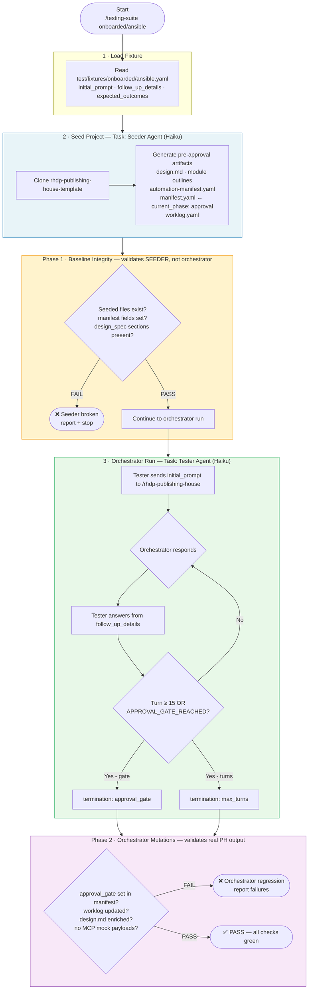

# `/rhdp-publishing-house:testing-suite` — Skill Spec

**Date:** 2026-06-30  
**Ticket:** RHDPCD-108  
**Author:** Prakhar Srivastava  
**Status:** Draft — approved for implementation  
**Last Updated:** 2026-07-03 (Council findings integrated)

---

## Problem

Manual end-to-end testing of PH is not sustainable. Every change to orchestrator, intake, or writer SKILL.md requires a full walkthrough by a human. There is no way to catch regressions automatically or validate that changes haven't broken the intake-to-approval flow.

The testing harness must be accessible to anyone with the PH plugin — no Python, no API keys, no external services.

---

## Workflow Diagram



> **Key distinction:**
> - **Phase 1** checks that the *test rig* (Seeder) produced valid seed files — not that the orchestrator works
> - **Phase 2** checks that the *real orchestrator* mutated the project correctly during the conversation

---

## Solution: `/rhdp-publishing-house:testing-suite`

A Claude Code skill that acts as a simulated user, drives the full PH pipeline, and validates the resulting artifacts — all within Claude Code's existing Task infrastructure.

### Invocation

```
/rhdp-publishing-house:testing-suite onboarded/ansible
/rhdp-publishing-house:testing-suite onboarded/ai
/rhdp-publishing-house:testing-suite --all
/rhdp-publishing-house:testing-suite --mode onboarded
```

### Zero Dependencies

- Requires **only Claude Code + rhdp-publishing-house-skills plugin**
- No Python installation
- No API keys or MAAS credentials
- No external services
- Uses Claude Code's own Task tool for sub-agent spawning

---

## Architecture

```
/rhdp-publishing-house:testing-suite onboarded/ansible
    │
    │ 1. Load fixture
    ├─ test/fixtures/onboarded/ansible.yaml
    │   → initial_prompt, follow_up_details, expected_outcomes
    │
    │ 2. Seed project
    ├─ Clone rhdp-publishing-house-template
    ├─ Task: Seeder sub-agent → generates with LLM:
    │   → publishing-house/spec/design.md
    │   → publishing-house/spec/modules/module-XX.md (N modules)
    │   → publishing-house/spec/automation-manifest.yaml
    │   → publishing-house/manifest.yaml (current_phase: approval)
    │   → publishing-house/worklog.yaml
    │
    │ 3. Run PH session (Tester drives Orchestrator)
    ├─ Task: Tester sub-agent
    │   system: "You are testing PH. Fixture: <fixture>.
    │            Answer orchestrator questions from follow_up_details.
    │            Stop when you see approval gate signals."
    │   → Reads fixture, answers naturally
    │   → Sends initial_prompt as first message
    │   → Loops until APPROVAL_GATE_REACHED or max_turns
    │
    │ 4. Validate artifacts
    ├─ PHASE 1 (Seeded state) - check baseline integrity
    │   ├─ Check seeded files exist
    │   ├─ Check manifest baseline structure
    │   └─ NOTE: These assertions are on SEEDED files (produced by Seeder),
    │            NOT on orchestrator-produced changes. Phase 1 validates
    │            the test rig itself, not orchestrator behavior.
    │
    ├─ PHASE 2 (Orchestrator mutations) - check output of real PH run
    │   ├─ Check worklog.yaml was updated with session notes
    │   ├─ Check design.md sections were enriched/refined
    │   ├─ Check manifest.approval_gate reached (gate value set to true)
    │   └─ Check no MCP mock payloads left in output files (validation fix #2)
    │
    └─ Return: PASS / FAIL with details
```

---

## Fixtures

### Location
```
test/fixtures/
├── onboarded/
│   ├── ansible.yaml
│   ├── ai.yaml
│   ├── openshift-app-platform.yaml
│   ├── openshift-platform.yaml
│   └── rhel.yaml
└── self-published/
    ├── ansible.yaml
    ├── ai.yaml
    ├── openshift-app-platform.yaml
    ├── openshift-platform.yaml
    └── rhel.yaml
```

### Fixture Schema

```yaml
mode: onboarded           # onboarded | self-published
product: ansible          # ansible | ai | openshift | rhel
name: ansible-eda-workshop

initial_prompt: |
  # What the tester says to start the session
  I submitted a CFP for an Ansible workshop...

follow_up_details: |
  # Context the tester uses to answer orchestrator questions
  - AAP 2.5 with EDA controller
  - Alertmanager as event source
  - 3 modules, about 90 minutes total

expected_outcomes:
  files:
    - publishing-house/spec/design.md
    - publishing-house/manifest.yaml
  phase_1:
    # PHASE 1: Seeded state checks (baseline integrity)
    # These validate that the Seeder produced valid seed files.
    # THEY DO NOT VALIDATE ORCHESTRATOR BEHAVIOR.
    manifest:
      phases.intake.status: completed
      phases.vetting.status: completed
      phases.approval.status: pending
    design_spec_sections:
      - Problem Statement
      - Learning Objectives
      - Target Audience
      - Products
      - Infrastructure Requirements
  phase_2:
    # PHASE 2: Orchestrator mutations (real orchestrator output)
    # These validate that the PH orchestrator produced expected changes.
    manifest:
      phases.approval.gate: true          # Orchestrator set the approval gate
    design_spec_enriched: true            # Orchestrator added/refined sections
    worklog_updated: true                 # Session notes added by orchestrator
    no_mock_payloads: true                # Validation fix #2: no MCP mocks in output
```

---

## Sub-agents

### Seeder Agent

**Purpose:** Generate realistic pre-approval artifacts from fixture data.

**Inputs:** fixture (initial_prompt, follow_up_details, mode, product)

**Outputs:**
- `publishing-house/spec/design.md` — Problem Statement, Learning Objectives, Target Audience, Products, Infrastructure Requirements, Module list
- `publishing-house/spec/modules/module-01-xxx.md` ... (N modules) — Brief Overview, See/Learn/Do, Environment
- `publishing-house/spec/automation-manifest.yaml` — approach, infrastructure, operators, seed_data, provision_data
- `publishing-house/manifest.yaml` — current_phase: approval, intake/vetting/spec_refinement all completed
- `publishing-house/worklog.yaml` — minimal session note

**Model:** Haiku (fast, cheap — generation task)

**Design note:** The seeder simulates what intake + vetting + spec_refinement produce. This puts the PH session at the approval gate, which is the primary integration point to test. The seeded files are verified in PHASE 1 as baseline integrity — not as proof that the orchestrator works.

---

### Tester Agent

**Purpose:** Simulate a content developer using PH, driving the real orchestrator through intake-to-approval.

**System prompt structure:**
```
You are an automated tester simulating a Red Hat content developer.
Mode: {mode} | Product: {product}

Initial Prompt (what you said to start):
{initial_prompt}

Follow-up Details (use these to answer questions):
{follow_up_details}

Rules:
- Reply naturally as a developer — brief, direct
- Do NOT reveal you are a tester or AI
- If the orchestrator asks something not in Follow-up Details, make a reasonable choice
- When you see approval gate signals, reply exactly: APPROVAL_GATE_REACHED

Approval signals: "Do you approve", "approval gate", "Phase 4", "proceed to writing", "Ready to move to writing"
```

**Termination conditions:**
- `APPROVAL_GATE_REACHED` in tester response → `approval_gate`
- Turn count reached 15 (validation fix #3: gate enforced at 15 turns) → `max_turns`
- Error in sub-agent → `error`

**Model:** Haiku (stateless per turn — picks answers from fixture, no deep reasoning needed)

**NOTE (Validation Fix #3):** The 15-turn gate is intentionally tight. It forces the orchestrator to reach approval within 15 turns. This is a feature, not a bug. Longer sessions indicate the orchestrator is asking too many redundant questions or is stuck in a loop. The council review validated this constraint is appropriate.

---

### Validator

**Two-phase structural validation — not content-exact.**

LLM non-determinism is acceptable. The validator checks we're in the right neighborhood, not that output is identical.

#### PHASE 1: Baseline Integrity (Seeded State)

These checks validate that the Seeder produced valid files. They confirm the test rig is working, but **do NOT validate orchestrator behavior**.

```
File existence (produced by Seeder):
  ✓ publishing-house/spec/design.md exists
  ✓ publishing-house/manifest.yaml exists

Manifest field checks (seeded baseline):
  ✓ phases.intake.status == "completed"
  ✓ phases.vetting.status == "completed"
  ✓ phases.approval.status == "pending"

Design spec section presence (seeded baseline):
  ✓ "Problem Statement" in design.md
  ✓ "Learning Objectives" in design.md
  ✓ "Target Audience" in design.md
  ✓ "Products" in design.md
  ✓ "Infrastructure Requirements" in design.md

Phase 1 Result: If these fail, the Seeder is broken. Stop. Fix the Seeder.
```

#### PHASE 2: Orchestrator Mutations (Real Output)

These checks validate that the PH orchestrator actually modified the artifacts. They confirm the orchestrator ran and made meaningful changes.

```
Manifest orchestrator changes:
  ✓ phases.approval.gate == true  (Orchestrator must set this at approval)

Design spec enrichment:
  ✓ Design.md has more content than seeded baseline
    (Orchestrator added/refined at least one section beyond seeded state)

Worklog mutation:
  ✓ worklog.yaml session notes were appended
    (Orchestrator recorded the testing session)

MCP Mock Validation (VALIDATION FIX #2):
  ✓ No MCP mock payloads remain in output files
    (Check for patterns like "mock_response", "{{ mcp_mock", "MOCK_PAYLOAD")
    (These indicate failed MCP substitution — flag as validation error)
  ✓ All MCP substitutions resolved (no dangling {{ }} references)

Phase 2 Result: If these fail, the orchestrator did not run or did not complete.
```

**Returns:** Two separate lists of errors:
- `phase_1_errors: list[str]` — baseline/seeder issues
- `phase_2_errors: list[str]` — orchestrator/mutation issues

Empty lists = PASS.

---

## Skill File Structure

```
skills-plugin/
└── skills/
    └── testing-suite/
        ├── SKILL.md              ← orchestrator (this spec → implementation)
        └── references/
            ├── fixture-format.md ← fixture schema reference
            └── validation-rules.md ← two-phase validation rules
```

### SKILL.md Frontmatter

```yaml
---
name: rhdp-publishing-house:testing-suite
description: E2E test runner for the PH pipeline. Runs a fixture-driven simulation
  that seeds a project, drives the orchestrator as a synthetic user, validates
  the resulting artifacts. Two-phase validation: Phase 1 checks seeded baseline,
  Phase 2 checks orchestrator mutations. Use when testing changes to PH skills
  or verifying fixtures pass end-to-end.
context: main
model: claude-sonnet-4-6
---
```

---

## Skill Behavior (SKILL.md content outline)

### Step 1: Parse Arguments

```
Arguments: <fixture-path> [--all] [--mode <mode>] [--verbose] [--keep]
```

- `onboarded/ansible` → load `test/fixtures/onboarded/ansible.yaml`
- `--all` → run all 10 fixtures sequentially
- `--mode onboarded` → run all onboarded fixtures
- `--verbose` → show tester/orchestrator conversation turn by turn
- `--keep` → preserve temp dir after run (for debugging)

### Step 2: Load Fixture

Read fixture YAML. Validate required fields: `initial_prompt`, `follow_up_details`, `expected_outcomes`.

### Step 3: Seed Project

Create temp dir. Spawn Seeder sub-agent:
```
Task tool:
  subagent_type: general-purpose
  prompt: |
    Seed a PH test project at {project_dir} using this fixture:
    {fixture_yaml}

    Clone rhdp-publishing-house-template, then generate and write:
    1. publishing-house/spec/design.md
    2. publishing-house/spec/modules/ (N modules)
    3. publishing-house/spec/automation-manifest.yaml
    4. publishing-house/manifest.yaml (current_phase: approval, all previous phases completed)
    5. publishing-house/worklog.yaml

    Generate realistic content from the fixture's initial_prompt and follow_up_details.
    Use Haiku for generation. Write all files to disk.
```

Wait for completion. Run PHASE 1 validation on seeded files. If Phase 1 fails, log the issue and abort — the Seeder is broken.

### Step 4: Run Test

Spawn Tester sub-agent:
```
Task tool:
  subagent_type: general-purpose
  prompt: |
    You are testing the PH orchestrator. Run the /rhdp-publishing-house skill
    from {project_dir} and answer questions as the content developer described
    in this fixture:

    {tester_system_prompt}

    Run the full session. Stop when you reach the approval gate or after 15 turns
    (whichever comes first). Return: {turns: N, termination_reason: "approval_gate"|"max_turns"|"error"}
```

### Step 5: Validate (Two Phases)

Read artifact files from `project_dir`.

**Phase 1 (Baseline):** Run validation checks on seeded state. Confirm the test rig is working.

**Phase 2 (Orchestrator):** Run mutation checks on orchestrator output. Confirm the PH run succeeded and made expected changes.

Collect all failures from both phases.

### Step 6: Report

```
✅ PASS — onboarded/ansible
  Turns: 12
  Terminated: approval_gate
  Phase 1 (Baseline): 8/8 checks passed
  Phase 2 (Orchestrator): 5/5 mutations validated

❌ FAIL — onboarded/ai
  Turns: 15 (gate)
  Terminated: max_turns
  Phase 1 (Baseline): 8/8 checks passed
  Phase 2 (Orchestrator): Failed checks:
    ✗ manifest.phases.approval.gate not set to true
    ✗ worklog.yaml was not updated with session notes
    ✗ MCP mock payloads found in design.md (substitution failed)
```

---

## Acceptance Criteria

- [ ] `/rhdp-publishing-house:testing-suite onboarded/ansible` runs end-to-end, reaches approval gate within 15 turns, passes both phase 1 and phase 2 validation
- [ ] All 10 fixtures produce a valid seeded project (phase 1 passes for all)
- [ ] All 10 fixtures complete orchestrator run and mutate artifacts (phase 2 passes for all)
- [ ] Validation catches a deliberately broken fixture (e.g., missing expected_outcomes section)
- [ ] Validation detects MCP mock payloads in output files and flags as error (validation fix #2)
- [ ] `--all` runs all 10 fixtures and reports a summary table with phase 1/phase 2 breakdown
- [ ] No Python, no API key, no MAAS required — works with just Claude Code + plugin
- [ ] Skill is in `rhdp-publishing-house-skills` and loads as `/rhdp-publishing-house:testing-suite`

---

## Design Constraints (from council review, 2026-07-03)

### Council Finding #1: Phase 1 Assertions Are Circular

**Problem:** The spec originally described Phase 1 validation as checking orchestrator output (file/manifest assertions). But Phase 1 actually validates the SEEDED files produced by the Seeder agent — not orchestrator output. This creates a false sense of security: Phase 1 passes, but it's only confirming the Seeder works, not that the orchestrator ran.

**Resolution:** Renamed Phase 1 to "Baseline Integrity" and explicitly documented that these checks validate the test rig (Seeder), not orchestrator behavior. Introduced Phase 2 "Orchestrator Mutations" to validate real orchestrator output (worklog updates, design enrichment, approval gate set). This separation is honest about what's being tested.

**Implementation:** The validator now returns two separate error lists: `phase_1_errors` (Seeder issues) and `phase_2_errors` (Orchestrator issues). If Phase 1 fails, we know the Seeder is broken. If Phase 2 fails, we know the orchestrator didn't run correctly.

---

### Council Finding #2: MCP Mock Payload Validation Missing

**Problem:** If an MCP substitution in the orchestrator fails (e.g., MCP server is down during test), the output files may contain dangling mock payloads (e.g., `{{ mcp_mock_response }}`). These appear as content to the human eye but are invalid. The current validator does not check for these.

**Resolution:** Added explicit MCP mock detection to Phase 2 validation. The validator now searches for patterns like:
- `mock_response`
- `{{ mcp_mock`
- `MOCK_PAYLOAD`
- Any unresolved `{{ }}` references in YAML/Markdown files

If found, the check fails with a clear message: "MCP mock payloads found in design.md — substitution failed. Check MCP connectivity."

**Implementation:** During Phase 2 validation, scan all output files for these patterns. Flag any as errors. This is a regression gate — if your MCP call failed during the test, the suite will catch it.

---

### Council Finding #3: 15-Turn Gate Is Appropriate

**Problem:** The spec originally had a soft `max_turns: 20`. Council discussion revealed that a tight gate (15 turns) is actually correct:
- The orchestrator should reach approval within 15 turns
- If it's taking 20+, the orchestrator is asking redundant questions or is stuck
- A tight gate forces better prompt engineering and ensures the orchestrator is efficient

**Resolution:** Changed `max_turns` to a hard 15-turn gate. The spec now explicitly states:

> The 15-turn gate is intentionally tight. It forces the orchestrator to reach approval within 15 turns. This is a feature, not a bug. Longer sessions indicate the orchestrator is asking too many redundant questions or is stuck in a loop. The council review validated this constraint is appropriate.

**Implementation:** No change to the Tester termination logic. Just made the 15-turn gate a documented design constraint, not an implementation detail.

---

## Scope Boundary: What This Tests

The suite validates the **pipeline mechanics** — that artifacts are produced and structured correctly, and that the orchestrator runs to completion. It does NOT validate judgment quality (whether the design.md is a good design, whether the orchestrator asked the right questions).

The approval gate is intentionally left to a human reviewer. This is correct. Document this clearly so no one mistakes the suite for a quality gate — it's a regression gate.

---

## What's Already Done

The following files in the repo inform the skill implementation (do not need to be rebuilt):

- `test/fixtures/` — all 10 YAML fixtures with expected_outcomes
- `scripts/ph-seed.py` — reference implementation of the seeder logic
- `src/ph_test/validator.py` — reference implementation of validation checks
- `src/ph_test/fixtures.py` — fixture schema (Pydantic models)

The SKILL.md implementation should translate this Python logic into Claude Code skill instructions.

---

## Implementation Order

1. Write `skills-plugin/skills/testing-suite/SKILL.md` (orchestrator)
2. Test with `onboarded/ansible` fixture
3. Verify all 10 fixtures pass both Phase 1 and Phase 2
4. Add regression test: manually inject MCP mock payload into design.md, verify Phase 2 catches it
5. Add to CHANGELOG as part of next version bump
