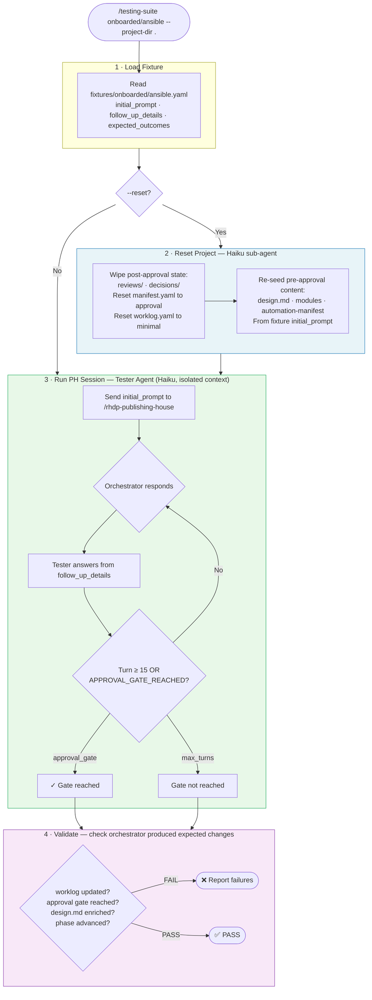

# `/rhdp-publishing-house:testing-suite` — Skill Spec

**Date:** 2026-06-30  
**Last Updated:** 2026-07-03  
**Ticket:** RHDPCD-108  
**Author:** Prakhar Srivastava  
**Status:** In Progress

---

## What It Does

A Claude Code skill that runs fixture-driven end-to-end tests of the Publishing House pipeline. It simulates a content developer going through intake-to-approval, validates that the orchestrator behaves correctly, and reports pass/fail results.

The skill always operates on an **existing project directory**. No temporary directories are created.

---

## Workflow



---

## Invocation

```
# Test with current working directory (must contain publishing-house/)
/rhdp-publishing-house:testing-suite onboarded/ai

# Test with explicit project directory
/rhdp-publishing-house:testing-suite onboarded/ai \
  --project-dir ~/work/code/rhdp-publishing-house-example

# Reset project to seeded state, then re-run
/rhdp-publishing-house:testing-suite onboarded/ai \
  --project-dir ~/work/code/rhdp-publishing-house-example \
  --reset

# With explicit fixtures path (for anyone without dev hub)
/rhdp-publishing-house:testing-suite onboarded/ai \
  --project-dir . \
  --fixtures-path /abs/path/to/rhdp-publishing-house/test/fixtures

# All fixtures
/rhdp-publishing-house:testing-suite --all --project-dir .

# All fixtures for one mode
/rhdp-publishing-house:testing-suite --mode onboarded --project-dir .

# Verbose — see tester/orchestrator conversation
/rhdp-publishing-house:testing-suite onboarded/ai --project-dir . --verbose
```

### Arguments

| Argument | Purpose | Default |
|----------|---------|---------|
| `<fixture-path>` | Fixture to run (e.g. `onboarded/ai`) | required unless `--all` or `--mode` |
| `--project-dir <path>` | Project directory containing `publishing-house/` | current working directory (`.`) |
| `--reset` | Wipe post-approval state and re-seed pre-approval content from fixture | false |
| `--fixtures-path <path>` | Absolute path to fixtures directory | auto-discovered |
| `--all` | Run all fixtures across all modes | false |
| `--mode <mode>` | Run all fixtures for one mode: `onboarded` \| `self-published` | — |
| `--verbose` | Print tester/orchestrator conversation turn-by-turn | false |

### Project Directory

The skill always operates on an **existing project directory** that must contain a `publishing-house/` subdirectory.

**Default:** If `--project-dir` is not specified, the skill uses the current working directory (`.`).

**Validation:** The skill verifies that `{project_dir}/publishing-house/` exists before proceeding. If the directory does not exist, the skill errors with a clear message.

### Reset Mode (`--reset`)

Resets the project to the approval gate state without modifying surrounding project files:

What `--reset` changes:
- `manifest.yaml` → `current_phase: approval`, all prior phases completed, approval pending
- `worklog.yaml` → cleared to a minimal "ready for approval gate" note
- `reviews/` → cleared (post-approval artifacts)
- `decisions/` → cleared (post-approval artifacts)

What `--reset` preserves (pre-approval content):
- `spec/design.md` — regenerated from fixture
- `spec/modules/` — regenerated from fixture
- `spec/automation-manifest.yaml` — regenerated from fixture
- Everything outside `publishing-house/` — untouched

---

## Fixtures

Fixtures live in `rhdp-publishing-house/test/fixtures/` (the dev hub, not the published skill).

```
test/fixtures/
├── onboarded/
│   ├── ansible.yaml
│   ├── ai.yaml
│   ├── openshift-app-platform.yaml
│   ├── openshift-platform.yaml
│   └── rhel.yaml
└── self-published/
    ├── ansible.yaml
    ├── ai.yaml
    ├── openshift-app-platform.yaml
    ├── openshift-platform.yaml
    └── rhel.yaml
```

**10 fixtures total** across 2 modes and 5 products.

### Fixture Schema

```yaml
mode: onboarded | self-published
product: ansible | ai | openshift-app-platform | openshift-platform | rhel
name: "ansible-eda-workshop"

initial_prompt: |
  # What the simulated user says to open the session

follow_up_details: |
  # Context the tester uses to answer orchestrator questions
  - AAP 2.5 with EDA controller
  - 3 modules, about 90 minutes total

expected_outcomes:
  conversation:
    min_turns: 15
  worklog_updated: true
  approval_gate_reached: true
  design_spec_enriched: true
  no_mock_payloads: true
```

---

## Sub-agents

### Seeder Agent (Haiku) — Runs Only on `--reset`

When `--reset` is used, this agent regenerates pre-approval state from the fixture:

- `publishing-house/spec/design.md` — full design spec from fixture
- `publishing-house/spec/modules/module-XX.md` — N module outlines
- `publishing-house/spec/automation-manifest.yaml` — infrastructure requirements
- `publishing-house/manifest.yaml` — `current_phase: approval`, all prior phases completed
- `publishing-house/worklog.yaml` — minimal "ready for approval gate" state

This agent is **not** used if `--reset` is not provided. In that case, the test runs against the project's current state.

### Tester Agent (Haiku)

Simulates a content developer. Has isolated context — sees ONLY the fixture, not the orchestrator's system prompt.

```
You are an automated tester simulating a Red Hat content developer.
Mode: {mode} | Product: {product}

Initial Prompt: {initial_prompt}
Follow-up Details: {follow_up_details}

Rules:
- Reply naturally as a developer — brief, direct
- Do NOT reveal you are a tester or AI
- When you see approval gate signals, reply exactly: APPROVAL_GATE_REACHED
```

Terminates at turn 15 (hard limit) or `APPROVAL_GATE_REACHED`, whichever comes first.

---

## Validation

Checks that the orchestrator made the expected mutations during the conversation:

| Check | What it verifies |
|-------|-----------------|
| `worklog_updated` | `publishing-house/worklog.yaml` has new entries from the session |
| `approval_gate_reached` | Tester sent `APPROVAL_GATE_REACHED` during conversation |
| `design_spec_enriched` | `design.md` was updated/refined by the orchestrator |
| `phase_advanced` | `manifest.yaml` shows progress past approval phase |
| `no_mock_payloads` | No unresolved `{{ mcp_mock }}` patterns in output files |

---

## Design Constraints

**Project directory always provided:** The skill always operates on an existing directory. Default is current working directory if `--project-dir` is not specified. The skill verifies that `{project_dir}/publishing-house/` exists before proceeding.

**Tester context isolation:** The tester sub-agent must NOT see the orchestrator's system prompt. The Task prompt is fully self-contained — only fixture data. Violation = test results meaningless.

**Idempotent resets:** When `--reset` is used, the seeder only modifies files within `publishing-house/`. Everything outside is preserved.

**15-turn gate:** Hard limit at 15 turns. A well-functioning orchestrator reaches the approval gate before 15 turns. Longer sessions indicate redundant questions or a stuck orchestrator — that is a regression, not a success.

**Scope — what this tests:** Orchestrator mutations during the session (worklog entries, design.md refinement, approval gate). Not content quality — that is a human judgment.

---

## Acceptance Criteria

- [ ] `/rhdp-publishing-house:testing-suite onboarded/ansible` (uses cwd) reaches approval gate and passes all checks
- [ ] `--project-dir .` works correctly
- [ ] `--reset` properly wipes and re-seeds the project
- [ ] `--fixtures-path` correctly overrides auto-discovery
- [ ] All 10 fixtures produce a passing result
- [ ] A deliberately broken fixture (bad manifest) fails with a clear error
- [ ] `--all` runs all 10 fixtures and prints a summary table
- [ ] `--mode onboarded` runs all 5 onboarded fixtures
- [ ] Tester sub-agent has isolated context (manual verification)
