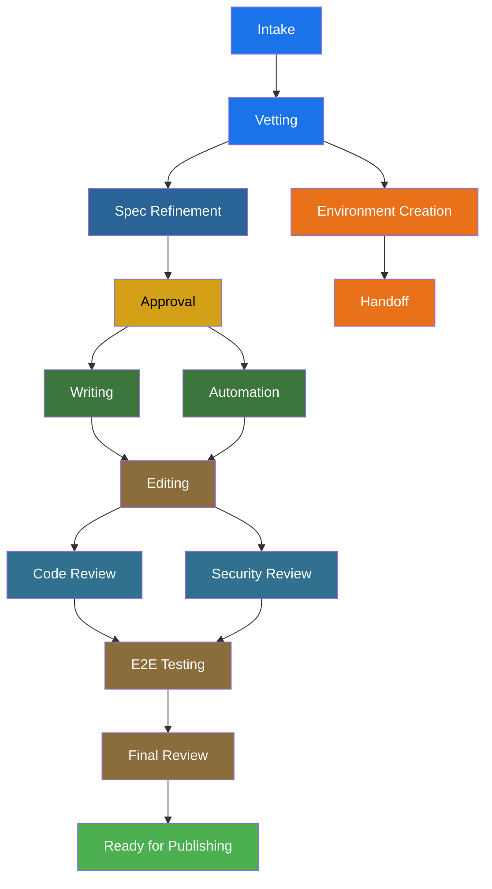

# Deployment Modes

Publishing House supports three deployment modes. You choose during intake — the choice determines how much process your project goes through and where it ends up.

| | Onboarded | Self-Published | Express |
|---|-----------|---------------|---------|
| **Purpose** | RHDP catalog item | Your own content | One-off demo |
| **Git repo** | Yes | Yes | No |
| **Gates** | Hard (enforce quality) | Soft (advisory) | None |
| **Jira** | Automatic | No | No |
| **Durability** | Permanent | Permanent | Disposable |



Onboarded and self-published projects take the upper path (all 12 phases). Express takes the lower path after vetting.

---

## Onboarded

For content going into the RHDP catalog — workshops and demos that anyone can order.

**What makes it different:**

- Hard gates enforce quality at each phase boundary
- Jira Epic and tasks created automatically, synced as work progresses
- AgnosticV catalog item produced during automation
- All review phases required before publishing

**Example:**

```
You: /rhdp-publishing-house
PH:  What deployment mode?
You: onboarded

     → Intake captures requirements, generates spec and module outlines
     → RCARS checks for content overlap
     → Spec reviewed and approved (cannot self-approve)
     → Writer generates AsciiDoc modules
     → Automation builds AgnosticV catalog + deployment code
     → Editor reviews against spec and Red Hat standards
     → Code review, security review, e2e testing, final review
     → Ready for publishing in the RHDP catalog
```

---

## Self-Published

For content you'll host and manage yourself — internal demos, training materials, team-specific workshops. Same quality tools as onboarded, but you control the pace.

**What makes it different:**

- Soft gates — PH flags issues but never blocks you from advancing
- No automatic Jira tracking
- GitOps automation only (Helm + ArgoCD) — no AgnosticV catalog item
- You decide when it's ready

**Example:**

```
You: /rhdp-publishing-house
PH:  What deployment mode?
You: self-published

     → Same intake and spec process as onboarded
     → Same writing and editing tools
     → Gates produce findings but don't block — you choose when to advance
     → No Jira tasks created
     → You deploy using your own infrastructure
```

---

## Express

For when you need a working demo environment quickly — a customer meeting next week, a conference next month. No full lab, no review process.

!!! note "In development"
    The intake path for express mode exists and routes correctly. The environment creation skill is not yet built.

**What makes it different:**

- No git repo — state lives in Central only
- Minimal lifecycle: intake, vetting, then environment creation
- No writing, editing, or review phases
- Environment is disposable

If an express demo proves valuable enough to maintain, start a new onboarded or self-published project from scratch.

---

## Choosing a Mode

PH presents all three during intake. Three questions to decide:

1. **Is this going in the RHDP catalog?** → Onboarded
2. **Is this content you'll maintain but host yourself?** → Self-published
3. **Do you just need a demo environment?** → Express
