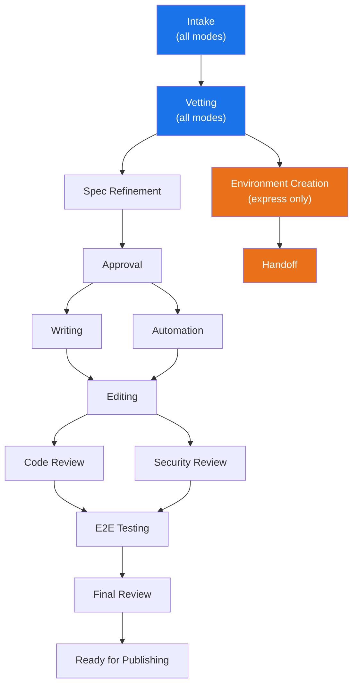

# Deployment Modes

Publishing House supports three deployment modes that determine how your project is built, tracked, and published. Every project starts with the same intake process — describe what you need, and PH generates a spec — but the modes diverge after intake based on the project's purpose and intended durability.

The mode is selected during intake. It cannot be changed after the project is created.

## At a Glance

| | Onboarded | Self-Published | Express |
|---|-----------|---------------|---------|
| **Internal name** | `rhdp_published` | `self_published` | `express` |
| **Purpose** | Published RHDP catalog item | Self-managed content | One-off demo environment |
| **Git repo** | Yes | Yes | No |
| **State location** | Git manifest | Git manifest | Central DB |
| **Gate type** | Hard (blocks progress) | Soft (advisory) | None |
| **Jira tracking** | Automatic | No | No |
| **Review phases** | Required | Optional | None |
| **Automation** | AgnosticV + GitOps/Ansible | GitOps (Helm + ArgoCD) | Purpose-built, not stored |
| **Content format** | Full Showroom lab | Full Showroom lab | Optional lightweight docs |
| **Durability** | Permanent catalog item | Permanent, self-managed | Transient, disposable |

All three modes use the same intake agent and the same RCARS vetting system. The differences emerge in what happens after intake: how many phases you pass through, whether gates block or advise, and where the project state lives.

## Onboarded

Onboarded mode builds a published RHDP catalog item — a workshop or demo that appears in the Red Hat Demo Platform catalog for anyone to order. This is the full-commitment path for content developers building official RHDP content.

The git manifest (`publishing-house/manifest.yaml`) is the source of truth. Central and Jira are downstream consumers — they reflect the manifest, never drive it. PH automatically creates a Jira Epic when the project registers with Central, creates per-deliverable tasks, and syncs status as phases progress.

Onboarded projects pass through all 12 lifecycle phases. Gates are hard — they block progress until requirements are met. The approval phase requires a reviewer who is not the project owner. Code review and security review must both pass before e2e testing begins. These gates exist because published catalog items represent Red Hat to every user who orders them.

The automation phase produces an AgnosticV catalog item and environment automation (Ansible, GitOps, or both). Content is a full Showroom lab — the writer agent generates AsciiDoc from approved spec outlines, and the editor reviews it against Red Hat quality standards.

## Self-Published

Self-published mode uses the same quality lifecycle as onboarded, but the author retains full control. The content is not published to the RHDP catalog — the author hosts and manages it. This mode is for teams building internal demos, training materials, or anything that benefits from a structured process but does not need to appear in the catalog.

State management is identical to onboarded. The same 12 phases are available. The difference is enforcement: all gates are soft. PH flags issues but will not prevent the author from advancing. Every gate runs the same validation logic and produces the same findings — a failure produces a warning instead of a stop.

No automatic Jira sync. Automation is GitOps only — Helm charts and ArgoCD patterns. The AgnosticV catalog item sub-phase (7b) is automatically skipped. To make the content orderable, the author uses an existing Field Source catalog item and points it at their repository URL.

## Express

Express mode solves a different problem: get a working demo environment quickly. A customer meeting next week. A conference booth next month. A one-off need that does not justify building a full lab.

Express mode is in design. The intake path exists and routes correctly, but the environment creation skill is not yet built.

No git repo, no manifest file. Express sessions are stored in the Central database — queryable through MCP tools but not version-controlled. The lifecycle is minimal: intake and vetting. RCARS identifies the closest existing base environment, and the express skill (once built) will provision and customize it. No writing, no editing, no review gates, no Jira.

Automation is purpose-built and disposable. The express skill will generate configuration on the fly, provision the environment, and discard it. If the demo proves valuable enough to justify a permanent catalog item, the user starts a new onboarded or self-published project from scratch.

## Choosing a Mode

PH presents all three modes during intake. The choice is yours — PH does not steer you toward a particular mode. The decision comes down to three questions:

**Is this for the RHDP catalog?** Choose onboarded. This is the only mode that produces an AgnosticV catalog item and passes through the full review pipeline.

**Is this permanent content you will maintain?** Choose self-published. You get the same quality tools without the enforcement overhead — same lifecycle, same validation, soft gates instead of hard ones.

**Do you just need a demo environment?** Choose express. No repo, no review process, no long-term commitment.

If you are unsure, onboarded and self-published can always be started and paused. Express is the only mode that cannot be converted — if the demo proves valuable, you start fresh with a git-based mode.

## How Modes Affect the Lifecycle

Onboarded projects traverse every phase in the upper path, with hard gates at approval, editing, code review, security review, e2e testing, and final review. Self-published projects traverse the same path with soft gates — the author chooses when to advance. Express projects exit after vetting and take the lower path directly to environment creation and handoff.

## Cross-References

- [Lifecycle and Phases](../architecture/lifecycle-phases.md) — detailed phase definitions, gate logic, and how hard vs. soft gates are evaluated
- [Overview](../overview.md) — what PH is and how it works
- [Getting Started](getting-started.md) — how to install PH and start your first project
